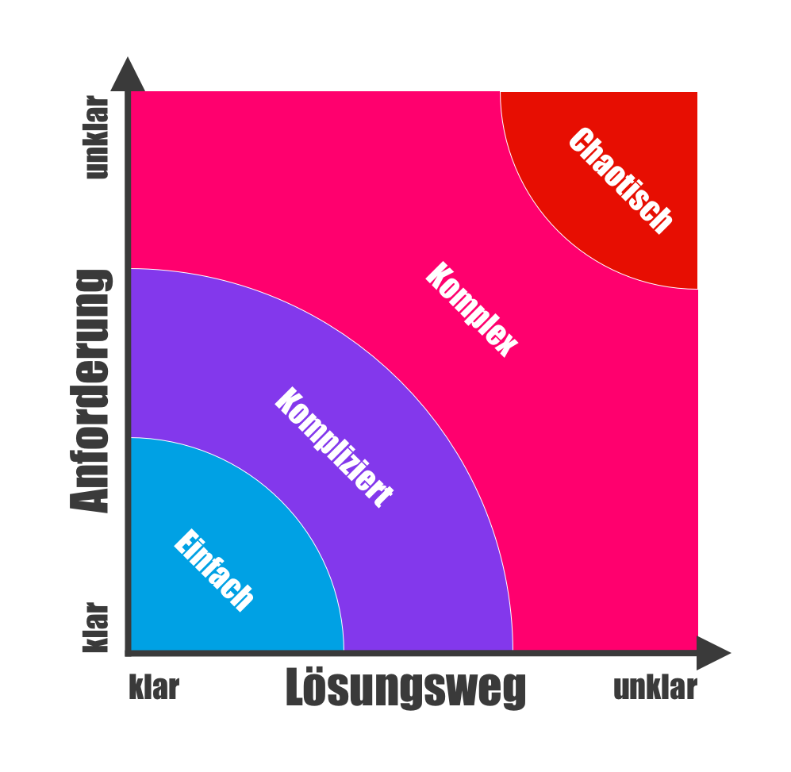
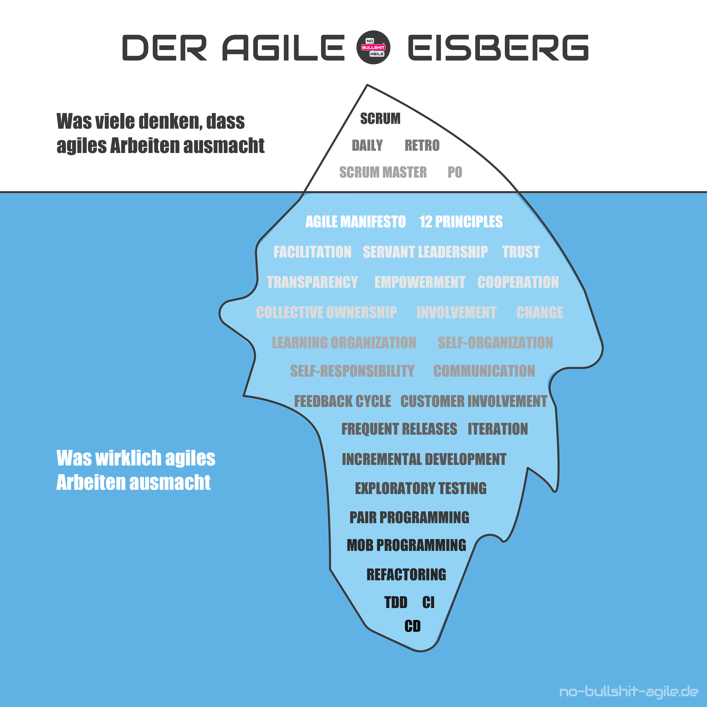
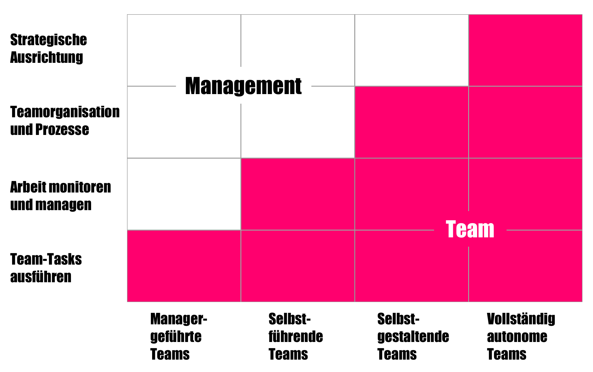
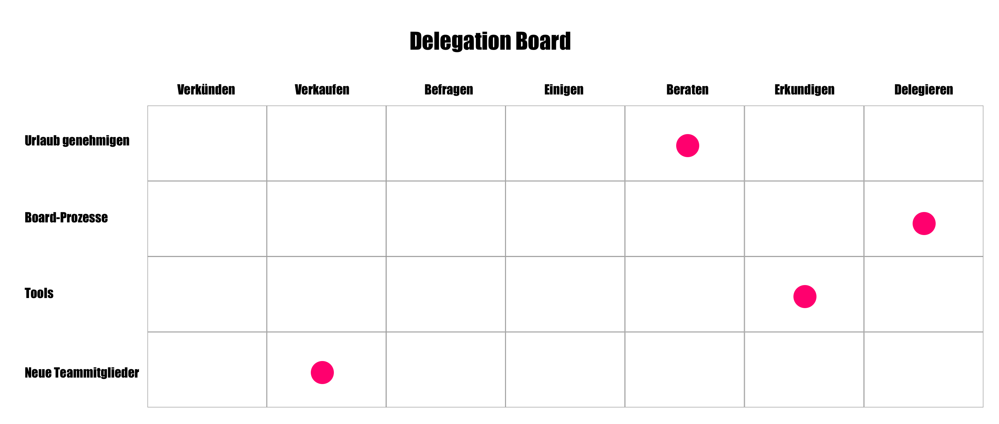
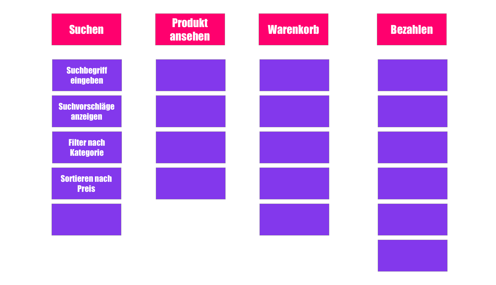
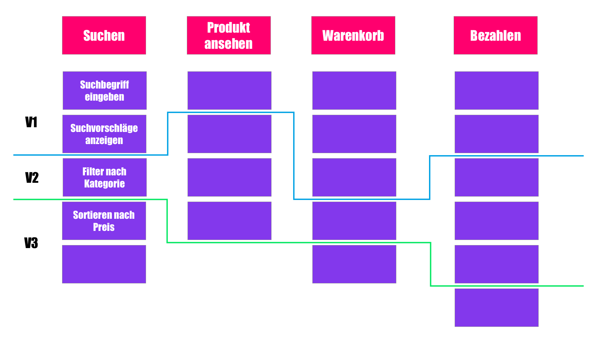
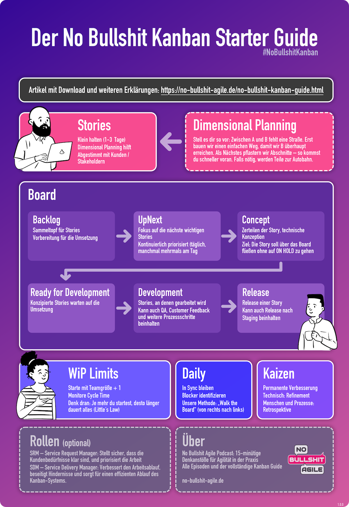
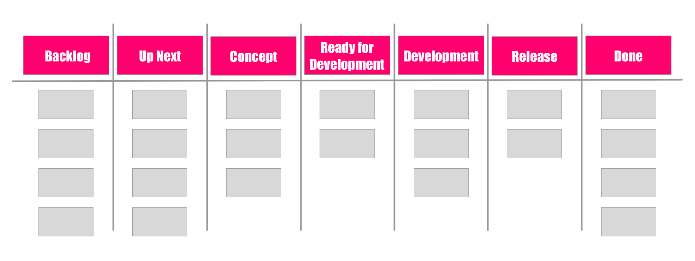
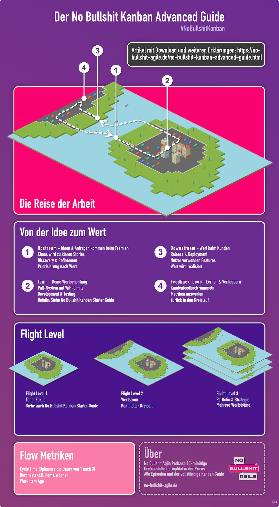

# Vorwort

Noch ein Buch über agiles Arbeiten? Das war auch meine erste Reaktion, als in mir die Idee aufkam. Und doch habe ich es geschrieben. Nach guten 80 Folgen meines Podcasts "No Bullshit Agile"[@nba_podcast_2025] hatte ich einfach das Gefühl, dass ich die Themen, die ich dort besprochen habe, noch einmal in ein geordnetes Format bringen möchte. 

Wie auch im Podcast geht es mir darum, agiles Arbeiten in seinem Fundament zu erklären und mit vielen Missverständnissen und Mythen aufzuräumen, denen ich zum Teil auch aufgesessen bin und die mir heute immer noch oft begegnen. Dieses Buch bündelt meine 20+ Jahre Erfahrung im (nicht immer) agilen Arbeiten gemeinsam mit Teams und Kunden einzubringen.

Das Buch besteht aus vier Teilen. Im **ersten Teil** schaffen wir das Fundament. In meinen Augen ist es wichtig, sich mit dem agilen Manifest und weiteren fundamentalen Themen auseinander zu setzen um wirklich zu verstehen, was agiles Arbeiten braucht.

Im **zweiten Teil** geht es um alle Beteiligten - die Menschen, die in agilen Projekten arbeiten. Da dieser Teil etwas umfangreicher geworden ist, habe ich ihn in die drei Abschnitte **Team**, **Führung** (oder Management) und **Kunden** oder Stakeholder aufgeteilt.

Der **dritte Teil** taucht dann tief in die Praxis des agilen Arbeitens ein. Wir klären, wie wir Projekte planen, ohne in die Wasserfall-Falle zu tappen, wie wir Anforderungen als User Stories so schneiden, dass sie echten Wert liefern, und wie wir den Arbeitsfluss steuern, um Ergebnisse zu erzielen, anstatt nur beschäftigt zu sein.

Im **vierten Teil** gehen wir dann praxisnah auf die Methode Kanban ein. Dazu folgender Hinweis: Ich beschreibe Kanban als Methode, da es in seiner Essenz flexibler ist und den hier beschriebenen Kernprinzipien oft näher kommt. Dies ist keine Abwertung von Scrum, sondern ein Plädoyer für einen prinzipienfesten Pragmatismus, den Kanban exemplarisch verkörpert. Alle angesprochenen Themen in den Teilen I bis III sind komplett unabhängig von einer Methode, die agiles Arbeiten implementiert.

## Feedback
Wenn dir etwas im Buch auffällt oder du Feedback hast, freue ich mich sehr darüber. Du erreichst mich per Mail an nobsagile@gmail.com oder auf Mastodon unter https://mastodon.social/\@nobsagile.

## Version
Dies ist die Version 1.5.0 des Buchs. 

## Mitarbeit
Du kannst an dem Buch hier mitarbeiten: https://github.com/nobsagile/agiles-arbeiten-in-der-praxis

Vielen Dank an folgende Kontributoren:

- Adrian Salamon
- Marco von SCRUMSchau
- Sebastian

## Lizenz
Dieses Buch steht unter folgender Lizenz:

Agiles Arbeiten in der Praxis © 2025 by Thomas Esders is licensed under Creative Commons Attribution-NonCommercial-ShareAlike 4.0 International. To view a copy of this license, visit https://creativecommons.org/licenses/by-nc-sa/4.0/

# Teil I: Das Fundament

## Was ist Agilität? Und warum ich lieber von agilem Arbeiten spreche

Bevor wir tief in die Methoden und Praktiken eintauchen, lass uns einen Moment innehalten. Im Vorwort und auch im Titel dieses Buchs spreche ich bewusst von **agilem Arbeiten**. Du wirst diesen Begriff hier immer wieder lesen. Doch warum? Der gängige Begriff ist doch "Agilität".

Ehrlich gesagt ist mir der Begriff "Agilität" über die Jahre zu schwammig, zu allgemein und, ja, oft auch einfach verbrannt vorgekommen. In über 80 Folgen meines Podcasts habe ich gemerkt, dass ich mich ganz natürlich in Richtung "agiles Arbeiten" bewegt habe. Es drückt für mich viel besser den Kern aus: das Tun, das Schaffen, das Handwerk.

Was ist also diese grundlegende Haltung, jenseits von Buzzwords und Zertifikaten? Für mich ist es eine Haltung, die drei Dinge radikal in den Mittelpunkt stellt:

1.  **KONTEXT:** Die Anerkennung, dass wir uns fast immer in unsicherem Terrain, im "Neuland", bewegen.
2.  **ZIEL:** Maximaler Kundenwert, nicht maximale Planerfüllung.
3.  **FÄHIGKEIT:** Lernen und Anpassen als die alles entscheidende Kernkompetenz.

Umgesetzt wird diese Haltung durch einen gnadenlos ehrlichen Kreislauf: In kurzen Zyklen funktionierende Software liefern, echtes Feedback einholen und den Kurs permanent anpassen.

Genau das ist die Abgrenzung zum plangetriebenen Ansatz. Dieser geht von der Illusion aus, man könne Komplexität durch einen perfekten Plan am Anfang beherrschen. Er optimiert für Vorhersagbarkeit in einer Welt, die nicht vorhersagbar ist. Die Konsequenz dieses Denkens ist die systematische Zerstörung von Wert: Man ignoriert wertvolles Lernen, produziert unnötige Arbeit ("Waste") und liefert am Ende das perfekte Produkt für ein Problem, das der Kunde vielleicht gar nicht mehr hat.

Du siehst also: **Agilität** ist für mich die grundlegende Haltung, das Mindset. **Agiles Arbeiten** ist die tägliche, ehrliche Praxis, die dieses Mindset mit Leben füllt.

Und genau dieses Fundament – diese Haltung – wollen wir uns jetzt genauer ansehen.

## Rituale ohne Seele: Wenn Agilität frustriert

Wir alle sprechen von Agilität. Wir nutzen Scrum, haben Dailys und füllen Backlogs. Und doch stellt sich oft eine quälende Frage: Warum fühlt es sich so oft mühsam, ineffektiv und frustrierend an? Warum scheint das große Versprechen von Agilität in der Praxis so selten eingelöst zu werden?

Dieser erste Teil des Buches liefert die Antwort. Wir legen die Methoden und die komplexen Frameworks für einen Moment beiseite und kehren zurück zum absoluten Fundament. Bevor wir über das „Wie“ sprechen können, müssen wir das „Warum“ verstehen. Wir entdecken das agile Manifest neu, entlarven die Missverständnisse, die zu Scheinagilität führen, und bauen gemeinsam die Basis, auf der echte, wirksame Agilität erst entstehen kann: das richtige Mindset. Denn ohne dieses Fundament ist jedes agile Vorgehen nur ein Ritual ohne Seele.

## Das agile Manifest und seine 12 Prinzipien

### Was das agile Manifest ist und warum es noch wichtig ist

Du kennst das agile Manifest wahrscheinlich. Aber ganz ehrlich: Wann hast du es dir das letzte Mal bewusst angesehen? Mir ist aufgefallen, dass ich es viel zu selten zur Hand nehme. Lass uns das ändern und gemeinsam einen genauen Blick darauf werfen, denn dieses Dokument ist das Fundament für alles, was wir in der agilen Welt tun.

#### Die Entstehung des Manifests

Stell dir vor: Im Jahr 2001, als schwerfällige Prozesse die Softwareentwicklung dominierten, gewannen leichtgewichtige Alternativen an Popularität. Dazu zählten vor allem Scrum[@sutherland_scrum:_2024], maßgeblich geprägt von Ken Schwaber[@noauthor_ken_2025] und Jeff Sutherland[@noauthor_jeff_2025], Extreme Programming (XP)[@beck_extreme_2012] von Vordenkern wie Kent Beck[@noauthor_kent_2025] und Robert C. Martin[@noauthor_robert_2025], sowie die Crystal-Methodenfamilie[@cockburn_crystal_2005] von Alistair Cockburn[@noauthor_alistair_2025].

Genau die Vertreter dieser Strömungen – insgesamt 17 Pioniere – trafen sich im Februar 2001 in einem Ski-Resort in Utah. Sie wollten herausfinden, was ihre unterschiedlichen Ansätze im Kern verbindet und ob sie diese auf ein gemeinsames Fundament stellen können. Das Ergebnis dieser Diskussion war das „Manifest für Agile Softwareentwicklung“[@noauthor_manifest_nodate]

#### Die vier Kernwerte im Detail

Gehen wir die vier Werte des Manifests durch und was sie für deine tägliche Arbeit bedeuten.

**1. Individuen und Interaktionen mehr als Prozesse und Werkzeuge**

Natürlich sind Prozesse und Werkzeuge wichtig. Sie geben Struktur und Unterstützung. Aber du solltest dich niemals hinter ihnen verstecken. Anstatt dich im stillen Kämmerlein stur an einen Prozess oder die Vorgaben eines Tools zu halten, sprich lieber direkt mit deinen Kollegen. Die direkte Interaktion zwischen Menschen ist entscheidend, um Herausforderungen zu lösen und wirklich gute Software zu entwickeln.

**2. Funktionierende Software mehr als umfassende Dokumentation**

Der eigentliche Wert entsteht durch eine Software, die funktioniert und die deine Nutzer verwenden können. Das ist die Existenzberechtigung für deine Arbeit. Eine Dokumentation ist zwar Teil des Entwicklungsprozesses, aber sie darf niemals nur Selbstzweck sein. Es geht hier nicht darum, *keine* Dokumentation zu schreiben. Vielmehr bedeutet es, dass du im Zweifel immer die funktionierende Software priorisieren solltest. Sie ist letztlich auch ein Teil ihrer eigenen Dokumentation.

**3. Zusammenarbeit mit dem Kunden mehr als Vertragsverhandlungen**

Gerade in der Zusammenarbeit mit größeren Unternehmen stößt du auf feste Einkaufs- und Vertragsprozesse. Das ist aus deren Sicht auch verständlich. Doch es ergibt keinen Sinn, stur auf den Details eines Lasten- oder Pflichtenhefts zu beharren, wenn sich die Realität ändert. Auch dein Kunde lernt im Laufe des Projekts dazu. Was anfangs eine gute Idee schien, kann sich später als falsch herausstellen. In solchen Momenten ist es viel wertvoller, das Gespräch zu suchen und gemeinsam eine Lösung zu finden, anstatt auf die Buchstaben des Vertrags zu pochen.

**4. Reagieren auf Veränderungen mehr als das Befolgen eines Plans**

Ein Plan, den du vor drei Monaten erstellt hast, ist heute höchstwahrscheinlich veraltet. Das bedeutet nicht, dass du planlos arbeiten sollst. Im Gegenteil: Du solltest permanent planen. Lass neue Erkenntnisse und veränderte Rahmenbedingungen kontinuierlich in deine Planung einfließen. Wenn alle Beteiligten erkennen, dass eine Veränderung notwendig ist, ist es unsinnig, an einem alten Plan festzuhalten. Schau gemeinsam mit dem Kunden oder den Stakeholdern, was jetzt getan werden muss und wie ihr am besten auf die neue Situation reagiert.

#### Ein wichtiger Hinweis

Bei all diesen Vergleichen ist eines ganz entscheidend: Die Aspekte auf der rechten Seite – Prozesse, Dokumentation, Verträge und Pläne – sind nicht unwichtig! Aber die Werte auf der linken Seite sind in der agilen Arbeitsweise **wichtiger**. Als nächstes sollten wir auf die Ergänzung zum agilen Manifest schauen.

### 12 Agile Prinzipien

Die 17 Autoren haben es damals nicht bei den vier Kernwerten belassen. Sie haben das Manifest mit zwölf Prinzipien[@noauthor_prinzipien_nodate] konkretisiert, um es greifbarer und im Alltag anwendbar zu machen. Schauen wir mal rein.

**1. Unsere höchste Priorität ist es, den Kunden durch frühe und kontinuierliche Auslieferung wertvoller Software zufriedenzustellen.**

Es geht darum, dem Kunden so früh wie möglich etwas Funktionierendes in die Hand zu geben. Das erreichst du, indem du deine Aufgaben (oder User Stories) so klein wie möglich hältst und sicherstellst, dass jede kleine Lieferung für sich genommen einen in sich abgeschlossenen Wert hat. So erhältst du wertvolles Feedback – vom Kunden, von dessen Nutzern oder sogar aus Analytics-Daten. Dieses Feedback lässt du direkt in die Weiterentwicklung einfließen und machst die Software Stück für Stück wertvoller.

**2. Heiße Anforderungsänderungen selbst spät in der Entwicklung willkommen. Agile Prozesse nutzen Veränderungen zum Wettbewerbsvorteil des Kunden.**

Hier steht der Nutzen für den Kunden im Mittelpunkt. Du entwickelst keine Software im luftleeren Raum, und Änderungen sind willkommen, weil sie bedeuten, dass alle Beteiligten im Projektverlauf schlauer werden. Diese neuen Erkenntnisse nutzt du, um dem Kunden einen echten Wettbewerbsvorteil zu verschaffen. Ich weiß, je nach Vertragsgestaltung können Änderungen schwierig sein. Das ist aber ein Anlass, über andere Vertragsmodelle nachzudenken, anstatt wertvolle Änderungen abzulehnen.

**3. Liefere funktionierende Software regelmäßig innerhalb weniger Wochen oder Monate und bevorzuge dabei die kürzere Zeitspanne.**

Der Gedanke dahinter ist klar: Du willst einen hohen Durchsatz, frühes Feedback und die Gewissheit, dass deine Ideen in der Praxis funktionieren. Das geht über den reinen MVP-Gedanken hinaus. Indem du über das gesamte Projekt hinweg regelmäßig kleine, funktionierende Versionen lieferst, stellst du vielleicht sogar fest, dass du gar nicht alles entwickeln musst, was ursprünglich geplant war. Oft reichen 80% des ursprünglichen Umfangs aus, weil du durch das frühe Feedback gelernt hast, was wirklich zählt.

**4. Fachexperten und Entwickler müssen während des Projekts täglich zusammenarbeiten.**

Die Fachexperten sind in der Regel deine Kunden und Stakeholder oder auch Kollegen aus anderen Bereichen wie dem Design. Zugegeben, "täglich" ist in der Praxis oft nicht umsetzbar, da auch der Kunde nicht jeden Tag Zeit hat. Das Ideal ist jedoch ein möglichst enger und regelmäßiger Austausch. Versuche, deinem Team den direkten Draht zum Kunden zu ermöglichen. Wenn dieser Austausch funktioniert, ist der Mehrwert riesig.

**5. Errichte Projekte rund um motivierte Individuen. Gib ihnen das Umfeld und die Unterstützung, die sie benötigen, und vertraue darauf, dass sie ihre Aufgaben erledigen.**

Dieser Punkt, besonders der letzte Teil – das Vertrauen –, ist in der Praxis eine der größten Hürden. Ich gehe grundsätzlich davon aus, dass Menschen, die an einem Projekt arbeiten, motiviert sind. Wenn nicht, sind es vielleicht die falschen Leute für das Team. Wenn du aber motivierte Individuen hast, musst du ihnen ein Umfeld schaffen, in dem sie dieses Engagement auch einbringen können. Das bedeutet, ihnen Unterstützung zu geben und vor allem darauf zu vertrauen, dass sie ihre Arbeit erledigen. Dieses Vertrauen ist, wie wir in Teil II sehen werden, die vielleicht wichtigste Aufgabe von moderner Führung.

**6. Die effizienteste und effektivste Methode, Informationen an und innerhalb eines Entwicklungsteams zu übermitteln, ist im Gespräch von Angesicht zu Angesicht.**

Direkte und synchrone Kommunikation über die aktuelle Arbeit ist viel effektiver, als asynchrones schriftliches Diskutieren. Das ist auch ein Grund, warum das Daily Scrum ein so wichtiges Event im Framework ist. Außerdem: Dieses Prinzip stammt aus dem Jahr 2001, lange vor der Corona-Pandemie 2020 und der sich seit dem festigenden Homeoffice-Kultur. Dennoch ist es aktueller denn je. Auch wenn Videoanrufe heute Standard sind, geht bei der reinen Online-Kommunikation unglaublich viel verloren. Es ist etwas völlig anderes, gemeinsam in einem Raum vor einem Whiteboard zu stehen und eine Idee zu diskutieren. Der direkte Dialog bleibt unschlagbar, um komplexe Informationen effizient zu übermitteln und ein gemeinsames Verständnis zu schaffen. 

**7. Funktionierende Software ist das wichtigste Fortschrittsmaß.**

Lass diesen Satz auf dich wirken. Dein Fortschritt wird nicht an der "Velocity" oder in komplexen Fortschrittsbalken gemessen. Das einzig wahre Maß ist der Teil der Software, der tatsächlich funktioniert und ausgeliefert werden kann. Halbfertige Funktionen zählen nicht. Das macht diesen Maßstab so ehrlich und verlässlich.

**8. Agile Prozesse fördern nachhaltige Entwicklung. Die Auftraggeber, Entwickler und Benutzer sollten ein gleichmäßiges Tempo auf unbegrenzte Zeit halten können.**

Viele Menschen assoziieren "agil" fälschlicherweise mit "schnell". Doch agil bedeutet "beweglich". Es geht nicht darum, in Sprints zu hetzen. Deine Arbeit sollte eher einem Dauerlauf oder einem entspannten Spaziergang gleichen. Das Ziel ist ein gleichmäßiges, nachhaltiges Tempo, das alle Beteiligten auf unbegrenzte Zeit durchhalten können, ohne auszubrennen.

**9. Ständiges Augenmerk auf technische Exzellenz und gutes Design fördert Agilität.**

Wenn du kontinuierlich darauf achtest, dass deine technische Basis sauber und deine Softwarearchitektur (das "Design") durchdacht ist, schaffst du die Voraussetzung für Beweglichkeit. Nur mit einer exzellenten technischen Grundlage kannst du schnell und sicher auf Umweltveränderungen reagieren, ohne dass dir alles um die Ohren fliegt.

**10. Einfachheit – die Kunst, die Menge nicht getaner Arbeit zu maximieren – ist essenziell.**

Der größte Erfolg für ein Unternehmen liegt darin, so wenig wie möglich zu tun, um ein Ziel zu erreichen. Das ist eine hohe Kunst. Es bedeutet, ständig zu reflektieren, was gut funktioniert hat und wo "Waste" (Verschwendung) produziert wurde. Indem du kontinuierlich daran arbeitest, Unnötiges wegzulassen, maximierst du den Wert deiner Arbeit.

**11. Die besten Architekturen, Anforderungen und Entwürfe entstehen durch selbstorganisierte Teams.**

Selbstorganisierte Teams sind das große Ziel. Doch der Weg dorthin ist harte Arbeit für alle Beteiligten. Es berührt technische, organisatorische und vor allem menschliche Aspekte wie Verantwortungsübernahme und eine gesunde Fehlerkultur. Aber das Ergebnis ist es wert: Wenn ein Team sich selbst organisiert, entstehen die besten und nachhaltigsten Lösungen. Genau diese Herausforderung schauen wir uns in Teil II noch ganz genau an.

**12. In regelmäßigen Abständen reflektiert das Team, wie es effektiver werden kann, und passt sein Verhalten entsprechend an.**

Die bekannteste Form hierfür ist die Retrospektive. Aber Reflexion ist mehr als nur die Retro. Sie findet im Kleinen bei der Test-Driven Development statt, in "Lessons Learned"-Sessions oder in Formaten wie einem Open Space. Nur wenn du und dein Team regelmäßig innehaltet, um zu reflektieren und daraus Anpassungen abzuleiten, könnt ihr euch wirklich verbessern.

Wenn du dir diese zwölf Prinzipien ansiehst, wird klar, wie praxisnah und relevant sie auch heute noch sind. Ähnlich wie das Manifest selbst geraten sie im Alltag jedoch oft in den Hintergrund. Überlege dir, wie du diese Prinzipien für dich und dein Team präsent halten kannst. Sie sind der perfekte Kompass, besonders dann, wenn ihr Entscheidungen treffen müsst.

Du hast die Werte und Prinzipien jetzt wieder frisch im Kopf. Als Nächstes geht’s darum, warum ohne das richtige Mindset jede Methode zum Theater verkommt.

## Mindset vor Methode

Du hast es sicher schon oft erlebt: In Diskussionen, auf Social Media oder in Artikeln klagen viele darüber, dass agiles Arbeiten nicht funktioniert. Viele, die in "agilen" Teams arbeiten, fühlen sich gegängelt. Das was sie über agiles Arbeiten lesen entspricht nicht dem, wie sie bei sich agiles Arbeiten erleben. Sie sagen: „Wir machen doch Scrum“ oder „Wir nutzen Jira und haben ein Daily“, aber irgendwie funktioniert das alles nicht. Die Folge ist oft pure Frustration.

Warum ist das so? Die Antwort liegt in einem fundamentalen Missverständnis dessen, was Agilität im Kern ausmacht.

### Das große Missverständnis: Falsche Erwartungen

Mach einmal den Test und google selbst zum Beispiel „Why Agile“. Die Ergebnisse sind oft ebenso erhellend wie erschreckend. Du wirst auf Sätze stoßen wie:

*   Agile Methoden helfen Teams, Projekte **pünktlich und im Budget** abzuschließen.
*   Ein Vorteil von Agilität ist eine **bessere Projektkontrolle**.
*   Agilität hilft Teams, **effizienter zu arbeiten** und die **höchste Qualität** innerhalb der Budgetbeschränkungen zu liefern.

Genau hier liegt das Problem. Diese Aussagen schaffen Erwartungen, die Agilität niemals erfüllen kann oder will. Agilität hat nichts mit klassischem Projektmanagement oder starrer Budgetkontrolle zu tun. Zwar können positive Effekte wie eine hohe Qualität oder eine gewisse Budgettransparenz durch kleine Lieferungen entstehen, aber sie sind nicht der eigentliche Grund für agiles Arbeiten.

### Die erste und wichtigste Frage: Was für eine Arbeit machst du?

Bevor du überhaupt über Agilität nachdenkst, solltest du dir eine ehrliche Frage stellen: Welche Art von Tätigkeit übst du und dein Team aus?

Stell dir vor, du arbeitest bei VW und baust einen Golf. Der Prozess ist bekannt, die Schritte sind klar, das Ergebnis ist definiert. Du **reproduzierst** etwas. In einem solchen Umfeld brauchst du kein hohes Maß an Agilität. Ein klassischer Planungsansatz ist hier wahrscheinlich effizienter und sinnvoller.

Jetzt stell dir vor, du entwickelst eine völlig neue Software. Du betrittst permanent **Neuland**. Die Anforderungen sind am Anfang vage, denn selbst der Kunde kann nicht vollständig beschreiben, was er am Ende genau braucht (auch, wenn er das manchmal behauptet). Das ist kein Vorwurf, das ist menschlich und völlig normal. In Projekten werden wir alle schlauer.

Genau für dieses Umfeld – das Unbekannte – wurde Agilität geschaffen. Sie erkennt an, dass wir:

*   nicht alles von Anfang an wissen können.
*   während des Projekts dazulernen.
*   Feedback brauchen, um zu überprüfen, ob unsere Ideen funktionieren.

Agilität ist also die Antwort auf Projekte, bei denen der Weg und das Ziel nicht von Anfang an glasklar sind. Sie ist nicht per se „schnell“, sondern „beweglich“ (*agile*). Sie ist das relativ schnellste Vorgehen in einem unbekannten Umfeld, weil sie durch ständiges Lernen und Anpassen Verschwendung (*Waste*) vermeidet.

### Ein Modell zur Orientierung: Die Stacey Matrix

Dieser intuitive Unterschied zwischen der Arbeit am Fließband und der Erkundung von Neuland hat einen Namen und ein Modell: die **Stacey Matrix** von Ralph D. Stacey[@stacey_2025]. Sie ist ein geniales Werkzeug, um zu verstehen, welche Art von Arbeit du vor dir hast und welcher Lösungsansatz dafür am besten geeignet ist.

Die Matrix spannt sich über zwei Achsen auf:

* **Die vertikale Achse (Das Was)**: Wie klar sind die **Anforderungen**? Wie einig sind wir uns (Team, Kunde, Stakeholder) darüber, was am Ende herauskommen soll? Die Skala reicht von „nah an der Gewissheit“ bis „weit entfernt von Gewissheit“.
* **Die horizontale Achse (Das Wie)**: Wie klar ist der **Lösungsweg** oder die Technologie? Wissen wir genau, mit welchen Schritten und Werkzeugen wir das Ziel erreichen? Die Skala reicht von „nah an der Gewissheit“ bis „weit entfernt von Gewissheit“.

Daraus ergeben sich vier Hauptdomänen:

* **Einfach (Simple)**: Unten links. Die Anforderungen sind klar, der Lösungsweg ist bekannt. Das ist dein VW Golf vom Fließband oder Backen nach Rezept. Hier brauchst du kein agiles Vorgehen. Ein klassischer Plan (Wasserfall) ist effizient und absolut ausreichend. Man spricht hier auch von "Best Practice".
* **Kompliziert (Complicated)**: In der Mitte. Die Anforderungen sind relativ klar, aber der Lösungsweg erfordert Expertenwissen und Analyse. Der Bau einer Brücke oder die Reparatur eines Uhrwerks fällt hierunter. Auch hier sind klassische Projektmanagement-Methoden oft noch gut geeignet, da das Problem durch Analyse lösbar bleibt. Man spricht hier von "Good Practice".´
* **Komplex (Complex)**: Oben rechts. Sowohl die Anforderungen als auch der Lösungsweg sind unklar. Das ist das **Neuland** der Softwareentwicklung. Wir wissen am Anfang nicht genau, was der Kunde am Ende wirklich braucht, und wir wissen nicht, welche technischen Hürden auf dem Weg lauern. **Genau hier, im komplexen Bereich, ist Agilität zu Hause**. Hier können wir nicht planen, wir müssen entdecken – durch kurze Zyklen, Experimente und schnelles Feedback.
* **Chaotisch (Chaotic)**: Ganz oben rechts. Hier herrscht pures Chaos – ein Systemausfall des Produktionsservers, eine schwere Krise tritt ein. Es gibt keine Zeit für Pläne – Chaos ist nicht planbar. Das einzige Ziel ist, sofort zu handeln und die Situation zu stabilisieren, während sich die Umstände rapide ändern können. Agilität kann helfen, um etwas Struktur in die Unordnung zu bringen und gegebenenfalls die Situation wieder ins Komplexe zu bringen. Das Chaos an sich ist nicht handhabbar.  

Die Stacey Matrix zeigt schonungslos, warum der Versuch, komplexe Softwareprojekte mit den Methoden aus der "einfachen" oder "komplizierten" Welt zu managen, zum Scheitern verurteilt ist. Es ist der Versuch, eine unbekannte Landschaft mit einer perfekten, vorher gezeichneten Karte zu durchqueren. Das kann nicht funktionieren.

Wenn du also feststellst, dass du und dein Team sich die meiste Zeit im komplexen Feld bewegt, dann ist die Frage nicht *ob* ihr agil arbeiten solltet, sondern nur noch *wie*.

Hinweis: Die Stacey Matrix ist ein einfaches, aber extrem wirkungsvolles Modell, um diese Unterscheidung zu treffen. Ein weiteres, noch tiefergehendes Framework in diesem Bereich ist das Cynefin Framework[@cynefin_2025] von Dave Snowden, das uns lehrt, Probleme erst zu klassifizieren, bevor wir handeln. Schau hier gerne in den verlinkten Wikipedia Artikel, wenn du tiefer buddeln möchtest.

### Das Fundament: Mehr als nur Regeln und Werkzeuge

Wenn du also in einem Umfeld des „Neulands“ arbeitest, wie setzt du Agilität dann richtig um? Hier kommt der entscheidende Punkt: **Agilität ist zuallererst ein Mindset, eine Haltung.**

Es braucht am Anfang nicht viel: Nur das Verständnis für das Agile Manifest und seine zwölf Prinzipien. Das ist die Basis. Alles andere – Scrum, Kanban, Jira, Rollen wie der Product Owner oder Scrum Master – ist untergeordnet. Diese Frameworks, Methoden und Werkzeuge sind nur Hilfestellungen, die *on top* kommen. Sie sind das „Wie“, aber das Mindset ist das „Warum“.

Der häufigste Fehler ist, diesen Schritt zu überspringen. Menschen sehnen sich nach klaren Regeln, deshalb greifen sie zu einem Framework wie Scrum. Sie halten sich penibel an das Regelwerk, führen alle Zeremonien durch und wundern sich dann, warum sie nicht agil sind. Der Grund ist einfach: Sie oder ihr Umfeld haben das Fundament, das Mindset, nicht verstanden oder verinnerlicht.

Wenn bei dir im Team die Frage aufkommt „Warum funktioniert Scrum bei uns nicht?“, solltest du einen Schritt zurücktreten und fragen: „Welche Grundprinzipien der Agilität leben wir nicht gut genug?“

### Die „Agile Primitives“: Der Baukasten, auf den es wirklich ankommt

Wenn es also nicht die Methode ist, was ist es dann? Wenn 'Mindset' das 'Warum' ist, was sind dann die fundamentalen Bausteine des 'Wie', die unabhängig von Scrum oder Kanban immer gelten müssen? Stefan Wolpers hat dafür einen brillanten Begriff geprägt: die **„Agile Primitives“**[@wolpers_agile_2024]. Das sind die fundamentalen, unteilbaren Bausteine, die den Kern jeder echten agilen Arbeitsweise ausmachen – unabhängig von einem spezifischen Framework. Wenn du diese Prinzipien lebst, bist du agil, egal ob du Scrum, Kanban oder gar keine benannte Methode nutzt.

Lass uns diese zehn „Primitives“ als eine Art „No Bullshit“-Checkliste betrachten:

1.  **Iterative Entwicklung:** Du arbeitest in kurzen Zyklen, in denen du planst, umsetzt, testest und lieferst.
2.  **Inkrementelle Lieferung:** Du lieferst funktionierende Software in kleinen, werthaltigen Teilen aus, so früh und so oft wie möglich. (Übrigens: Nichts im agilen Manifest verbietet es, mitten in einem Sprint zu liefern, wenn etwas fertig und wertvoll ist!)
3.  **Kontinuierliche Verbesserung (Kaizen):** Du schaust permanent auf deine Produkte *und* deine Prozesse und fragst: „Was können wir besser machen?“ und „Wie können wir uns besser organisieren?“. Die Retrospektive ist dafür nur ein Werkzeug, nicht das einzige.
4.  **Zusammenarbeit mit dem Kunden:** Der Kunde ist ein aktiver Partner im Prozess, nicht nur ein Auftraggeber am Anfang und ein Abnehmer am Ende.
5.  **Selbstorganisation:** Das Team hat den Freiraum und die Verantwortung, seine eigene Arbeit zu gestalten und zu organisieren.
6.  **Anpassungsfähigkeit:** Du begrüßt Veränderungen, weil du weißt, dass sie im Neuland unvermeidlich und wertvoll sind. Dein Prozess ist darauf ausgelegt, auf neue Erkenntnisse reagieren zu können.
7.  **Kontinuierliche Integration:** Dein Code wird ständig zusammengeführt und in einem releasbaren Zustand gehalten. Das ist die technische Grundlage für Geschwindigkeit.
8.  **Transparenz:** Die Arbeit, der Fortschritt und die Probleme sind für alle Beteiligten jederzeit sichtbar.
9.  **Feedbackschleifen:** Du baust an jeder denkbaren Stelle Mechanismen ein, um schnell Feedback zu bekommen – vom Kunden, vom Nutzer, von automatisierten Tests, von deinen Kollegen.
10.  **Einfachheit:** Du konzentrierst dich darauf, die Menge an nicht getaner Arbeit zu maximieren. Du baust nur das, was jetzt den größten Wert schafft.

Diese zehn Punkte sind das wahre Betriebssystem der Agilität.

### Das Hausbau-Beispiel: Der Unterschied im Denken

Um noch mehr in die Denkweise für agiles Arbeiten zu kommen, hier ein kleines (wenn auch konstruiertes) Beispiel. Stell dir vor, du baust ein Haus und es geht jetzt darum, die Anzahl und Position der Steckdosen festzulegen. Jetzt hast du drei Möglichkeiten:

*   **Der Wasserfall-Ansatz:** Du erstellst einen detaillierten Plan, wo jede einzelne Steckdose hinkommen soll. Du investierst Wochen in die perfekte Planung, um ja keine Steckdose zu vergessen. Wenn das Haus fertig ist, stellst du unweigerlich fest: „Mist, hier hinter dem Sofa fehlt eine, und die da in der Ecke brauche ich doch nicht.“ Der Plan war perfekt, aber die Realität hat sich geändert.
*   **Der „Geld-ist-egal“-Ansatz:** Du sagst: „Egal, was es kostet, ich will in jeder Ecke eine Doppelsteckdose.“ Du hast am Ende überall Strom, aber auch viele unnötige Steckdosen, die die Wände verschandeln und Geld gekostet haben.
*   **Der agile Ansatz:** Du sagst: „Lass uns eine Grundausstattung an den offensichtlichsten Stellen installieren. Wenn ich im Haus wohne und meinen Alltag lebe, werde ich schnell merken, wo wirklich noch eine Steckdose fehlt oder eine stört.“ Du vereinbarst mit dem Elektriker, dass er später für schmales Geld schnell und unkompliziert weitere Steckdosen nachrüsten oder entfernen kann.

Der agile Ansatz erkennt an, dass du den perfekten Plan nicht am Anfang machen kannst. Er optimiert nicht für die perfekte Vorhersage, sondern für die schnelle und kostengünstige Anpassungsfähigkeit an die Realität.

### Wie du das agile Mindset im Unternehmen verankerst

Ein Mindset lässt sich nicht einfach per Anweisung einführen. Es muss wachsen. Aber du kannst die idealen Bedingungen dafür schaffen.

1.  **Sichere dir die Unterstützung des Managements:** Ohne die Rückendeckung der Führungsebene wirst du immer wieder an Grenzen stoßen. Wenn das Management nicht versteht, warum Agilität mehr ist als nur „Scrum machen“, wird jeder weitere Schritt ein Kampf.

2.  **Bilde eine Gruppe, die für das Thema brennt:** Suche dir Gleichgesinnte aus allen Bereichen des Unternehmens – Management, Entwicklung, Product Owner, Scrum Master, Account Manager. Gründet eine kleine, aber vielfältige Gruppe, eine Art „Tech-Team Agilität“. Die einzige Voraussetzung: Alle in dieser Gruppe müssen für das Thema brennen und es vorantreiben wollen.

3.  **Schafft ein gemeinsames Fundament:** Die erste Aufgabe dieser Gruppe ist es, sich ein einheitliches und tiefes Verständnis von Agilität zu erarbeiten. Beschäftigt euch intensiv mit dem Manifest und den Prinzipien. Was bedeuten sie konkret für euer Unternehmen? Wo ist Agilität bei euch sinnvoll und wo nicht?

4.  **Arbeitet agil an der Agilität:** Nutzt die agilen Prinzipien, um Agilität im Unternehmen voranzubringen.
    *   **Setzt euch erreichbare Ziele** und plant in Iterationen.
    *   **Sammelt permanent Feedback** aus der Organisation.
    *   **Passt euren Plan** basierend auf diesem Feedback an. Denkt daran: Nicht der Plan ist wertvoll, sondern das Planen.

5.  **Kommuniziert, kommuniziert, kommuniziert:** Seid radikal transparent. Teilt eure Pläne, eure Ziele und vor allem die *Gründe* für eure Entscheidungen. Das schafft Vertrauen und nimmt den Leuten die Angst vor dem Unbekannten. Eine Gruppe, die im Verborgenen arbeitet, erzeugt nur Misstrauen.

6.  **Werdet zu Multiplikatoren:** Nutzt eure Gruppe, um das Wissen im Unternehmen zu verbreiten. Bietet kleine Talks an, steht als Ansprechpartner für Fragen zur Verfügung und helft anderen Teams, die Prinzipien zu verstehen und anzuwenden.

7.  **Gebt einen Rahmen, aber lasst Freiheit:** Setzt Leitplanken, was im Fokus steht und was nicht. Aber gebt den Teams die Freiheit, diese Leitplanken für sich zu interpretieren. Nicht jede Lösung passt für jedes Team.

Dieser Weg ist kein schneller Sprint, sondern ein Marathon. Aber er ist der einzige nachhaltige Weg, um ein echtes agiles Mindset zu etablieren, das weit über das bloße Befolgen von Regeln hinausgeht.

Im Laufe dieses Buchs werden wir alle oben angesprochenen Aspekte weiter ausführen und ich werde euch aus meiner Praxis jeweils Methoden liefern, die ihr als Start- oder Überprüfungspunkt verwenden könnt.

Agilität ist also in erster Linie eine Haltung. Im nächsten Kapitel schauen wir uns mit dem Eisberg-Modell an, warum viele Unternehmen nur die Spitze sehen – und dann scheitern.

## Der agile Eisberg

Die Szene ist vertraut: Dein Team macht Dailys, ihr habt Sprint-Backlogs und vielleicht sogar einen Scrum Master. Von außen betrachtet wirkt alles agil. Aber wenn du ehrlich bist, hat sich an der Art, wie ihr zusammenarbeitet und Ergebnisse erzielt, kaum etwas geändert. Die Frustration wächst, und schnell heißt es: „Scrum funktioniert bei uns nicht“ oder sogar „Agilität ist tot.“

Die Wahrheit ist: In den allermeisten Fällen scheitert nicht die Agilität, sondern der Versuch, sie zu imitieren, ohne sie zu verstehen. Dieses Phänomen hat einen Namen: **Cargo-Kult**. Man ahmt Rituale und Praktiken nach, weil man gesehen hat, dass sie bei anderen erfolgreich sind, aber man versteht die dahinterliegenden Prinzipien nicht. Das Ergebnis ist eine leere Hülle – eine Scheinagilität.

Um zu verstehen, warum das so oft passiert, hilft ein einfaches Bild: der agile Eisberg. 

### Die Spitze des Eisbergs: Das, was alle sehen

Wenn wir über agiles Arbeiten sprechen, konzentrieren sich die meisten auf das, was sichtbar ist – die Spitze des Eisbergs, die aus dem Wasser ragt. Das sind die konkreten Methoden, Praktiken und Rollen:

*   **Methoden:** Scrum, Kanban
*   **Rituale:** Daily Stand-ups, Retrospektiven, Sprint Plannings
*   **Rollen:** Product Owner, Scrum Master
*   **Artefakte:** Backlogs, Boards, Story Points

Als wir damals mit Scrum anfingen, habe ich genau diesen Fehler gemacht. Ich war überzeugt: Wenn wir uns strikt an den Scrum Guide halten, arbeiten wir automatisch agil. Das war naiv. Wir konzentrierten uns voll und ganz auf die Spitze des Eisbergs und wunderten uns, warum das erhoffte Potenzial ausblieb.

Denn das eigentliche Drama und die wahre Kraft der Agilität spielen sich unter der Wasseroberfläche ab.

### Unter der Oberfläche: Das Fundament, das alles trägt

Dieser verborgene Teil des Eisbergs ist nichts anderes als das gelebte Mindset, das wir im letzten Kapitel besprochen haben – die 'Agile Primitives' in Aktion. Sie lassen sich in vier entscheidende Säulen gliedern:

**1. Denkweisen und Prinzipien**
Hier liegt der absolute Kern. Es beginnt mit dem **agilen Manifest** und seinen **zwölf Prinzipien**. Doch es geht weiter. Es braucht ein Mindset von **Servant Leadership**, bei dem Führungskräfte das Team unterstützen, anstatt es zu kontrollieren. Es braucht **Vertrauen**, **Transparenz** und das **Empowerment** der Teams, damit sie selbstorganisiert arbeiten können.

**2. Kultur und Organisation**
Agilität kann nur in einer passenden Kultur gedeihen. Dazu gehört eine gelebte **Fehlerkultur**, in der Experimente erlaubt sind und Scheitern als Lernchance gesehen wird. Es braucht eine **lernende Organisation**, die sich kontinuierlich verbessern will. Eine offene, ehrliche und permanente **Kommunikation** ist ebenso unabdingbar wie das Aufbrechen von Silos. Ein Unternehmen, das an starren Hierarchien und Kontrollmechanismen festhält, wird echte Agilität immer blockieren.

**3. Technische Exzellenz**
Wenn du Software entwickelst, sind technische Fähigkeiten die Grundlage für Geschwindigkeit und Qualität. Das ist kein „Funky Stuff“, sondern eine Notwendigkeit.

*   **Inkrementelle Entwicklung:** Nur wenn du in kleinen, wertvollen Schritten lieferst, bekommst du schnelles Feedback.
*   **Automatisierte Tests (TDD):** Sie sind dein Sicherheitsnetz. Sie geben dir das Vertrauen, schnell zu entwickeln und zu releasen, ohne etwas kaputt zu machen.
*   **Automatisierte Release-Pipelines (CI/CD):** Die Fähigkeit, Code jederzeit und auf Knopfdruck in Produktion zu bringen, ist der Schlüssel zu kurzen Feedback-Zyklen.

**4. Echte Kollaboration**
Agilität lebt von der Zusammenarbeit. Das bedeutet nicht nur, einmal am Tag im Daily zu stehen. Es bedeutet, Praktiken wie **Pair- oder Mob-Programming** zu nutzen und vor allem eine **permanente Kundenbeteiligung** sicherzustellen – nicht nur am Anfang bei der Anforderungserhebung, sondern während des gesamten Prozesses bis hin zum finalen Feedback.

Das Schaubild oben ist dabei bestimmt keine vollständige Abbildung aller relevanten Themen. Trotzdem finde ich, dass es hilft, die Frage zu beantworten, was es für agiles Arbeiten braucht. Und damit ist es leichter zu verstehen, warum agiles Arbeiten schnell scheitern kann.

### Woran du den agilen Schein erkennst

Wenn das Fundament unter der Oberfläche fehlt, zeigen sich schnell typische Symptome einer Scheinagilität. Frag dich ehrlich, ob dir folgende Punkte bekannt vorkommen:

*   **Rituale ohne Zweck:** Das Daily ist ein reiner Statusreport für den Vorgesetzten, anstatt ein Planungstreffen für das Team. Die Retro führt zu keinen echten Veränderungen.
*   **Wasserfall im Scrum-Gewand:** Am Anfang wird monatelang geplant und das Backlog bis ins Detail gefüllt. Die Sprints der nächsten Monate sind bereits fest verplant, was schnelles Reagieren auf Feedback unmöglich macht.
*   **Fokus auf Output statt Outcome:** Alle reden über **Velocity** und **Story Points**. Teams werden anhand dieser Schein-KPIs verglichen, anstatt den Fokus auf den tatsächlich geschaffenen **Kundennutzen** (Outcome) zu legen.
*   **Mikromanagement statt Vertrauen:** Die Führungsebene mischt sich in die tägliche Arbeit des Teams ein, anstatt ihm die Freiheit und das Vertrauen zu geben, seine Prozesse selbst zu gestalten.
*   **Buzzword-Rebranding:** Abteilungen werden plötzlich „Squads“ oder „Tribes“ genannt, aber an den alten Strukturen, Prozessen und der Denkweise ändert sich nichts.

### Konzentriere dich auf das, was wirklich zählt

Sauber eingeführtes Scrum macht dich noch lange nicht agil. Wenn du aber die Prinzipien unter der Wasseroberfläche verstanden hast und in deinem Unternehmen anwendest, bist du bereits agiler als viele, die nur dem Scrum-Playbook folgen.

Der obere Teil des Eisbergs ist verlockend, weil er einfach und anfassbar ist. Die Arbeit am unteren Teil – an Kultur, Vertrauen und technischen Fähigkeiten – ist deutlich schwieriger und langwieriger. Aber sie ist nicht optional. Sie ist das Fundament.

Wenn du also das Gefühl hast, bei euch läuft es nicht rund, schau nicht auf die Methode. Schau unter die Wasseroberfläche. Nutze das Bild des Eisbergs als Checkliste und gehe die Themen Stück für Stück an – iterativ, in kleinen Schritten. Jede Verbesserung am Fundament wird euch in großen Schritten dabei helfen, wirklich agil zu werden.

Du siehst: Das Fundament fehlt oft, und dann wirkt Agilität schwach. Deshalb rufen manche „Agilität ist tot“ – und genau damit räumen wir im nächsten Kapitel auf.

## Warum Agilität nicht tot ist

Wenn ich höre, dass Agilität tot sei, frage ich mich immer: Was denn anders machen? Und was genau ist die Alternative zu agilem Arbeiten?

Die Wahrheit ist: Die Aussage „Agilität ist tot“ ist in meinen Augen grundfalsch. Das Problem ist nicht die Agilität selbst, sondern ihre oft nicht optimale Umsetzung in der Praxis. Die Frustration, die viele empfinden, ist absolut nachvollziehbar, aber sie richtet sich gegen ein Zerrbild von Agilität, nicht gegen den eigentlichen Kern. Lass uns die wahren Gründe für diesen Frust genauer ansehen.

### Die wahren Gründe für die Frustration: Fake Agile und Dark Agile

Wenn Unternehmen scheitern, liegt das meist an zwei Mustern:

1.  **Fake Agile:** Unternehmen beschließen, „agil zu werden“. Oft greifen sie dann zu Scrum, weil es wie eine klare Einstiegsdroge wirkt – die Regeln und Rollen sind im Scrum Guide gut erklärt. Sie führen die Methode ein, ohne aber die Basis verstanden zu haben. Sie wissen nicht, *warum* sie es tun und was die Prinzipien des agilen Manifests wirklich bedeuten. Das Ergebnis ist eine mechanische Umsetzung von Ritualen ohne den agilen Geist.

2.  **Dark Agile:** Dieses Muster ist noch schlimmer. Hier wird eine agile Methode wie Scrum ganz bewusst als Deckmantel benutzt. Nach außen hin gibt man sich modern und agil, aber intern nutzt das Management die Strukturen, um weiterhin top-down zu steuern, zu kontrollieren und im Grunde wasserfallartig zu arbeiten. Für die Mitarbeiter in einem solchen Umfeld ist das extrem frustrierend, weil sie in einem System gefangen sind, das Agilität verspricht, aber Kontrolle lebt.

Dazu kommt eine dritte Säule, die das Ganze befeuert: die **Kommerzialisierung**. Eine wahre Flut an Zertifikaten und Coaching-Angeboten hat den Markt überschwemmt. Um immer neue Produkte verkaufen zu können, werden agile Ansätze mit immer mehr Komplexität überladen (Beispiel: SAFe[@noauthor_scaled_2025]). Das ursprüngliche, schlanke Fundament geht dabei völlig verloren.

Diese Muster sind die direkte Folge, wenn Unternehmen versuchen, nur die Spitze des agilen Eisbergs zu kopieren.

### Das eigentliche Problem: Ein grundlegendes Missverständnis

Das größte Problem ist also eine fehlgeleitete Interpretation von Agilität. Die Leute sind frustriert von dem, was in ihrem Unternehmen als „agil“ verkauft wird, und glauben, das sei Agilität. Dabei haben sie die echte Agilität nie erlebt.

Besonders Scrum befindet sich hier in einer Zwickmühle. Auf der einen Seite ist seine Einfachheit und Klarheit der Grund für seinen riesigen Erfolg. Du kannst den Scrum Guide lesen und im Grunde sofort loslegen. Auf der anderen Seite ist genau das seine größte Last. Du kannst Scrum nach allen Regeln des Playbooks umsetzen, ohne auch nur ein Stück weit agil zu sein. Du kannst alle Rituale durchführen, aber wenn das Fundament fehlt, bleibt es eine leere Hülle.

Viele setzen heute Agilität grundsätzlich mit Scrum gleich und haben keine Vorstellung von der eigentlichen Basis – dem agilen Manifest und den Situationen, in denen agiles Arbeiten überhaupt sinnvoll ist.

### Wann Agilität wirklich lebt

Agilität ist kein Allheilmittel, das man wie ein Pflaster auf jede Organisation kleben kann. Sie entfaltet ihre Stärke nur unter bestimmten Bedingungen. Jemand hat das auf Mastodon letztens treffend zusammengefasst:

Agilität lebt dort, …

*   wo **Time-to-Market** und **Cost of Delay** entscheidende Metriken sind.
*   wo es **starken Marktwettbewerb**, **disruptive Technologien** und sich **schnell ändernde Kundenerwartungen** gibt.

Agilität ist hingegen tot, …

*   wo sie sich zu weit von ihrem eigentlichen Anwendungskontext entfernt.
*   wo sie zu einem **Produkt für alle** wird und einfache Rezepte verkauft werden, die die Komplexität ins Unendliche steigern.

### Der Weg nach vorn: Zurück zu den Grundlagen

Was ist also die Lösung? Ganz einfach: **Back to Basics!**

Investiere deine Zeit und deinen Einfluss darauf, in deinem Umfeld immer und immer wieder die agile Basis zu erklären. Bevor du über die Einführung von Scrum, Kanban oder XP sprichst, sorge dafür, dass alle verstehen, was das agile Manifest wirklich bedeutet: Software für Kunden zu liefern, die schnell und erfolgreich am Markt sein muss. Das kannst du übrigens auch machen, wenn ihr eine agile Methode bereits eingeführt habt.

Mein Appell ist klar: Legt den Fokus auf das Fundament. Es ist besser, einen pragmatischen Mix aus verschiedenen Methoden zu entwickeln, der wie ein Handschuh zu eurer Organisation passt und den Zweck der Agilität erfüllt, als stur nach den Regeln von Scrum zu arbeiten, ohne den Sinn dahinter zu leben.

Die Aussage "Agilität ist tot" ist nicht nur falsch, sie lenkt vom eigentlichen Problem ab. Sie schiebt die Schuld auf das Konzept, anstatt die fehlerhafte Umsetzung in den Fokus zu rücken.

Wir haben entlarvt, warum „Agilität ist tot“ Unsinn ist. Jetzt lade ich dich zu einem Gedankenexperiment ein, das den wahren Kern von Agilität freilegt.

## Gedankenexperiment: Der wahre Kern der Agilität

Je länger du dich mit Agilität beschäftigst, desto klarer wird dir vermutlich, wie fundamental das agile Manifest und seine zwölf Prinzipien wirklich sind. Wir haben sie in den vorigen Kapiteln besprochen, und auf den ersten Blick klingen sie logisch, sinnvoll und fast schon selbstverständlich.

Aber ich möchte dich nun zu einem Gedankenexperiment einladen. Lass uns tiefer graben und die wahre Absicht hinter dem Manifest hinterfragen. Was ich dir jetzt präsentiere, ist eine bewusst provokante These. Vielleicht wirst du zusammenzucken oder meine Interpretation für falsch halten. Ich bitte dich aber, mir bis zum Ende zu folgen, denn ich glaube, aus diesem Experiment kann eine wertvolle Diskussion entstehen, die unser Verständnis von Agilität schärft.

### Die Hypothese

Das agile Manifest entstand, weil die klassische Softwareentwicklung im Wasserfall-Modell oft nicht die erhofften Ergebnisse lieferte. Heute wird Agilität häufig als etwas verstanden, das vor allem gut für die Menschen im Entwicklungsprozess ist – für die Entwickler, die Teams und deren Arbeitsumfeld.

Und jetzt kommt mein Gedankenexperiment: Ich behaupte, das ist nur ein Nebeneffekt. Die Autoren des Manifests wollten nicht in erster Linie ein besseres Arbeitsumfeld für Entwickler schaffen. **Ihr primäres Ziel war es, dem Kunden schneller ein gutes und wertvolles Produkt zu liefern.**

Schon im ersten agilen Prinzip steht: „Wir erschließen bessere Wege, Software zu entwickeln.“ Es geht um die *Software*, nicht darum, dass uns das Arbeiten leichter fällt. Die steile These lautet also: Im Kern des agilen Manifests geht es darum, Software besser zu entwickeln, um dem Kunden einen Wettbewerbsvorteil zu verschaffen. Der Mensch im agilen Umfeld und sein Wohlbefinden sind dabei zunächst zweitrangig.

Nimm diese Hypothese für einen Moment an und lass uns schauen, wohin sie uns führt.

### Die Geschichte hinter dem Manifest

Um diese Hypothese zu untermauern, müssen wir noch einmal tiefer in die Entstehungsgeschichte des Manifests eintauchen, als wir es in Kapitel 1 getan haben – diesmal aber mit einem scharfen Blick auf den wirtschaftlichen Kontext, in dem es entstand.

Lass uns daher noch einmal aus einer anderen Perspektive in das Jahr 2001 zurückreisen. Das Internet war erwachsen geworden und hatte die Märkte fundamental verändert. Plötzlich hatte jeder Zugang zum globalen Markt, der dadurch extrem transparent und schnelllebig wurde. Für Unternehmen entstand ein enormer Druck. Sie mussten ihre Produkte und Dienstleistungen online präsentieren und viel schneller auf Veränderungen reagieren als je zuvor.

In dieser Zeit arbeiteten die meisten noch nach dem Wasserfall-Prinzip: starre, aufeinanderfolgende Phasen von Anforderung über Konzeption und Entwicklung bis zum Test. Dieser Prozess war schwerfällig und langsam.

Genau in diesem Umfeld trafen sich die 17 Vordenker der Softwareentwicklung – Vertreter von Ansätzen wie Scrum (ja, Scrum ist älter als das agile Manifest) oder Extreme Programming. Sie kannten die Probleme aus der Praxis und suchten nach einem leichtgewichtigeren Ansatz (damals sprachen sie von "Lightweight", bevor sie sich auf "Agil" einigten). Ihr Ziel war es, keine neuen starren Regeln, sondern Orientierungshilfen – "Guidelines" – zu formulieren.

Ihr Weg zu den vier Kernwerten zeigt ihre Denkweise:

*   Sie stellten fest: **„Great Teams make great Software“**. Daraus entstand der Fokus auf **„Individuen und Interaktionen“**.
*   Sie erkannten: **„Prozesse und Tools machen uns langsam“**. So wurde die Interaktion **wichtiger als Prozesse und Werkzeuge**.
*   Sie wussten: **„Regelmäßiges Liefern von Software bringt dem Kunden viel mehr Wert als Dokumentation“**. Das führte zu **„Funktionierende Software über umfassende Dokumentation“**.
*   Sie waren frustriert, dass Diskussionen über Verträge oft die eigentliche Entwicklung blockierten. Ihre Lösung: Der Kunde muss von Anfang an Teil des Projekts sein. Daraus wurde **„Zusammenarbeit mit dem Kunden über Vertragsverhandlung“**.
*   Inspiriert von Extreme Programming fügten sie hinzu, dass man auf äußere Einflüsse reagieren muss, anstatt stur einem Plan zu folgen. Das Ergebnis: **„Reagieren auf Veränderungen über das Befolgen eines Plans“**.

### Agilität als Antwort auf ein Marktproblem

Wenn du dir diese Entstehungsgeschichte im Kontext des boomenden Internets ansiehst, wird eines klar: Das Wasserfall-Modell war für diese neue, schnelle Welt tot. Mit diesem Ansatz konnten Unternehmen am Markt nicht mehr erfolgreich sein.

Das agile Manifest war die Antwort auf ein **ökonomisches Problem**. Es ging darum, den Kunden in die Lage zu versetzen, in einem hochdynamischen Marktumfeld zu bestehen. Das Produkt, der Kunde und die schnelle Lieferung von werthaltiger Software stehen im absoluten Mittelpunkt.

### Der positive Nebeneffekt

Natürlich hat agiles Arbeiten eine extrem positive Auswirkung auf das Arbeitsumfeld. Ein motiviertes Team, das Sinn in seiner Arbeit sieht und dem vertraut wird, leistet bessere Arbeit und entwickelt bessere Software. Das ist unbestreitbar und großartig.

Im Rahmen unseres Gedankenexperiments ist dieses gute Arbeitsumfeld aber nur ein **notwendiger Nebeneffekt**, nicht das primäre Ziel. Es ist das Mittel zum Zweck, um das eigentliche Ziel zu erreichen: dem Kunden zu helfen, am Markt erfolgreich zu sein.

### Was bedeutet das für deine tägliche Arbeit? Der Wert von „Wert“

Wenn du diese Perspektive einnimmst, verändert das deinen Blick auf alltägliche agile Praktiken. Agilität ist kein Selbstzweck. Hinter ihr steckt ein fundamentaler ökonomischer Gedanke.

Der oft benutzte Begriff „Wert“ (Value) wird plötzlich ganz konkret. Es geht nicht um einen abstrakten Wert, sondern in erster Linie um **Geld**. Entweder verdienst du mit deiner Software Geld für deinen Kunden oder du hilfst ihm, Geld zu sparen, indem du Prozesse optimierst.

Stelle dir mit dieser Brille einmal folgende Fragen:

*   **Retro:** Machen wir eine Retro nur, damit wir als Menschen besser miteinander auskommen? Oder machen wir sie, um Blockaden zu finden, die uns daran hindern, dem Kunden *schneller Wert zu liefern*? Der Fokus verschiebt sich.
*   **Refinement:** Dient das Refinement dazu, uns die Arbeit möglichst einfach zu machen? Oder dazu, das nächste Inkrement so zu schneiden, dass es mit dem geringsten Aufwand den maximalen ökonomischen Wert für den Kunden erzeugt?
*   **Eine Story oder ein Inkrement:** Wenn du das nächste Feature planst, frage dich: Wie viel Wert in Euro steckt wirklich in dem, was du hier lieferst? Kannst du diesen Wert maximieren, indem du es anders schneidest oder etwas anderes priorisierst?

Jeff Sutherland, einer der Scrum-Erfinder, fasst es so in seinem Buch "Scrum: The Art of Doing Twice the Work in Half the Time"[@sutherland_scrum:_2024] zusammen: „Figure out where the most value can be delivered for the least effort and do that one right away.“ (Finde heraus, wo der meiste Wert mit dem geringsten Aufwand geliefert werden kann, und erledige genau das sofort.)

Dieses Gedankenexperiment soll bewusst schwarz-weiß malen, um eine Diskussion anzustoßen. Aber ich glaube fest daran: Wenn wir verstehen, *warum* wir agil arbeiten – nämlich um unseren Kunden im Wettbewerb zu helfen –, können wir unsere Methoden und Prinzipien viel gezielter und effektiver einsetzen. Es gibt all unseren agilen Zeremonien einen tieferen, ökonomischen Sinn.

Das Gedankenexperiment hat deutlich gemacht: Im Kern geht es um Wert für den Kunden. Im nächsten Kapitel schauen wir nach vorn – in die Diskussion um „Post-Agile“ und was wirklich dahintersteckt.

## Post Agile

Nachdem wir uns nun intensiv mit dem Fundament, den Prinzipien und den Herausforderungen von Agilität beschäftigt haben, möchte ich zum Abschluss dieses Teils einen Blick nach vorne werfen. Immer wieder taucht in Diskussionen der Begriff „Post-Agile“ auf. Er suggeriert, dass wir uns in einer Zeit nach der Agilität befinden, dass ihre Prinzipien überholt sind und wir etwas Neues brauchen. Oft schwingt dabei die bekannte These „Agile is dead“ mit.

Aber was bedeutet „Post-Agile“ wirklich? Ist es eine Revolution, eine Evolution oder vielleicht nur ein cleverer Marketing-Schachzug?

### Die Argumente der Post-Agile-Befürworter

Die Verfechter einer post-agilen Welt bringen oft valide Kritikpunkte an der gelebten agilen Praxis vor:

1.  **Starre Rituale und Dogmen:** Agile Methoden, allen voran Scrum, haben sich oft zu starren Regelwerken entwickelt. Teams halten sich dogmatisch an das „Playbook“ (z.B. den Scrum Guide), führen Rituale wie Dailys oder Refinements durch, ohne deren eigentlichen Zweck zu hinterfragen. Post-Agile plädiert dafür, sich von diesen starren Vorgaben zu lösen und pragmatisch zu prüfen: Was hilft uns *wirklich*, schnell Feedback zu bekommen und wertvolle Software zu liefern?

2.  **Fokus auf Werte und Outcome:** Ein weiterer Kernpunkt ist die Abkehr von internen Metriken wie Velocity oder Story Points (Output) hin zum einzigen, was wirklich zählt: dem geschaffenen Kundennutzen (Outcome). Es geht nicht darum, wie *viel* ein Team arbeitet, sondern darum, ob das Ergebnis dem Kunden hilft, am Markt erfolgreicher zu sein.

Diese Kritikpunkte teile ich voll und ganz. Ironischerweise sind sie jedoch keine Abkehr von der Agilität, sondern eine Rückbesinnung auf ihren eigentlichen Kern. Das agile Manifest hat nie etwas von Velocity gesagt. Es hat immer den Kunden und die funktionierende Software in den Mittelpunkt gestellt.

### Warum wir noch lange nicht „post“ sind

Der Bedarf an Agilität ist heute größer denn je. Die grundlegenden Bedingungen, die zur Entstehung des agilen Manifests geführt haben, haben sich nicht geändert – sie haben sich sogar verschärft. Wir arbeiten nach wie vor in einem unsicheren Umfeld, in dem wir das Ziel zwar kennen, der Weg dorthin aber unklar ist. Wir müssen permanent dazulernen und auf Feedback reagieren. Das ist der Nährboden, auf dem echte Agilität gedeiht und immer gedeihen wird.

Warum also die Diskussion um ein „Post-Agile“? Wenn man genauer hinsieht, wird sie oft von Interessen angetrieben, die wenig mit dem Kern der Sache zu tun haben:

*   **Kommerzielle Interessen:** Beratungsunternehmen, die jahrelang agile Transitionen verkauft haben, brauchen ein neues Produkt. Nachdem Scrum und SAFe überall eingeführt sind, ist „Post-Agile“ der nächste logische Schritt, um neue Workshops und Schulungen zu verkaufen.
*   **Der KI-Hype:** Viele versuchen, die Post-Agile-Diskussion mit dem Thema Künstliche Intelligenz zu verknüpfen. Sie behaupten, KI würde agile Coaches oder Scrum Master ersetzen. Das ist Unsinn. KI ist ein mächtiges Werkzeug, das uns bei repetitiven Aufgaben unterstützen kann, aber sie ersetzt weder menschliche Empathie noch die Fähigkeit, komplexe Teamsituationen zu analysieren und zu verbessern – ein Thema, auf das wir im Epilog dieses Buches noch ausführlich blicken werden.

Lasst euch von diesen Argumenten nicht ins Bockshorn jagen. Das Fundament der Agilität ist heute relevanter denn je.

### Ein besseres Modell: Der Weg zur Meisterschaft mit Shuhari

Anstatt über das „Ende“ der Agilität zu sprechen, sollten wir uns darauf konzentrieren, sie meisterhaft anzuwenden. Hierfür bietet sich ein altes japanisches Konzept aus dem Kampfsport an: **Shuhari**. Es beschreibt den Lernprozess in drei Phasen.

**1. Shu – Befolgen:**
In dieser Phase lernst du die Grundlagen und hältst dich strikt an die Regeln. Übertragen auf Agilität bedeutet das: Du verstehst zuerst das **agile Manifest** und seine **Prinzipien**. Wenn du dich für eine Methode wie Scrum entscheidest, wendest du sie „lehrbuchartig“ an, um das System dahinter wirklich zu durchdringen. Du sammelst Erfahrung und baust ein solides Fundament.

**2. Ha – Brechen:**
Nachdem du die Grundlagen gemeistert hast, beginnst du, die Regeln zu hinterfragen und zu brechen. Du startest Experimente. Du passt die Methodik an deine spezifischen Bedürfnisse an. Vielleicht stellst du fest, dass Story Points für euch nicht funktionieren, oder ihr entwickelt ein besseres Format für eure Demos. In dieser Phase passt du das Gelernte an deine Praxis an.

**3. Ri – Verlassen/Übertreffen:**
In der letzten Phase erreichst du die Meisterschaft. Du hast die Prinzipien so tief verinnerlicht, dass du dich von den ursprünglichen Regeln lösen kannst. Du entwickelst eigene, innovative Praktiken, die perfekt zu deinem Team und deinem Kontext passen. Du bist nicht mehr nur Anwender einer Methode, sondern Schöpfer deines eigenen agilen Weges.

### Fazit: Wir sind nicht Post-Agile, wir sind Pre-Shuhari

Die meisten Unternehmen und Teams, die heute über das Ende der Agilität klagen, haben die erste Phase von Shuhari nie wirklich abgeschlossen. Sie haben die Regeln imitiert (Cargo-Kult), ohne das Fundament zu verstehen.

Die Lösung ist also nicht „Post-Agile“, sondern eine ehrliche Auseinandersetzung mit dem Lernprozess. Hört auf, euch an starre Methoden zu klammern, aber werft nicht die grundlegenden Prinzipien über Bord. Versteht die Grundlagen (Shu), passt sie an euren Kontext an (Ha) und entwickelt daraus eure eigene Meisterschaft (Ri).

Shuhari zeigt: Agilität ist ein Lernweg, nicht vorbei. Im nächsten Abschnitt fasse ich die zentralen Erkenntnisse dieses ersten Teils noch einmal klar zusammen.

## Erkenntnisse: Das Fundament

In Teil I haben wir gemeinsam das Fundament für ein tieferes und wirksameres Verständnis von Agilität gelegt. Der Fokus lag darauf, die oft starren Methoden für einen Moment beiseitezulegen und zu den eigentlichen Wurzeln zurückzukehren. Ziel war es, das "Warum" hinter der agilen Bewegung zu beleuchten, bevor wir uns dem "Wie" zuwenden.

**Die zentralen Thesen dieses Teils sind:**

*   **Der Kompass ist wichtiger als die Karte:** Das Agile Manifest mit seinen vier Werten und zwölf Prinzipien ist auch heute noch der einzig wahre Kompass. Es richtet unseren Fokus konsequent auf funktionierende Software, Kundenkollaboration, Individuen und die Reaktion auf Veränderungen.

*   **Mindset ist wichtiger als Methode:** Echte Agilität beginnt im Kopf. Ohne diese grundlegende Haltung verkommt jede Methode, sei es Scrum oder Kanban, unweigerlich zu einem leeren Ritual und purer Scheinagilität.

*   **Arbeite am Fundament, nicht nur an der Fassade:** Das Bild des agilen Eisbergs zeigt die Wahrheit: Während alle auf die sichtbaren Methoden und Rituale starren, entscheidet das unsichtbare Fundament aus Prinzipien, Kultur und technischer Exzellenz über Erfolg oder Scheitern.

*   **Agilität ist nicht das Problem, ihre Imitation ist es:** Die weitverbreitete Frustration richtet sich selten gegen die agilen Werte selbst, sondern gegen ihre fehlerhafte Umsetzung als „Fake Agile“ oder ihren Missbrauch als Kontrollinstrument im Sinne von „Dark Agile“.

*   **Agilität ist eine ökonomische Strategie:** Im Kern geht es darum, dem Kunden durch schnelle Lieferung einen entscheidenden Wettbewerbsvorteil zu verschaffen. Ein motiviertes, selbstorganisiertes Team ist das notwendige Mittel zum Zweck, nicht das eigentliche Ziel.

*   **Meisterschaft kommt nach den Regeln, nicht davor:** Statt über ein „Post-Agile“ zu fantasieren, zeigt das Shuhari-Modell den wahren Weg. Erst das Verstehen der Regeln (Shu), dann das bewusste Brechen (Ha) führt zur wahren Meisterschaft (Ri), in der die Prinzipien verinnerlicht sind.

Die Essenz dieses ersten Teils ist der Perspektivwechsel: weg vom reinen „Doing Agile“ (dem mechanischen Anwenden von Methoden) hin zum „Being Agile“ (dem Leben einer agilen Haltung). Mit diesem soliden Fundament bist du nun bestens gerüstet, die Praktiken und Methoden in den folgenden Teilen nicht nur zu verstehen, sondern sie wirksam und mit Leben zu füllen.

# Teil II: Menschen und Zusammenarbeit

Nachdem wir in Teil I das Fundament gelegt haben, wenden wir uns nun dem Herzstück jeder agilen Arbeit zu: den Menschen. Denn es sind die Menschen in ihren Teams, in ihrer Führungsrolle und im Austausch mit ihren Kunden, die darüber entscheiden, ob die besten agilen Prinzipien zu echten Ergebnissen führen oder zu lebloser Theorie und frustrierenden Ritualen verkommen. 

Im ersten Abschnitt zoomen wir auf die kleinste und wichtigste Einheit der Wertschöpfung: das **Team**. Wir klären die entscheidenden Fragen, wie es sich selbst organisiert, seine volle Kraft entfesselt, gute Entscheidungen trifft, permanent lernt und dabei langfristig gesund und leistungsfähig bleibt.

Im zweiten Abschnitt richten wir den Blick auf die vielleicht anspruchsvollste Rolle im agilen Umfeld: die **Führung**. Wir lösen das scheinbare Paradox auf, wie man Teams führt, die sich eigentlich selbst organisieren sollen, und beantworten die entscheidenden Fragen, wie eine moderne Führungskraft agiert, um Teams nicht zu steuern, sondern zu befähigen. Der Weg dorthin führt über eine veränderte Haltung und konkrete Werkzeuge. Wir beleuchten, wie Führung durch situative Anpassung wirksam wird, welche fundamentalen Fähigkeiten sie braucht und wie sie eine Kultur des Wachstums aktiv gestaltet.

Im dritten Abschnitt verlassen wir die interne Welt von Team und Führung und widmen uns der entscheidenden Schnittstelle nach außen: den **Kunden und Stakeholdern**. Wir ergründen, warum die Zusammenarbeit hier oft die größte Reibung erzeugt und klären die entscheidenden Fragen: Wie überbrücken wir die Kluft zwischen agiler Denkweise und der Realität des Kunden? Wie nehmen wir ihm die Angst vor dem iterativen Vorgehen? Und mit welchen konkreten Strategien machen wir ihn vom passiven Auftraggeber zum aktiven Partner, der den gemeinsamen Erfolg maßgeblich mitgestaltet?

## Der Balanceakt der Selbstorganisation

### Der Mythos vom Allheilmittel: Wenn Selbstorganisation scheitert

Wenn du dich mit agilem Arbeiten beschäftigst, stößt du unweigerlich auf den Begriff der selbstorganisierten Teams. Oft werden sie als das Allheilmittel dargestellt – der ultimative Zustand, den jedes agile Team erreichen muss. Lange dachte auch ich, Selbstorganisation sei ein An-Aus-Schalter: Entweder man hat sie, oder man hat sie nicht.

Doch das ist ein Trugschluss. Selbstorganisation ist kein Wundermittel, das automatisch funktioniert. Sie kann schnellere Entscheidungen, mehr Eigenverantwortung (*Ownership*) und eine höhere Motivation im Team bewirken. Aber sie kann auch scheitern und im schlimmsten Fall zu Chaos und Dysfunktionalität führen.

Du kannst einem Team nicht einfach sagen: „Glückwunsch, ihr seid jetzt selbstorganisiert, macht mal.“ Besonders neu formierte oder unerfahrene Teams kommen ins Straucheln, wenn die Führung sie ohne Rahmen ins kalte Wasser wirft.

Selbstorganisation lebt von offener Kommunikation und gegenseitigem Vertrauen. Bricht dieses Fundament weg – etwa durch zu wenig Austausch –, bricht auch das Team schnell zusammen. Das Ergebnis ist oft pures Chaos: Aufgaben bleiben liegen, Entscheidungen werden nicht getroffen und alle warten darauf, dass doch endlich jemand die Führung übernimmt.

Die häufigsten Gründe für das Scheitern sind:

1.  **Unklarheit über Rollen und Verantwortlichkeiten:** Wenn Entscheidungsstrukturen fehlen, weiß niemand, wer was tun soll. Das Team fühlt sich im Stich gelassen, während die Führung sich fragt, warum nichts vorangeht.
2.  **Fehlende Bereitschaft zur Verantwortung:** Nicht jedes Team will die volle Verantwortung. Viele Menschen sind es seit Jahren gewohnt, klare Anweisungen von einem Vorgesetzten zu erhalten. Die plötzliche Erwartung, alles selbst zu gestalten – von der Priorisierung bis zur Kundenkommunikation – führt zu Unsicherheit, Widerstand und der Angst, für Fehler den Kopf hinhalten zu müssen. Besonders in einer schlechten Fehlerkultur ist es der sicherere Weg, abzuwarten, bis jemand anderes entscheidet.
3.  **Informelle Hierarchien:** Wenn offizielle Strukturen fehlen, übernimmt oft jemand inoffiziell das Ruder – vielleicht die Person mit der lautesten Stimme oder der längsten Betriebszugehörigkeit. Das geschieht nicht aus böser Absicht, sondern weil das Vakuum gefüllt werden muss. Solche informellen Hierarchien sind riskant, weil sie selten auf Kompetenz basieren und oft zu Frust im Team führen.

Selbstorganisation ist also wertvoll, aber sie ist nicht grenzenlos. Sie braucht Pflege, Klarheit und manchmal auch gezielte Eingriffe von außen.

### Die Stufen der Autonomie: Das Hackman-Modell

Ein entscheidendes Learning ist, dass Selbstorganisation keine binäre Eigenschaft ist, sondern ein Spektrum. Das **Hackman-Modell** skizziert vier Reifegrade der Teamautonomie, die dir helfen zu verstehen, wo dein Team steht und welche Rahmenbedingungen es braucht.

1.  **Manager-geführte Teams:** Die Führungskraft setzt Ziele, definiert die Arbeit und managt den Prozess. Das Team ist für die Ausführung zuständig.
2.  **Selbstführende Teams:** Die Führungskraft setzt die übergeordneten Ziele, aber das Team managt seinen eigenen Arbeitsprozess und Fortschritt selbst.
3.  **Selbstgestaltende Teams:** Das Team ist nicht nur für die Ausführung und das Prozessmanagement zuständig, sondern gestaltet auch sein eigenes Team-Design und die Zusammensetzung.
4.  **Vollständig autonome Teams:** Das Team hat die volle Autorität über fast alle Aspekte, von der Zielsetzung bis zur Bezahlung.

Das Wichtigste an diesem Modell ist die Erkenntnis: **Nicht jedes Team muss die höchste Stufe erreichen.** Es ist vollkommen in Ordnung, wenn ein Team auf Stufe 2 glücklich und produktiv ist. Das Modell zeigt dir, welche Verantwortung beim Management liegt und welche beim Team. Das schafft Klarheit und Zufriedenheit auf beiden Seiten. Selbstorganisation ist kein Ziel, sondern ein Weg, den jedes Team in seinem eigenen Tempo geht.

### Die Rolle der Führung: Gärtner, nicht Marionettenspieler

Ein selbstorganisiertes Team braucht keinen Mikromanager, aber es braucht Führung. Welche Art von Führung, hängt direkt vom Reifegrad des Teams ab, den wir im Hackman-Modell gesehen haben. Die Kunst besteht darin, als Führungskraft den passenden Stil für die jeweilige Stufe zu finden und im Notfall auch einzugreifen. Ein gutes Bild dafür ist ein gesunder Körper: Er kann vieles selbst heilen, aber manchmal braucht er einen Arzt.

Die Kunst besteht darin, den richtigen Zeitpunkt für ein Eingreifen zu finden. Achte auf diese Warnsignale:

- Es gibt viele unerledigte Aufgaben trotz voller Auslastung.
- Konflikte im Team sind festgefahren und ungelöst.
- Entscheidungen werden endlos verzögert.
- Das Team hält seine Commitments wiederholt nicht ein.

Wenn du solche Signale bemerkst, handle mit Augenmaß.

1. **Sanft eingreifen:** Beginne mit Moderation, führe Gespräche, kläre Missverständnisse auf. Biete Hilfe an, ohne Druck auszuüben.
2. **Konsequentere Schritte:** Wenn sanfte Maßnahmen nicht fruchten, musst du möglicherweise klarer eingreifen – zum Beispiel eine vom Team getroffene Entscheidung überstimmen.
3. **Ultima Ratio:** Personelle Konsequenzen sind der letzte Ausweg und sollten extrem selten sein.

Jeder starke Eingriff wirft ein Team in seiner Entwicklung zurück und erfordert Zeit, um das Vertrauen wieder aufzubauen. Oft ist der richtige Zeitpunkt ein klein wenig später, als du denkst. Wenn das Team dir später sagt: „Gut, dass du eingegriffen hast, aber es war fast schon zu spät“, hast du dem Team genug Raum zur Selbstheilung gegeben, bevor du gehandelt hast.

### Fazit: Selbstorganisation ist ein Balanceakt

Selbstorganisation ist kein Dogma, sondern ein Balanceakt zwischen Vertrauen und Verantwortung, Freiheit und Führung. Es gibt keine Einheitslösung. Jedes Team muss seinen eigenen Weg finden, abhängig von seiner Reife und seinem Kontext.

Dein Ziel sollte es sein, einen Rahmen zu schaffen, in dem Teams mutig gestalten dürfen. Dieser Rahmen besteht aus klaren Leitplanken – über Ziele, Verantwortung und Grenzen. Innerhalb dieser Leitplanken unterstützt du sie mit Werkzeugen und bist als Führungskraft bereit, schrittweise loszulassen. Feiere ihre Erfolge und hilf ihnen, aus Rückschlägen zu lernen, ohne sofort wieder die Kontrolle zu übernehmen.

Denn Selbstorganisation ist kein Selbstzweck. Sie ist ein Weg zu mehr Engagement, besseren Ergebnissen und, nicht zuletzt, mehr Freude an der Arbeit.

Wir haben gesehen: Selbstorganisation ist ein Balanceakt. Im nächsten Kapitel schauen wir uns ein Werkzeug an, mit dem du Verantwortung konkret verteilen und klären kannst – Delegation Poker & Board.

## Wer entscheidet was? Klarheit mit Delegation Poker & Board

Im letzten Kapitel haben wir festgestellt, dass Selbstorganisation klare Leitplanken braucht, um nicht im Chaos zu enden. Das wirft sofort die entscheidende Frage auf: Wie definierst du diese Leitplanken gemeinsam mit deinem Team, ohne in alte Top-Down-Muster zu verfallen? Wie schaffst du Klarheit darüber, wer welche Entscheidungen trifft?

Die Antwort ist ein ebenso einfaches wie wirkungsvolles Werkzeug: **Delegation Poker**[@noauthor_delegation_nodate], entwickelt von Jürgen Appelo. Es ist ein spielerischer Workshop, der dir und deinem Team hilft, die Graustufen zwischen „Der Chef entscheidet alles“ und „Das Team entscheidet alles“ sichtbar und verhandelbar zu machen.

### Mehr als nur Schwarz und Weiß: Die sieben Stufen der Delegation

Der Kern von Delegation Poker ist die Erkenntnis, dass Delegation kein An-Aus-Schalter ist. Es gibt ein Spektrum an Möglichkeiten. Diese werden in sieben Stufen abgebildet, die während des Workshops als Kartensatz dienen. Die Stufen sind aus der Perspektive der Führungskraft formuliert:

**Stufe 1: Verkünden (Tell)**
Ich treffe die Entscheidung und teile sie dem Team mit. Eine Diskussion ist nicht vorgesehen.

**Stufe 2: Verkaufen (Sell)**
Ich treffe die Entscheidung, aber ich erkläre dem Team die Gründe und versuche, es von der Richtigkeit zu überzeugen.

**Stufe 3: Befragen (Consult)**
Ich hole mir den Rat und die Meinungen des Teams ein, bevor ich meine endgültige Entscheidung treffe. Der Input des Teams ist wichtig, die Entscheidungsgewalt liegt aber bei mir.

**Stufe 4: Einigen (Agree)**
Wir – das Team und ich – treffen die Entscheidung gemeinsam im Konsens. Wir diskutieren so lange, bis wir uns einig sind.

**Stufe 5: Beraten (Advise)**
Ich gebe dem Team meinen Rat und meine Meinung, aber die endgültige Entscheidung trifft das Team. Ich vertraue darauf, dass es meinen Input berücksichtigt.

**Stufe 6: Erkundigen (Inquire)**
Das Team trifft die Entscheidung komplett allein. Ich frage danach, wie entschieden wurde, um informiert zu bleiben, aber ich greife nicht ein.

**Stufe 7: Delegieren (Delegate)**
Das Team trifft die Entscheidung komplett selbstständig. Ich muss nicht einmal informiert werden und halte mich vollständig raus.

Diese sieben Stufen geben euch eine gemeinsame Sprache, um über Verantwortung zu sprechen.

### So funktioniert der Workshop

Stell dir einen Workshop vor, an dem dein gesamtes Team und du als Führungskraft teilnehmt. Es ist entscheidend, dass du mitspielst, denn es geht ja um die Verteilung der Entscheidungskompetenz. Ein neutraler Moderator (zum Beispiel ein agiler Coach) kann sehr hilfreich sein.

**1. Themen sammeln:**
Ihr sammelt im Vorfeld typische Entscheidungssituationen, bei denen Unklarheit herrscht. Fokussiert euch auf die relevanten, oft kniffligen Punkte, nicht auf Trivialitäten.

- Wer genehmigt Urlaubsanträge?
- Wer entscheidet, ob ein Bewerber nach der Probezeit übernommen wird?
- Wer entscheidet über die Einführung einer neuen Technologie im Projekt?

**2. Das Spiel:**
Jeder Teilnehmer erhält einen Satz Karten mit den Zahlen 1 bis 7.

- Der Moderator stellt das erste Szenario vor (z. B. „Urlaubsanträge“).
- Jeder wählt verdeckt die Karte, die seiner Meinung nach dem aktuellen oder gewünschten Delegationslevel entspricht.
- Alle decken ihre Karten gleichzeitig auf.

**3. Die Diskussion:**
Jetzt beginnt der wichtigste Teil. Ihr sprecht über die Ergebnisse.

- Gibt es große Abweichungen (z. B. jemand spielt eine 2, ein anderer eine 6)? Dann erklären diese beiden zuerst ihre Sichtweise.
- Das Ziel ist, ein gemeinsames Verständnis zu entwickeln und sich auf eine Stufe für dieses Szenario zu einigen.
- Nutzt eine Timebox (z. B. 5-10 Minuten pro Thema), um die Diskussionen fokussiert zu halten. Sehr strittige Themen können für eine separate Diskussion geparkt werden.

**4. Das Ergebnis festhalten:**
Sobald ihr euch für eine Delegationsstufe geeinigt habt, haltet ihr das Ergebnis fest. Dieses Festhalten führt uns direkt zum nächsten Werkzeug.

### Das Ergebnis: Das Delegation Board

Ein Delegation-Poker-Workshop ohne ein sichtbares Ergebnis verpufft. Deshalb überführt ihr eure Vereinbarungen auf ein **Delegation Board**.

Das ist im Grunde eine einfache Tabelle oder Matrix:

- **In den Zeilen** stehen eure Entscheidungsszenarien („Urlaubsanträge“, „Technologieauswahl“, etc.).
- **In den Spalten** stehen die sieben Delegationsstufen.

Für jedes Thema markiert ihr die Spalte, auf die ihr euch geeinigt habt. Macht dieses Board für alle im Team jederzeit sichtbar – ob an einer physischen Wand oder in einem digitalen Tool.

Das Delegation Board ist mehr als nur ein Protokoll:

- **Es schafft Klarheit:** Jeder weiß genau, wer was entscheiden darf. Missverständnisse werden vermieden.
- **Es ist ein lebendiges Dokument:** Schaut regelmäßig (z. B. einmal im Quartal) wieder darauf. Hat sich die Vereinbarung bewährt? Können wir bei einem Thema eine Stufe weiter in Richtung Selbstorganisation gehen? Oder müssen wir bei einem anderen Thema einen Schritt zurück machen? Das Delegation Board ist eure Landkarte auf dem Weg durch die Autonomie-Stufen des Hackman-Modells. Jede bewusste Verschiebung einer Aufgabe von Stufe 3 auf 4 ist ein gezielter Schritt hin zu mehr Selbstorganisation.
- **Es ist ein Onboarding-Werkzeug:** Neue Teammitglieder sehen auf einen Blick, wie bei euch Entscheidungen getroffen werden.

### Fazit: Vom vagen Wunsch zur klaren Vereinbarung

Delegation Poker und das dazugehörige Board sind der perfekte praktische nächste Schritt für jedes Team, das sich auf den Weg zur Selbstorganisation macht. Sie verwandeln den abstrakten Wunsch nach „mehr Verantwortung“ und „mehr Freiheit“ in konkrete, verhandelte und transparente Vereinbarungen.

Es ist ein Werkzeug, das Vertrauen aufbaut, weil es Erwartungen klärt. Die Führungskraft zeigt Vertrauen, indem sie bewusst Verantwortung abgibt, und das Team kann dieses Vertrauen annehmen, weil die Grenzen klar definiert sind. Es ist der „No Bullshit“-Weg, um Selbstorganisation im Alltag wirklich zu leben.

Delegation Poker schafft Klarheit über Entscheidungen. Im folgenden Kapitel geht es um die Kraft, die entsteht, wenn Teams diese Klarheit nutzen und selbst Initiative ergreifen.

## Die Power von Teams

In den letzten Kapiteln haben wir den Rahmen abgesteckt. Wir haben über Autonomie-Stufen gesprochen und mit dem Delegation Poker ein Werkzeug kennengelernt, um Verantwortung zu klären. Aber wozu das alles? Manchmal zeigt ein einziges Ereignis mehr als tausend Theorien, welche Kraft in einem Team steckt, wenn dieser Rahmen richtig genutzt wird. 

### Die Geschichte einer Veränderung, die nicht von mir kam

Wie in vielen Teams hatten auch wir das Gefühl, dass unsere Prozesse nicht optimal waren. Unser Kanban-Board, das unsere Arbeitsweise abbilden sollte, fühlte sich fremd und umständlich an. Ich konnte es aber nicht genauer greifen.

Dann geschah etwas Unerwartetes. Ein Teammitglied kam auf mich zu und sagte: „Du, ich habe da eine Idee.“

Er stellte mir in wenigen Sätzen ein komplett neues Konzept für unser Board und unseren Arbeitsfluss vor. Seine Perspektive war eine völlig andere als meine. Er dachte nicht von außen auf den Prozess, sondern von innen heraus – aus der täglichen Praxis. Mir war nach fünf Sätzen klar: Das ist es. Und, was noch wichtiger war: Ich wäre da niemals draufgekommen.

Wir setzten seine Idee mitten in einem Projekt um. Wir gestalteten unser Board neu, migrierten alle Aufgaben und sprangen ins kalte Wasser. Das Ergebnis war (und ist) toll! 

Dieses Erlebnis hat mir zwei entscheidende Lektionen über die Power von Teams gelehrt.

### Lektion 1: Die besten Lösungen kommen von denen, die dicht am Prozess sind

Egal, wie sehr du dich als Führungskraft bemühst, die Prozesse deiner Teams zu verstehen – du wirst sie nie so tief durchdringen wie die Menschen, die täglich darin arbeiten. Sie kennen die Reibungspunkte, die unnötigen Klicks, die umständlichen Wege. Sie spüren den Schmerz. Und genau deshalb haben sie auch die besten und pragmatischsten Ideen für Verbesserungen.

Das agile Prinzip „Errichte Projekte rund um motivierte Individuen. Gib ihnen das Umfeld und die Unterstützung, die sie benötigen, und vertraue darauf, dass sie ihre Aufgaben erledigen“ ist keine leere Phrase. Es ist eine knallharte strategische Anweisung. Dein Job als Führungskraft ist es nicht, die besten Ideen zu haben. Dein Job ist es, ein Umfeld zu schaffen, in dem die besten Ideen deines Teams entstehen und umgesetzt werden können.

Das bedeutet konkret:

- **Setze den Rahmen:** Gib klare Ziele und Leitplanken vor. Was ist die Vision? Was sind die Qualitätsstandards? Das ist deine Aufgabe.
- **Gib den Freiraum:** Überlasse dem Team das „Wie“. Vertraue darauf, dass sie den besten Weg finden, um die vorgegebenen Ziele zu erreichen.
- **Sei geduldig:** Gute Ideen brauchen Zeit. Widerstehe dem Impuls, bei jedem kleinen Problem sofort mit einer eigenen Lösung einzugreifen. Manchmal ist die beste Führung, sich bewusst zurückzuhalten und dem Team den Raum zu geben, selbst auf eine Lösung zu kommen.

### Lektion 2: Eigenverantwortung ist ein Muskel, der trainiert werden muss

Die Initiative meines Teamkollegen kam nicht aus dem Nichts. Sie war das Ergebnis einer Kultur, in der wir in Retrospektiven und anderen Formaten immer wieder über unsere Prozesse, über Agilität und über das Ziel "gute Software schnell liefern" gesprochen haben. Diese Gespräche haben das Bewusstsein und den Wunsch nach Verbesserung geschaffen.

Wenn du als Teammitglied das Gefühl hast, du könntest Dinge besser machen, dann warte nicht.

- **Fordere den Freiraum ein:** Sprich mit deiner Führungskraft. Erkläre, warum du glaubst, dass mehr Autonomie zu besseren Ergebnissen führt.
- **Arbeite deine Ideen aus:** Komm nicht nur mit einem Problem, sondern mit einem konkreten Vorschlag. Das zeigt, dass du Verantwortung übernehmen willst.
- **Beginne im Kleinen:** Niemand wird dir von heute auf morgen die komplette Prozesshoheit übergeben. Aber wenn du zeigst, dass deine kleinen Verbesserungsvorschläge funktionieren, wächst das Vertrauen und damit auch dein Gestaltungsspielraum.

Die Power eines Teams entsteht nicht durch die Anwesenheit von Superhelden. Sie entsteht, wenn eine Gruppe von Menschen das Vertrauen und den Freiraum erhält, ihre kollektive Intelligenz zur Lösung gemeinsamer Probleme zu nutzen.

### Fazit: Vertraue dem Team

Meine Geschichte ist kein Einzelfall. Sie ist das logische Ergebnis, wenn die Prinzipien der Selbstorganisation wirklich gelebt werden. Die wahre Kraft eines Teams entfesselt sich nicht durch Top-Down-Optimierung, sondern durch Bottom-Up-Initiative.

Für Führungskräfte bedeutet das: Halte dich öfter zurück, als du es für nötig hältst. Gib deinem Team den Raum, dich zu überraschen. Für Teammitglieder bedeutet das: Nutze diesen Raum. Deine Perspektive ist einzigartig und unendlich wertvoll.

Die Power von Teams entfaltet sich, wenn sie gestalten dürfen. Doch dazu gehört auch: gemeinsam gute Entscheidungen treffen – genau darum geht’s jetzt.

## Entscheidungen im Team treffen

Ein Team, das im Sinne der Selbstorganisation Verantwortung übernimmt, steht unweigerlich vor einer zentralen Herausforderung: Es muss Entscheidungen treffen. Und zwar ständig. Welche Technologie nutzen wir? Wie schneiden wir diese Story? Wie lösen wir diesen unerwarteten Bug?

Wir alle kennen das Idealbild: Das Team führt eine offene Diskussion, jeder bringt seine Erfahrung und Meinung ein, Vor- und Nachteile werden sachlich abgewogen, und am Ende steht eine Entscheidung, die alle mittragen – eine Entscheidung, aus der wir später gemeinsam lernen.

Doch die Realität sieht oft anders aus. Kennst du das? Im Raum herrscht Schweigen. Oder die immer gleichen, lauten Stimmen setzen sich durch. Manchmal findet nur eine Scheindiskussion statt, an deren Ende eine halbherzige Einigung steht, nur um das Meeting zu beenden.

Das ist nicht das Versagen einzelner Personen, sondern ein natürliches Phänomen. Aber es ist auch brandgefährlich. Denn ein Team, das nicht gut entscheiden kann, verspielt sein gesamtes Potenzial und die Power des Teams verpufft in Frustration und Ineffizienz.

### Warum gute Entscheidungen so schwerfallen

Bevor wir zu den Lösungen kommen, müssen wir verstehen, warum Teams in diese Muster verfallen. Dahinter stecken fast immer menschliche und systemische Gründe:

1.  **Angst vor Fehlern und Schuldzuweisungen:** Die häufigste und stärkste Blockade. Wenn in der Vergangenheit Entscheidungen zu Schuldzuweisungen geführt haben („Das war deine Idee, jetzt sieh zu, wie du es ausbadest!“), lernt jeder schnell, den Kopf einzuziehen. In einer Organisation ohne gelebte Fehlerkultur ist Schweigen die sicherste Strategie. Niemand will die Verantwortung für einen potenziellen Misserfolg übernehmen.
2.  **Unausgesprochene Konflikte und Teamdynamik:** Teams sind soziale Gebilde. Es gibt Meinungsmacher, stille Experten, vielleicht sogar schwelende Konflikte zwischen einzelnen Personen. Jemand traut sich nicht, dem erfahrenen Kollegen zu widersprechen, aus Angst, sein Ansehen zu verlieren. Ein anderer stimmt einem Vorschlag nur widerwillig zu, weil er einen Konflikt vermeiden will. Diese Dynamiken verhindern offene und ehrliche Diskussionen.
3.  **Die Illusion der Einstimmigkeit (Konsens-Falle):** Oft streben Teams nach dem perfekten Konsens, bei dem 100 % der Mitglieder zu 100 % hinter einer Entscheidung stehen. Dieses Ideal ist in der Praxis selten erreichbar und führt zu endlosen Diskussionen und faulen Kompromissen. Das Team wird handlungsunfähig, weil es auf ein unerreichbares Ziel hinarbeitet.

### Werkzeuge für bessere Entscheidungen

Die gute Nachricht ist: Wir sind diesen Mustern nicht hilflos ausgeliefert. Ein Team kann lernen, besser zu entscheiden. Der erste Schritt ist, das Problem offen anzusprechen: „Leute, mir ist aufgefallen, dass wir uns bei Entscheidungen schwer tun. Lasst uns mal schauen, wie wir das besser machen können.“

Hier sind drei praxiserprobte Methoden, die ihr je nach Komplexität der Entscheidung einsetzen könnt – vom schnellen Check im Alltag bis zum strukturierten Workshop.

#### 1. Für den Alltag: Konsent statt Konsens

Dies ist die wichtigste und einfachste Veränderung, die ihr vornehmen könnt.

*   **Konsens** fragt: „Sind alle dafür?“ Das Ziel ist die volle Zustimmung aller.
*   **Konsent** fragt: „Hat jemand einen schwerwiegenden Einwand dagegen?“ Das Ziel ist die Abwesenheit von begründetem Widerstand.

Hier ein kleines Beispiel: Stellt euch vor, es geht um die Einführung eines neuen Code-Linters. Bei Konsens müsste jeder sagen: 'Ja, das ist das beste Tool für uns!' Bei Konsent reicht es, wenn niemand sagt: 'Nein, dieses Tool wird aktiv unseren Workflow zerstören und zu großen Problemen führen.' Vielleicht bevorzugt jemand ein anderes Tool, kann aber mit diesem leben. Die Entscheidung ist getroffen, das Team kann weiterarbeiten.

Der Unterschied ist gewaltig. Bei Konsent muss niemand eine Entscheidung zu 100 % lieben. Man muss nur zustimmen können, dass die Entscheidung *sicher genug ist, um sie auszuprobieren*, und keinen absehbaren, großen Schaden anrichtet. Das senkt die Hürde für eine Entscheidung enorm, beschleunigt den Prozess und ermöglicht es dem Team, handlungsfähig zu bleiben.

#### 2. Für komplexe Probleme: Die Sechs Denkhüte (Six Hats)

Für wirklich komplexe und wichtige Entscheidungen, bei denen viele Perspektiven eine Rolle spielen, ist die Methode der Sechs Denkhüte[@noauthor_six_2025] unschlagbar. Sie zwingt das Team, ein Problem systematisch aus sechs verschiedenen Blickwinkeln zu betrachten. Jeder im Team setzt symbolisch nacheinander die gleichen „Hüte“ auf:

*   **Weißer Hut (Analytisch):** Wir betrachten nur die Fakten und Daten. Was wissen wir? Was fehlt uns?
*   **Roter Hut (Emotional):** Wir äußern nur Gefühle und Intuitionen, ohne Rechtfertigung. Wie fühlt sich diese Option an?
*   **Schwarzer Hut (Kritisch):** Wir suchen aktiv nach Risiken, Schwächen und Problemen. Was könnte schiefgehen?
*   **Gelber Hut (Optimistisch):** Wir suchen nach Chancen und Vorteilen. Was ist das Best-Case-Szenario?
*   **Grüner Hut (Kreativ):** Wir entwickeln neue, alternative Ideen und Lösungen. Gibt es einen ganz anderen Weg?
*   **Blauer Hut (Prozessorientiert):** Wir behalten den Überblick, fassen zusammen und steuern die Diskussion.

Der größte Vorteil: Diese Methode schafft psychologische Sicherheit. Die sonst eher stille Person hat unter dem schwarzen Hut die explizite Erlaubnis und den Auftrag, kritisch zu sein, ohne als Bedenkenträger abgestempelt zu werden. Jeder wird gehört, und die Entscheidung basiert auf einer 360-Grad-Analyse.

#### 3. Um aus Sackgassen zu kommen: Das Experiment

Was, wenn das Team zwischen zwei guten Optionen feststeckt und keine klare Entscheidung treffen kann? Dann trefft gar keine endgültige Entscheidung. Definiert stattdessen ein **Experiment**.

*   **Vereinbart:** „Okay, wir sind uns uneinig. Lasst uns Option A für die nächsten zwei Wochen ausprobieren.“
*   **Definiert Erfolgskriterien:** „Wir messen, ob sich dadurch Metrik X verbessert. Wenn nicht, probieren wir Option B.“
*   **Setzt einen Termin zur Überprüfung:** „In 14 Tagen schauen wir auf die Ergebnisse und entscheiden dann neu.“

Das Experiment senkt die Hürden dramatisch. Es geht nicht mehr um die *eine, richtige* Entscheidung für die Ewigkeit, sondern um einen reversiblen Schritt, um Daten zu sammeln. Es ist die agilste Form der Entscheidungsfindung, weil sie auf empirischen Ergebnissen statt auf reinen Meinungen basiert.

### Fazit: Entscheidungen sind eine Fähigkeit, kein Zufall

Ein Team, das gut entscheidet, ist kein Zufallsprodukt. Es ist das Ergebnis bewusster Arbeit an der eigenen Kultur und der Anwendung der richtigen Werkzeuge.

Schau zuerst auf dich selbst: Wie gehst du mit Entscheidungen um? Schaffe dann im Team das Bewusstsein für die typischen Fallstricke. Und schließlich: Nutzt Methoden wie Konsent, die Sechs Denkhüte oder das Experiment, um aus endlosen Diskussionen in produktives Handeln zu kommen.

Denn am Ende ist die Fähigkeit, gute und zeitnahe Entscheidungen zu treffen, der wahre Motor eines jeden selbstorganisierten Teams.

Entscheidungen gelingen mit klaren Formaten und Regeln. Im nächsten Kapitel richten wir den Blick darauf, wie Teams dauerhaft lernen und sich weiterentwickeln.

## Ein Team, das nicht lernt, stagniert

Ein agiles Team, das nicht lernt, ist ein totes Team. Es mag Rituale durchführen und Aufgaben abarbeiten, aber es wird stagnieren und bei der ersten unerwarteten Herausforderung zerbrechen. Die Fähigkeit, sich kontinuierlich zu verbessern, Wissen zu teilen und aus Fehlern zu lernen, ist das, was ein gutes Team von einem großartigen Team unterscheidet.

Permanentes Lernen ist kein nettes Extra, sondern der Motor der Agilität. Es ist die praktische Umsetzung des zwölften agilen Prinzips: „In regelmäßigen Abständen reflektiert das Team, wie es effektiver werden kann, und passt sein Verhalten entsprechend an.“

Doch wie etabliert man eine solche Kultur des Lernens? Es braucht mehr als nur die alle paar Wochen stattfindende Retrospektive. Es braucht ein Fundament, eine Haltung und konkrete Formate, die Lernen im Alltag verankern. In diesem Kapitel schauen wir uns die drei wichtigsten Säulen an: eine gesunde Fehlerkultur, ehrliches Peer Feedback und selbstorganisierten Wissensaustausch im Open Space.

### Die Grundlage: Eine gesunde Fehlerkultur

Im letzten Kapitel haben wir darüber gesprochen, wie Teams Entscheidungen treffen. Doch jede Entscheidung birgt das Risiko eines Fehlers. Eine gesunde Fehlerkultur ist das Sicherheitsnetz, das es einem Team überhaupt erst erlaubt, mutige Entscheidungen zu treffen, ohne in Angst vor Schuldzuweisungen zu erstarren.

Fehler passieren. Das ist keine Meinung, sondern eine Tatsache. Bugs schleichen sich in den Code, Annahmen erweisen sich als falsch, Entscheidungen führen in eine Sackgasse. Das ist normal, denn wir sind Menschen, die in einem komplexen Umfeld arbeiten. Die entscheidende Frage ist nicht, *ob* Fehler passieren, sondern *wie* wir als Team darauf reagieren.

Jocko Willink[@noauthor_jocko_2025], ein hochdekorierter Ex-Navy-Seal und heutiger Führungscoach, hat dazu eine radikale, aber extrem wirkungsvolle Haltung populär gemacht. Wenn etwas schiefläuft – ein Projekt scheitert, ein Test fehlschlägt, ein Plan sich als falsch erweist –, ist seine instinktive Reaktion ein einziges Wort: „Good.“ (Gut.)

*   Unerwartete Probleme? **Gut.** Das gibt uns die Chance, eine robuste Lösung zu finden.
*   Ein Bug ist in Produktion gelangt? **Gut.** Jetzt können wir unseren Testprozess verbessern, damit das nie wieder vorkommt.
*   Eine Prozess funktioniert nicht? **Gut.** Jetzt können wir uns schauen, was wir anpassen können.

Diese Haltung verwandelt jeden Fehler von einem Grund für Schuldzuweisungen in eine unmittelbare Chance zum Lernen. In einem Team mit einer schlechten Fehlerkultur hört man Sätze wie: „Das war ich nicht“, „Dafür kann ich nichts“ oder „Wer ist schuld?“. In einem Team mit einer guten Fehlerkultur hört man: „Okay, ein Fehler ist passiert. Lasst uns zusammensetzen und schauen, was wir daraus lernen können.“

Eine gesunde Fehlerkultur ist die absolute Voraussetzung für psychologische Sicherheit. Nur wenn niemand Angst haben muss, für einen Fehler bestraft zu werden, wird er bereit sein, Risiken einzugehen, neue Dinge auszuprobieren und – am wichtigsten – offen über Probleme zu sprechen.

**Praxistipp:** Etabliere eine Kultur der „blameless post-mortems“ (schuldfreie Nachbetrachtungen). Wenn ein signifikanter Fehler passiert, analysiert ihr nicht, *wer* den Fehler gemacht hat, sondern *warum* das System es zugelassen hat, dass dieser Fehler passieren konnte. Fehlte ein Prozessschritt? War die Dokumentation unklar? War die Testabdeckung unzureichend? Der Fokus liegt immer auf der Verbesserung des Systems, nicht auf der Bestrafung des Individuums.

### Individuelles Wachstum: Peer Feedback

Die klassische Form des Feedbacks ist das jährliche Gespräch mit dem Vorgesetzten. Das Problem daran: Es findet zu selten statt, die Führungskraft ist oft zu weit vom Tagesgeschäft entfernt, und es wird schnell zu einer reinen Gehaltsverhandlung. Agilität lebt jedoch von kurzen Feedbackzyklen – auch auf persönlicher Ebene.

Ein extrem wirkungsvolles Format dafür ist **Peer Feedback**. Die Idee ist einfach: Jeder im Unternehmen hat die Möglichkeit, sich alle sechs Monate gezielt Feedback von drei Kollegen seiner Wahl einzuholen.

**So funktioniert der Prozess:**

1.  **Die Auswahl (Der Feedback-Nehmer):** Du überlegst dir, wer dir das wertvollste Feedback für deine persönliche Entwicklung geben kann. Das können direkte Teamkollegen sein, jemand aus einem anderen Team oder sogar eine Führungskraft. Du hast die freie Wahl.

2.  **Die Vorbereitung (Die Feedback-Geber):** Die drei von dir ausgewählten Personen treffen sich ohne dich. Sie tauschen sich darüber aus, was du im letzten halben Jahr gemacht hast, an welchen Projekten du beteiligt warst und welche besonderen Leistungen oder Herausforderungen es gab.

3.  **Die Struktur:** Die Feedback-Geber bereiten sich dann individuell anhand von drei Leitfragen vor:
    *   **Was kann diese Person gut?** Was ist dank ihr im letzten halben Jahr besonders gut gelaufen?
    *   **Wo sehen wir Entwicklungspotenzial?** Wo gibt es Luft nach oben, woran könnte diese Person wachsen?
    *   **Was macht diese Person einzigartig?** Was ist ihre besondere Stärke, die sie ins Team einbringt?

4.  **Das Gespräch:** Im eigentlichen Feedback-Gespräch gehen die drei Geber reihum ihre Notizen zu jeder der drei Fragen durch. Du als Nehmer hörst zu. Du darfst Verständnisfragen stellen, aber du sollst dich nicht rechtfertigen. Es geht darum, das subjektive Feedback als Geschenk anzunehmen und für dich zu entscheiden, was du daraus machst.

5.  **Der sichere Raum:** Es gibt keine Protokolle und keine Berichte an die Geschäftsführung. Das Gespräch findet im Vertrauen statt („Vegas-Prinzip“: Was im Raum gesagt wird, bleibt im Raum).

Peer Feedback ist am Anfang ungewohnt und erfordert Mut. Aber es ist eine der besten Methoden, um blinde Flecken aufzudecken, Stärken zu erkennen und konkrete Impulse für die eigene Weiterentwicklung zu bekommen – von den Menschen, die deine Arbeit am besten beurteilen können: deinen Kollegen.

### Kollektives Wissen: Das Open Space

Während Peer Feedback das individuelle Lernen fördert, zielt der **Open Space**[@noauthor_open_2024] auf den selbstorganisierten Wissensaustausch im gesamten Team oder sogar im ganzen Unternehmen. Es ist wie ein internes Barcamp: dezentral, von den Teilnehmern gestaltet und extrem dynamisch.

Ein Open Space bricht mit der starren Struktur klassischer Konferenzen. Es gibt nur wenige, aber wichtige Regeln. Die wichtigste ist das **Gesetz der zwei Füße**: „Wenn du merkst, dass du in einer Session weder etwas lernst noch etwas beitragen kannst, nutze deine zwei Füße und gehe woanders hin.“ Das ist keine Unhöflichkeit, sondern Selbstverantwortung.

**So funktioniert ein Open Space in der Praxis (Beispiel):**

*   **Der Rahmen:** Ihr blockt einen festen Zeitslot, z.B. alle zwei Wochen eine Stunde.
*   **Die Pitch-Phase (5 Min):** Zu Beginn treffen sich alle. Wer ein Thema hat, stellt es in 30 Sekunden vor. Das kann alles sein: „Ich habe eine coole neue Technologie entdeckt, wer will sie mit mir ausprobieren?“, „Ich habe ein Problem mit X und brauche Hilfe“ oder „Ich möchte über Y diskutieren“.
*   **Die Session-Planung (5 Min):** Die vorgeschlagenen Themen werden auf die verfügbaren Räume und Zeitslots verteilt. Jeder entscheidet, an welcher Session er teilnehmen möchte.
*   **Die Sessions (z.B. 2x 20 Min):** Die Gruppen finden sich zusammen und bearbeiten ihre Themen. Dank des Gesetzes der zwei Füße können die Teilnehmer jederzeit die Session wechseln.
*   **Die Dokumentation:** Es hat sich bewährt, die Sessions aufzuzeichnen oder die Ergebnisse kurz zu protokollieren, damit Wissen nicht nur ausgetauscht, sondern auch bewahrt wird und für alle im Unternehmen zugänglich bleibt.

Der Open Space ist die perfekte Plattform, um Silos aufzubrechen, Wissen im Unternehmen zu verbreiten und eine Kultur zu schaffen, in der jeder sowohl Lehrer als auch Schüler sein kann.

### Fazit: Lernen als tägliche Praxis

Permanentes Lernen ist keine einmalige Initiative, sondern eine Haltung, die durch konkrete Praktiken im Alltag verankert werden muss. Eine gesunde Fehlerkultur schafft die psychologische Sicherheit, die es braucht, um überhaupt lernen zu *wollen*. Peer Feedback gibt dir die individuellen Impulse, um zu wachsen. Und der Open Space gibt dem kollektiven Wissen eine Bühne.

Wenn du diese drei Säulen in deinem Team etablierst, schaffst du ein Umfeld, das nicht nur resilient gegenüber Veränderungen ist, sondern aktiv nach ihnen sucht, um jeden Tag ein bisschen besser zu werden.

Lernen hält Teams beweglich. Aber Lernen allein reicht nicht – im nächsten Kapitel geht es darum, wie Teams gesund bleiben und auf Dauer leistungsfähig arbeiten können.

## Nachhaltiges Tempo

Eines der hartnäckigsten und gefährlichsten Missverständnisse in der agilen Welt ist die Gleichsetzung von „agil“ mit „schnell“. Getrieben von dem Wunsch nach mehr Effizienz, verfallen viele Organisationen in einen Modus, den man nur als eine endlose Abfolge von Sprints beschreiben kann. Das Ergebnis ist vorhersehbar: konstante Überlastung, sinkende Qualität und ausgebrannte, demotivierte Teams.

Doch das achte Prinzip des agilen Manifests, das wir in Teil I kennengelernt haben, sagt etwas völlig anderes: „Agile Prozesse fördern nachhaltige Entwicklung. Die Auftraggeber, Entwickler und Benutzer sollten ein gleichmäßiges Tempo auf unbegrenzte Zeit halten können.“

Agil bedeutet nicht schnell, sondern beweglich. Deine Arbeit sollte kein Sprint sein, bei dem du nach kurzer Zeit keuchend zusammenbrichst. Sie sollte ein Marathon sein, den du in einem gleichmäßigen, gesunden Tempo läufst – und zwar auf unbegrenzte Zeit. Ein nachhaltiges Tempo ist kein Luxus für das Team, sondern eine wirtschaftliche Notwendigkeit und die Grundlage für Exzellenz. Ein Team, das permanent am Limit arbeitet, kann nicht **permanent lernen**, es kann keine guten **Entscheidungen treffen** und es wird auf Dauer seine **Power** verlieren.

### Die Feinde des nachhaltigen Tempos: Tödliche Anti-Pattern

In vielen Unternehmenskulturen wird ein ungesundes Tempo nicht nur toleriert, sondern sogar gefeiert. Achte auf diese Warnsignale, die oft als Tugenden getarnt sind:

1.  **Die Glorifizierung der Überstunde:** Überstunden werden als Zeichen von Engagement und Hingabe missverstanden. Wer am längsten im Büro bleibt oder nachts noch E-Mails schreibt, wird als „Held“ gefeiert. In Wahrheit ist ständige Mehrarbeit oft ein Symptom für schlechte Planung, unrealistische Erwartungen oder ineffiziente Prozesse.

2.  **Busyness als Statussymbol:** Viele verwechseln Geschäftigkeit mit Produktivität. Der Kalender ist von morgens bis abends mit Meetings vollgestopft, und es bleibt keine Zeit für konzentrierte, tiefe Arbeit. Ein Team, das nur von Termin zu Termin hetzt, ist beschäftigt, aber nicht unbedingt effektiv. Kreativität und Problemlösung brauchen Freiraum und Phasen der Ruhe.

3.  **Die Vernachlässigung von Pausen und Erholung:** Pausen werden als verlorene Zeit angesehen. Das Mittagessen wird schnell am Schreibtisch heruntergeschlungen, und Urlaub wird so lange aufgeschoben, bis der Akku komplett leer ist. Doch genau wie ein Muskel braucht auch unser Gehirn regelmäßige Erholungsphasen, um leistungsfähig zu bleiben.

Ein Team, das in diesem Modus operiert, produziert vielleicht kurzfristig mehr Output. Langfristig führt es jedoch zu mehr Fehlern, schlechteren Entscheidungen und dem Verlust der besten Mitarbeiter.

### Wie du einen nachhaltigen Rhythmus etablierst

Ein nachhaltiges Tempo entsteht nicht von allein. Es erfordert eine bewusste Entscheidung und gemeinsame Anstrengung von Führung und Team.

#### Die Verantwortung der Führung

Als Führungskraft ist es deine primäre Aufgabe, die Rahmenbedingungen für ein nachhaltiges Tempo zu schaffen und das Team vor Überlastung zu schützen.

*   **Schütze das Team vor externem Druck:** Du bist das Schutzschild. Wenn unrealistische Forderungen von Stakeholdern oder dem Management kommen, ist es dein Job, „Nein“ zu sagen oder die Erwartungen zu managen.
*   **Priorisiere radikal:** Ein nachhaltiges Tempo ist nur möglich, wenn man sich auf die wirklich wichtigen Dinge konzentriert. Deine Aufgabe ist es, gemeinsam mit dem Product Owner dafür zu sorgen, dass das Team nicht an zu vielen Dingen gleichzeitig arbeitet, sondern sich immer nur auf die nächste wertvollste Aufgabe konzentrieren kann. Das erfordert eine knallharte Reihenfolge statt einer vagen Prioritätenliste – ein Thema, auf das wir in Kapitel 24 noch im Detail eingehen.
*   **Mache Pausen und Urlaub zu einem nicht verhandelbaren Wert:** Lebe es vor. Gehe pünktlich nach Hause. Nimm deine Pausen. Sprich positiv über deinen Urlaub. Wenn die Führungskraft Erholung vorlebt, wird es für das Team zur Norm.

#### Die Verantwortung des Teams

Ein **selbstorganisiertes Team** ist auch für sein eigenes Wohlbefinden verantwortlich. Es ist nicht die Aufgabe des Managements, jeden Einzelnen vor dem Ausbrennen zu bewahren.

*   **Macht das Tempo zum Thema:** Nutzt die Retrospektive, um regelmäßig über die Arbeitslast zu sprechen. Fühlt sich das Tempo gesund an? Wo gibt es Stressfaktoren? Was können wir als Team tun, um unseren Rhythmus zu verbessern?
*   **Nutzt eure Metriken (richtig):** Werkzeuge wie das Cumulative Flow Diagram oder die Cycle Time können euch helfen, Engpässe und Überlastung sichtbar zu machen. Nutzt diese Daten, um fundierte Diskussionen über eure Kapazität zu führen. Ein mächtiger Hebel dafür sind explizite Arbeitslimits (sogenannte WiP-Limits), die wir in Teil IV bei Kanban kennenlernen werden. Sie sind ein eingebauter Schutzmechanismus gegen Überlastung.
*   **Lernt, „Nein“ zu sagen (oder „Ja, aber…“):** Wenn eine neue Anforderung hereinkommt, die das Team überlasten würde, ist es die Verantwortung des Teams, dies transparent zu machen. „Ja, wir können das machen, aber dann müssen wir etwas anderes zurückstellen.“ Das ist keine Arbeitsverweigerung, sondern professionelle Planung.

### Fazit: Nachhaltigkeit ist Professionalität

Ein nachhaltiges Tempo zu halten, hat nichts mit Faulheit zu tun. Es ist das Zeichen eines hochprofessionellen Teams, das seine Energie und Leistungsfähigkeit bewusst managt, um langfristig exzellente Ergebnisse zu liefern.

Es ist die Grundlage für Kreativität, für sorgfältige Arbeit und für eine gesunde Teamkultur, in der Menschen gerne arbeiten und ihr volles Potenzial entfalten können. Es ist die Voraussetzung dafür, den Marathon der Produktentwicklung nicht nur zu überstehen, sondern ihn mit Freude und Exzellenz zu laufen.

## Erkenntnisse: Team

In diesem ersten Abschnitt von Teil II haben wir uns die kleinste und zugleich wichtigste Einheit jeder agilen Organisation angesehen: das Team. Der Fokus lag darauf, wie ein Team über das reine Abarbeiten von Aufgaben hinauswächst und zu einer eigenverantwortlichen, lernenden und resilienten Einheit wird.

**Die zentralen Botschaften und Erkenntnisse dieses Abschnitts sind:**

*   **Selbstorganisation ist ein Balanceakt, kein Schalter:** Echte Selbstorganisation ist kein Zustand der Anarchie, sondern das Ergebnis eines klaren Rahmens. Sie braucht Leitplanken und eine Führung, die versteht, wann sie loslassen und wann sie eingreifen muss. Mit Werkzeugen wie dem **Delegation Poker** wird diese Balance vom vagen Wunsch zu einer klaren, für alle transparenten Vereinbarung.

*   **Die wahre Kraft kommt von innen:** Die besten und innovativsten Lösungen für die tägliche Arbeit kommen nicht vom Management, sondern von den Menschen, die diese Arbeit machen. Die wichtigste Aufgabe von Führung ist es daher, das Vertrauen und den Freiraum zu schaffen, in dem diese "Power des Teams" entstehen und sich entfalten kann.

*   **Entscheidungsfähigkeit ist eine erlernbare Kompetenz:** Ein selbstorganisiertes Team muss ständig Entscheidungen treffen. Um die in Kapitel 9 beschriebene Power des Teams nicht in endlosen Diskussionen oder der Angst vor Fehlern zu verlieren, braucht es konkrete Werkzeuge. Der Wechsel von **Konsens zu Konsent** für den Alltag, die **Sechs Denkhüte** für komplexe Probleme und das **Experiment** für Sackgassen sind die praktischen Hebel, um handlungsfähig zu bleiben.

*   **Ein Team, das nicht lernt, stagniert:** Kontinuierliche Verbesserung ist der Motor der Agilität. Dies erfordert eine Kultur der psychologischen Sicherheit, die auf einer **gesunden Fehlerkultur** fusst. Formate wie regelmäßiges **Peer Feedback** für das individuelle Wachstum und der **Open Space** für den kollektiven Wissensaustausch machen das Lernen zu einer gelebten, täglichen Praxis.

*   **Nachhaltigkeit ist kein Luxus, sondern Professionalität:** Agil bedeutet nicht "schneller", sondern "beweglicher". Ein Team, das permanent am Limit arbeitet, verliert seine Fähigkeit zu lernen, kreativ zu sein und gute Entscheidungen zu treffen. Ein **nachhaltiges Tempo** ist daher keine nette Geste, sondern die wirtschaftliche Grundlage für langfristige Exzellenz und eine gesunde Teamkultur.

Zusammenfassend hat dieser Abschnitt den Weg von einer Gruppe von Individuen zu einem echten Team skizziert – einem Team, das nicht nur seine Prozesse beherrscht, sondern auch die Verantwortung für seine Entscheidungen, sein Lernen und sein eigenes Wohlbefinden übernimmt.

Wir verlassen jetzt die Ebene des Teams und blicken auf die Führung von Teams und das Management. Was ist ihr Beitrag zum erfolgreichen agilen Arbeiten? Wir fangen mit einem Leadership Modell an.

## Elastic Leadership

Führung im agilen Umfeld ist ein Paradox. Einerseits fordern wir **selbstorganisierte Teams**, die autonom agieren und Entscheidungen treffen. Andererseits wissen wir, dass Teams ohne Führung ins Chaos stürzen können, besonders wenn der Druck steigt. Wie löst man diesen Widerspruch auf? Wann hältst du dich, wenn du in einer führenden Rolle bist, zurück und wann musst du eingreifen?

Die Antwort lautet: Es gibt nicht den *einen* richtigen Führungsstil. Effektive agile Führung ist nicht starr, sondern elastisch. Sie passt sich an die jeweilige Situation und den Reifegrad des Teams an. Das Konzept des **Elastic Leadership**, geprägt durch das gleichnamige Buch[@osherove_elastic_2017] von Roy Osherove, gibt dir dafür ein klares mentales Modell an die Hand. Es hat mir persönlich die Augen geöffnet, als mein eigenes Team in einer schwierigen Phase steckte und ich unsicher war, wie ich führen sollte, ohne die Selbstorganisation zu untergraben.

Die Kernidee ist einfach: Jedes Team durchläuft verschiedene Phasen, und jede Phase erfordert einen anderen Führungsstil von dir.

### Die drei Phasen eines Teams

**1. Die Überlebensphase (Survival Mode)**
Du erkennst diese Phase sofort: Das Team hetzt von Deadline zu Deadline. Es werden nur noch Feuer gelöscht. Es prasseln ständig neue, dringende Anforderungen herein, und es bleibt absolut keine Zeit mehr zum Lernen oder Reflektieren. Das Team reagiert nur noch, es agiert nicht mehr. Chaos und Überlastung sind die Norm. In dieser Phase kämpft das Team ums Überleben.

**2. Die Lernphase (Learning Mode)**
Das Team hat den Kopf wieder über Wasser. Der akute Druck hat nachgelassen, und es gibt wieder Freiräume. In dieser Phase hat das Team die Kapazität, über die eigene Arbeit nachzudenken, Probleme zu analysieren, Prozesse zu verbessern und neue Fähigkeiten zu erlernen. Es ist der Weg zurück zur Normalität und zur Weiterentwicklung.

**3. Die Selbstorganisationsphase (Self-Organizing Mode)**
Das Team ist in einem stabilen, produktiven Fluss. Es arbeitet eigenständig, trifft die meisten Entscheidungen selbst und verbessert seine Prozesse kontinuierlich. Die Teammitglieder vertrauen einander und übernehmen gemeinsam die Verantwortung für ihre Ergebnisse. Du wirst feststellen, dass diese Phasen oft mit den Autonomie-Stufen aus dem Hackman-Modell korrelieren. Ein Team im Self-Organizing Mode bewegt sich typischerweise auf den höheren Stufen der Selbstgestaltung.

### Dein Führungsstil: Vom Kommandanten zum Coach zum Unterstützer

Dein Job als Führungskraft ist es, zu erkennen, in welcher Phase sich dein Team befindet, und deinen Stil entsprechend anzupassen. Elastic Leadership unterscheidet hier drei Modi:

**1. Commanding (Kommandieren) in der Überlebensphase**
Wenn dein Team im Survival-Modus ist, ist ein unterstützender, zurückhaltender Stil fehl am Platz. Das Team braucht jetzt eine klare, direktive Führung, um wieder handlungsfähig zu werden.

- **Deine Aufgabe:** Triff klare Entscheidungen. Setze eindeutige, kurzfristige Prioritäten. Gib konkrete Anweisungen. Dein Ziel ist es nicht, beliebt zu sein, sondern das Team so schnell wie möglich aus der Gefahrenzone zu führen.
- **Die wichtigste Maßnahme:** Schaffe sofort Freiräume, auch wenn es wehtut. Blocke eine halbe Stunde nach dem Daily für eine gemeinsame Reflektion. Verhandle mit Stakeholdern, um den Druck zu reduzieren. Kommuniziere transparent, dass das Team überlastet ist und ihr Maßnahmen ergreift. Nur so könnt ihr die Ursachen für den Survival-Modus beseitigen.
- **Die Gefahr:** Bleibe nicht zu lange in diesem Modus! Direktive Führung ist eine Notfallmedizin, keine Dauerlösung. Je länger du kommandierst, desto mehr gewöhnt sich das Team daran und desto schwerer wird der Weg zurück zur Eigenverantwortung.

**2. Coaching (Coachen) in der Lernphase**
Sobald der akute Druck nachlässt, musst du deinen Stil sofort ändern. Jetzt ist nicht mehr der Kommandant, sondern der Coach gefragt.

- **Deine Aufgabe:** Hilf dem Team, selbst Entscheidungen zu treffen. Stelle die richtigen Fragen, anstatt Antworten zu geben. Ermutige sie, Lösungen für ihre Probleme zu finden. Du bist jetzt Mentor und Unterstützer.
- **Die wichtigste Maßnahme:** Ziehe dich bewusst zurück. Halte in Meetings die Stille aus und gib dem Team den Raum, das Vakuum zu füllen. Gib schrittweise Verantwortung ab. Werkzeuge wie das **Delegation Poker** sind in dieser Phase ideal, um diesen Prozess transparent und sicher zu gestalten.

**3. Supporting (Unterstützen) in der Selbstorganisationsphase**
Wenn das Team selbstorganisiert arbeitet, trittst du noch einen weiteren Schritt zurück. Du bist jetzt der Unterstützer und Facilitator im Hintergrund.

- **Deine Aufgabe:** Gib dem Team das volle Vertrauen. Beseitige Hindernisse, die das Team nicht selbst aus dem Weg räumen kann. Greife nur noch ein, wenn es absolut notwendig ist, zum Beispiel, wenn du siehst, dass das Team droht, wieder in den Survival-Modus abzurutschen.
- **Die wichtigste Maßnahme:** Schaffe und schütze den Freiraum, in dem die **Power des Teams** zur vollen Entfaltung kommen kann. Sei da, wenn das Team deinen Rat braucht, aber dränge dich nicht auf.

### Fazit: Führung ist Bewegung

Elastic Leadership ist kein starres Regelwerk, sondern ein dynamisches Modell. In der Praxis sind die Übergänge zwischen den Phasen fließend, und du wirst ständig gefordert sein, deine Rolle neu zu justieren.

Die größte Herausforderung ist, die aktuelle Phase deines Teams ehrlich zu diagnostizieren und den Mut zu haben, deinen Stil anzupassen – auch wenn es sich unangenehm anfühlt. Es erfordert Mut, in einer Krise autoritär zu sein, und es erfordert noch mehr Mut, in stabilen Zeiten die Kontrolle abzugeben.

Aber genau diese Flexibilität ist der Kern agiler Führung. Es geht darum, dem Team genau die Art von Führung zu geben, die es *jetzt gerade* braucht, um zu wachsen und erfolgreich zu sein.

Situative Führung zeigt: Es gibt kein One-Size-Fits-All. Im nächsten Kapitel werfen wir einen Blick auf die Fähigkeiten, die jede agile Führungskraft braucht.

## Die Kunst des Zuhörens

Von allen Instrumenten, die dir als Führungskraft zur Verfügung stehen, ist das Zuhören das am meisten unterschätzte – und gleichzeitig das mächtigste. Es ist die Grundlage für Vertrauen, der Schlüssel zum Verständnis und die Voraussetzung für jede Form von effektiver Führung. Denn wie willst du wissen, in welcher Phase sich dein Team befindet, wenn du nicht wirklich hinhörst?

Ich muss zugeben, dass auch ich immer wieder damit kämpfe, wirklich zuzuhören. Eine Lektion, die sich bei mir tief eingebrannt hat, stammt aus einem Kommunikationsseminar vor vielen Jahren.

### Die Lektion im Reisebüro

Wir machten ein Rollenspiel. Die Aufgabe schien einfach: Ich war ein Angestellter im Reisebüro, die Seminarleiterin spielte eine Kundin. Mein Auftrag war, ihr eine Reise zu verkaufen. Sie versicherte mir vorab, dass sie auf jeden Fall buchen würde, egal was ich anbiete. Ein sicherer Abschluss also.

Das Spiel begann. Ich legte los, voller Elan. Ich pries die Strände an der Algarve an, malte die Wolkenkratzer in New York in den schillerndsten Farben und beschrieb die Abenteuer einer Safari in Afrika. Aber sie lehnte alles ab. Fünf Minuten lang redete ich mir den Mund fusselig, wurde immer verwirrter und frustrierter. Warum kaufte sie nicht, obwohl sie es versprochen hatte?

Dann brach die Seminarleiterin ab und löste die Situation auf: „Du hast mich einfach nicht reden lassen.“

Hätte ich ihr nur eine einzige Frage gestellt und dann geschwiegen, hätte sie mir erzählt, dass sie mit ihrem behinderten Kind reist und deshalb ganz spezielle Anforderungen an das Hotel, die Anreise und die Barrierefreiheit hat. Mein Fehler war nicht, dass ich schlechte Angebote machte. Mein Fehler war, dass ich nicht zugehört habe.

Diese Erfahrung hat meine Sicht auf Kommunikation fundamental verändert. In Meetings, Workshops und vor allem in Gesprächen mit meinem Team versuche ich seitdem, mich immer wieder daran zu erinnern: Rede weniger, höre mehr zu.

### Warum wir so schlecht zuhören

Zuzuhören klingt trivial, ist aber unglaublich schwer. Oft hören wir nicht zu, um zu verstehen, sondern wir hören zu, um zu antworten. Während die andere Person noch spricht, formuliert unser Gehirn bereits die eigene Erwiderung, den nächsten brillanten Einwand oder die perfekte Lösung.

Besonders in einer Führungsrolle ist diese Falle groß. Wir glauben, es sei unser Job, Probleme zu lösen und Antworten zu geben. Also springen wir bei der ersten Andeutung eines Problems sofort in den Lösungsmodus. Damit schneiden wir uns aber selbst von wertvollen Informationen ab und signalisieren dem Teammitglied: „Deine Perspektive ist nicht so wichtig wie meine Lösungsidee.“ Das Ergebnis ist verlorenes Potenzial. Die besten Ideen und wichtigsten Bedenken bleiben unausgesprochen, weil wir ihnen keinen Raum geben.

### Aktives Zuhören als Führungswerkzeug

Gutes Zuhören ist keine passive Handlung, sondern ein aktiver Prozess. Es geht darum, dem Gegenüber einen Raum zu geben, in dem es sich sicher fühlt, seine Gedanken vollständig zu entfalten.

Besonders in Formaten wie dem **One-on-One** (das wir im nächsten Kapitel genauer betrachten) ist diese Fähigkeit entscheidend. Aber auch in jedem Team-Meeting oder jeder spontanen Diskussion kannst du durch aktives Zuhören die Qualität des Gesprächs massiv verbessern.

Ein einfacher, aber unglaublich wirkungsvoller Praxistipp dafür ist eine simple Anschlussfrage. Wenn jemand seinen Gedanken beendet hat und eine Pause entsteht, widerstehe dem Impuls, sofort selbst zu sprechen. Frage stattdessen einfach:

**„Was noch?“**

Diese zwei Worte sind ein magischer Türöffner. Sie signalisieren: „Ich höre dir wirklich zu. Nimm dir den Raum, den du brauchst. Dein Gedanke ist noch nicht zu Ende, wenn du nicht willst.“ Du wirst erstaunt sein, wie oft nach dieser Frage die wirklich wichtigen, tieferliegenden Punkte zur Sprache kommen. Wiederhole die Frage so lange, bis dein Gegenüber von sich aus sagt: „Nein, das war’s.“ Erst dann ist der Raum wirklich vollständig gefüllt.

### Fazit: Zuhören ist die Basis von allem

Wenn du deinem Team wirklich **Vertrauen geben** willst, dann beginne damit, ihm zuzuhören. Wenn du verstehen willst, welche Art von Unterstützung es braucht, höre zu. Wenn du die besten Ideen aus deinem Team heben willst, höre zu.

Zuhören ist kein Zeichen von Schwäche oder Passivität. Es ist der ultimative Ausdruck von Respekt und die intelligenteste Art, an die Informationen zu gelangen, die du für gute Entscheidungen brauchst. Es ist die Grundlage, auf der alle anderen Aspekte von guter Führung aufbauen.

Versuche es in deinem nächsten Gespräch: Halte inne, unterdrücke den Impuls zu antworten und frage stattdessen einfach: „Was noch?“ Du wirst überrascht sein, was du alles erfährst.

Zuhören ist der erste, entscheidende Schritt, um Vertrauen zu schaffen. Im nächsten Kapitel gehen wir weiter und schauen uns an, was es bedeutet, dieses Vertrauen aktiv zu geben und es zur Grundlage der Zusammenarbeit zu machen.

## Vertrauen geben

Im letzten Kapitel haben wir über das Zuhören als die Grundlage für Verständnis und Respekt gesprochen. Doch Zuhören allein reicht nicht aus. Um die wahre Power eines Teams zu entfesseln, musst du den entscheidenden nächsten Schritt gehen: Du musst aktiv Vertrauen geben.

Ich habe es einmal in Anlehnung an einen Ausspruch eines bekannten Comedian so formuliert: „Ein Leben ohne Vertrauen ist möglich, aber sinnlos.“ Das gilt nirgendwo mehr als in der agilen Zusammenarbeit. Ohne Vertrauen verkommt Agilität zu einem mechanischen Theaterstück. Teams führen Rituale auf, aber die eigentliche Magie – Eigenverantwortung, Kreativität und Mut – bleibt aus.

Vertrauen ist der Treibstoff für Selbstorganisation. Das fünfte Prinzip des agilen Manifests formuliert es als klare Anweisung: „Errichte Projekte rund um motivierte Individuen. Gib ihnen das Umfeld und die Unterstützung, die sie benötigen, und **vertraue darauf**, dass sie die Aufgaben erledigen.“

### Die hohen Kosten des Misstrauens

Wenn Vertrauen fehlt, füllt Misstrauen das Vakuum. Und Misstrauen hat einen extrem hohen Preis. Es ist die Wurzel der meisten agilen Dysfunktionen:

1.  **Es führt zu Mikromanagement:** Wenn du nicht darauf vertraust, dass dein Team die richtige Entscheidung trifft, wirst du anfangen, dich in Details einzumischen, jeden Schritt zu kontrollieren und am Ende die Arbeit selbst zu machen. Du wirst vom Coach zum Kontrolleur.
2.  **Es zerstört die Effizienz:** In einem Klima des Misstrauens sichern sich alle ab. Entscheidungen dauern ewig, weil niemand die Verantwortung übernehmen will. Die Kommunikation wird politisch; es entstehen versteckte Agenden, weil niemand offen über Probleme spricht.
3.  **Es erstickt Innovation:** Kreativität und das Ausprobieren neuer Ideen erfordern Mut. Aber wer ist schon mutig, wenn er Angst hat, bei einem Fehler bestraft zu werden? Ohne Vertrauen wird dein Team aufhören, Risiken einzugehen, und nur noch Dienst nach Vorschrift machen.
4.  **Es vertreibt deine besten Leute:** Hochqualifizierte, motivierte Menschen wollen gestalten und Verantwortung übernehmen. Sie ertragen ein Umfeld des Mikromanagements und des Misstrauens nicht lange. Die Ersten, die gehen, sind immer die, die du am dringendsten halten wolltest.

### Der Sprung ins kalte Wasser: Du musst anfangen

Vertrauen ist keine Belohnung, die sich das Team erst verdienen muss. Vertrauen ist ein Vorschuss. Es ist ein aktiver, bewusster und manchmal auch mutiger Schritt, den du als Führungskraft als Erster gehen musst. Du kannst nicht darauf warten, dass andere dir beweisen, dass sie vertrauenswürdig sind. Du musst damit anfangen, ihnen zu vertrauen.

Wenn du bei dir selbst merkst, dass du zögerst, Vertrauen zu geben, halte inne und frage dich ehrlich, warum.

- **Hast du Angst, die Kontrolle zu verlieren?** Oft ist Misstrauen ein Ausdruck unserer eigenen Unsicherheit.
- **Wurdest du in der Vergangenheit enttäuscht?** Eine schlechte Erfahrung mit einer Person darf nicht dazu führen, dass du allen anderen misstraust.
- **Glaubst du, dass nur du es „richtig“ machen kannst?** Diese Haltung ist der größte Feind von Skalierung und Team-Wachstum.

Deine Aufgabe ist es, an diesen Blockaden zu arbeiten. Denn deine Fähigkeit, Vertrauen zu geben, ist der größte Hebel, den du für die Entwicklung deines Teams hast.

### Was tun, wenn Vertrauen gebrochen wird?

Natürlich ist Vertrauen keine Einbahnstraße und keine Einladung zur Nachlässigkeit. Es wird Situationen geben, in denen dein Vorschuss enttäuscht wird. Das ist der Moment, in dem es wichtig ist, gut zu reagieren.

Ignoriere den Vertrauensbruch nicht. Sprich ihn direkt und respektvoll an. Versuche, die Ursache zu verstehen, anstatt die Schuld zuzuweisen. Oft stecken dahinter keine bösen Absichten, sondern Missverständnisse, fehlende Fähigkeiten oder unklare Erwartungen.

Wenn du aber feststellst, dass jemand dein Vertrauen systematisch und bewusst missbraucht, musst du handeln. So hart es klingt: Manchmal ist es notwendig, sich von einer Person zu trennen, um das Vertrauen und die Gesundheit des restlichen Teams zu schützen. Eine Person, die das System ausnutzt, schadet allen anderen, die dein Vertrauen annehmen und produktiv nutzen.

### Fazit: Vertrauen ist eine aktive Entscheidung

Vertrauen zu geben, ist eine der schwierigsten und zugleich wichtigsten Aufgaben einer agilen Führungskraft. Es ist eine tägliche Entscheidung, die du immer wieder aufs Neue treffen musst.

Beginne damit, deine Teammitglieder konsequent in Entscheidungsprozesse einzubinden – nutzt Werkzeuge wie das Delegation Poker, um dies transparent und bewusst zu tun. Gehe davon aus, dass sie gute Arbeit leisten *wollen*. Schaffe ein Umfeld, in dem sie wachsen und ihre Fähigkeiten beweisen können.

Denn Vertrauen ist mehr als nur ein warmes Gefühl. Es ist die unsichtbare Infrastruktur, auf der Hochleistungsteams aufgebaut sind. Es ist die Lizenz für dein Team, sein volles Potenzial zu entfalten.

Vertrauen ist die Grundlage, die wir bewusst legen müssen. Aber wie sorgen wir dafür, dass diese Grundlage auch Früchte trägt? Im nächsten Kapitel schauen wir uns das Schwungrad-Prinzip an – ein Modell, das zeigt, wie man Vertrauen in eine nachhaltige, positive Team-Energie umwandelt.

## Das Schwungrad-Prinzip

Wir haben darüber gesprochen, wie wichtig es ist, dem Team Vertrauen zu geben und einen Rahmen für Selbstorganisation zu schaffen. Aber wie füllst du diesen Rahmen mit Leben und Energie? Wie stellst du sicher, dass die agilen Werte nicht nur auf dem Papier existieren, sondern im Alltag gelebt werden?

Die Antwort liegt in einem einfachen, aber mächtigen mentalen Modell: dem **Schwungrad-Prinzip**.

Stell dir die Kultur und die Arbeitsweise deines Teams wie ein riesiges, schweres Schwungrad vor. Am Anfang steht es still. Es erfordert enorme Anstrengung, es überhaupt in Bewegung zu setzen. Jeder einzelne Stoß scheint kaum etwas zu bewirken. Aber wenn du konsequent und immer in die gleiche Richtung drückst, beginnt es sich langsam zu drehen. Zuerst mühsam, dann leichter. Irgendwann entwickelt es eine Eigendynamik. Es speichert die Energie und dreht sich fast von allein weiter. Jetzt braucht es nur noch gelegentliche, gezielte Impulse, um es am Laufen zu halten.

Als Führungskraft ist es deine wichtigste Aufgabe, dieses agile Schwungrad anzustoßen und mit positiver Energie zu versorgen. Du bist derjenige, der das Vorbild liefert, an dem sich andere orientieren.

### Show, Don’t Tell: Führung durch Vorleben

In der Filmbranche gibt es die eiserne Regel: „Show, Don’t Tell“. Erkläre nicht, dass ein Charakter mutig ist – zeige, wie er auf eine Bedrohung zurennt. Dasselbe Prinzip gilt für agile Führung.

Du kannst deinem Team hundertmal erklären, wie wichtig eine gute Fehlerkultur oder offene Kommunikation ist. Aber die wahre Wirkung entfaltet sich erst, wenn du es selbst vorlebst. Das Schwungrad wird nicht durch Workshops in Bewegung gesetzt, sondern durch dein tägliches, sichtbares Handeln.

Denk an diese Beispiele:

- **Das Daily Stand-up:** Anstatt dein Team zu ermahnen, sich besser vorzubereiten, sei selbst immer gut vorbereitet. Stelle aktiv Rückfragen, biete Hilfe an und zeige, wie wertvoll dieses Meeting sein kann. Deine Energie wird ansteckend sein.
- **Fehlerkultur:** Wenn ein Fehler passiert, ist deine Reaktion der stärkste Impuls für das Schwungrad. Reagierst du mit der Suche nach einem Schuldigen, speist du negative Energie ein und das Rad bremst. Reagierst du mit der Haltung „**Gut.** Was können wir daraus lernen?“, gibst du dem Rad einen kraftvollen Stoß in Richtung psychologische Sicherheit und Lernbereitschaft.
- **Methoden und Praktiken:** Anstatt eine lange Präsentation über die perfekte Nutzung eines Whiteboards zu halten, nutze es selbst vorbildlich in jedem Meeting. Die Leute werden es sehen, den Nutzen erkennen und es unbewusst nachahmen.

Diese Energieübertragung ist oft subtil. Teammitglieder treffen selten die bewusste Entscheidung, „das jetzt auch so zu machen“. Vielmehr sickert dein Verhalten langsam in die Team-DNA ein. Es wird zur Norm, weil du es zur Norm machst.

### Die Quelle deiner Energie: Authentizität

Das Schwungrad-Prinzip funktioniert nur unter einer Bedingung: Es muss ehrlich sein. Du kannst Begeisterung nicht vorspielen. Wenn du nicht wirklich hinter den agilen Prinzipien stehst, wird dein Team das sofort spüren. Deine Energie muss authentisch sein.

Das bedeutet auch, dass du nicht jeden Tag die gleiche Energie haben musst. Es ist völlig in Ordnung, einen schlechten Tag zu haben. Was wichtig ist: das auch offen zu kommunizieren: „Leute, erwartet heute nicht zu viel von mir, ich habe schlecht geschlafen.“ Das macht dich nicht schwach, sondern menschlich und glaubwürdig.

Sei aber wachsam gegenüber „Energievampiren“ – Menschen, die deine positive Energie nur aussaugen, ohne selbst etwas beizutragen. Wenn du merkst, dass deine Hilfsbereitschaft ausgenutzt wird („Super, Thomas, dann kannst du das ja machen“), ist es wichtig, Grenzen zu setzen: „Ich helfe gerne, aber das ist eine Team-Aufgabe.“

### Fazit: Du bist der erste Impuls

Agilität einzuführen ist kein Projekt, das man nach zwei Monaten abschließt. Es ist ein langer Prozess der kulturellen Veränderung. Das Schwungrad-Prinzip ist dein wichtigstes Werkzeug auf dieser Reise.

Verstehe dich nicht als Manager, der Prozesse kontrolliert, sondern als Führungskraft, die ein System mit Energie versorgt. Jeder deiner Handlungen, jede deiner Reaktionen, jede deiner Prioritäten ist ein Impuls, der das Schwungrad entweder beschleunigt oder bremst.

Wenn du diese Verantwortung annimmst und konsequent positive, authentische Energie in dein Team einspeist, wirst du etwas Tolles erleben: Das Rad beginnt, sich selbst zu drehen. Andere Teammitglieder werden anfangen, es ebenfalls anzustoßen. 

Im folgenden Kapitel schauen wir uns das letzte entscheidende Werkzeug, in dem die Prinzipien des Zuhörens, des Vertrauens und der situativen Unterstützung zusammenfließen, an - das One-on-One. Damit schließt sich der Kreis unserer Reise durch die agile Führung, was uns zum idealen Punkt für eine Zusammenfassung der wichtigsten Erkenntnisse bringt.

## Das One-on-One Gespräch

Wir haben über elastische Führung, die Kunst des Zuhörens, das Geben von Vertrauen und das Schwungrad-Prinzip gesprochen. Aber wo findet all das in der Praxis statt? Wo ist der geschützte Raum, in dem du als Führungskraft wirklich verstehen kannst, was in den Köpfen deiner Teammitglieder vorgeht?

Die Antwort ist ein einfaches, aber fundamental wichtiges Ritual: das **One-on-One**.

Ein regelmäßiges, gut geführtes One-on-One ist mehr als nur ein Status-Update. Es ist kein Ersatz für Peer Feedback oder das Jahresgespräch. Es ist das Bindeglied deiner Führungsbeziehung zu jedem einzelnen Teammitglied. Es ist der Ort, an dem du zuhörst und Vertrauen aufbaust.

### Der Rahmen: Rhythmus und Verlässlichkeit

Ein One-on-One entfaltet seine Kraft nur durch Regelmäßigkeit. Es muss ein verlässlicher Anker im Kalender sein.

*   **Frequenz:** Eine gute Faustregel ist, mit kleinen Teams (bis fünf Personen) wöchentlich und mit größeren Teams alle zwei Wochen mit jedem Team-Mitglied ein One-on-One zu führen.
*   **Dauer:** Plane zwischen 30 und 60 Minuten ein. Manchmal ist das Gespräch nach fünf Minuten vorbei, manchmal reicht die Zeit kaum. Beides ist in Ordnung.
*   **Verlässlichkeit:** Diese Termine sind heilig. Sie abzusagen oder ständig zu verschieben sendet ein fatales Signal: „Etwas anderes ist wichtiger als du.“ Halte sie konsequent ein.

### Die goldene Regel: Es ist *ihr* Meeting, nicht deines

Das ist der wichtigste Perspektivwechsel: Das One-on-One gehört nicht dir, sondern deinem Gegenüber. Deine primäre Rolle ist es, den Raum zu halten und **zuzuhören**. Es geht nicht darum, dass du einen Report bekommst oder deine Anweisungen verteilst. Es geht darum, dass dein Teammitglied einen sicheren Ort hat, um über alles zu sprechen, was es bewegt.

Ich halte mich in diesen Gesprächen bewusst zurück. Oft sage ich zu Beginn: „Das ist dein Meeting. Der Raum gehört dir.“ Die stärkste Kraft entfaltet sich in der Stille. Widerstehe dem Drang, jede Pause mit eigenen Worten zu füllen. Nutze stattdessen die magische Frage: **„Was noch?“**

### Die Struktur: Leitfragen als Inspiration

Um dem Gespräch eine Richtung zu geben und sicherzustellen, dass wichtige Themen nicht untergehen, habe ich gute Erfahrungen mit einem festen Set an Leitfragen gemacht. Ich teile diese Fragen vorab mit dem Team, damit jeder weiß, worum es geht. Sie sind kein starrer Fragebogen, sondern eine Einladung und Inspiration.

Meine bewährten Leitfragen sind:

1.  **Über was reden wir gerade nicht, über das wir reden sollten?**
    Diese Frage öffnet die Tür für unangenehme oder schwierige Themen. Sie gibt die Erlaubnis, auch das anzusprechen, was sonst unter den Teppich gekehrt wird.

2.  **Was möchtest du?**
    Das ist die Frage nach Wünschen und Bedürfnissen. Von einem neuen Laptop über den Wunsch nach einer bestimmten Weiterbildung bis hin zum Bedürfnis, Prozesse verändern zu wollen – hier ist Platz für alles.

3.  **Was stoppt dich?**
    Das ist die Frage nach Blockaden und Hindernissen. Ist der Lärmpegel im Büro zu hoch? Gibt es Reibung mit einem Kollegen? Fehlt eine wichtige Information? Hier erfährst du, wo du als Führungskraft konkret helfen kannst, Steine aus dem Weg zu räumen.

4.  **Was hilft dir? Was motiviert dich?**
    Diese Fragen zielen auf die positiven Treiber. Welches Projekt hat besonders viel Spaß gemacht? Welche Art von Aufgabe gibt dir Energie? Das sind unschätzbar wertvolle Informationen, um die Stärken der Person besser zu verstehen und gezielt einzusetzen.

5.  **Wie kann das Team dich (besser) unterstützen?**
    Diese Frage verlagert den Fokus von der individuellen Ebene auf die Teamdynamik und kann helfen, zwischenmenschliche Probleme frühzeitig zu erkennen.

### Dein Umgang mit den Antworten

Die Antworten, die du in einem One-on-One bekommst, können herausfordernd sein. Du wirst mit Frustration, Kritik und Problemen konfrontiert, für die du nicht sofort eine Lösung hast.

**Deine Aufgabe ist es nicht, sofort zu antworten.** Falle nicht in die Rechtfertigungsfalle. Nimm die Themen ernst, bedanke dich für die Offenheit und gib das klare Signal: „Danke, dass du das teilst. Ich nehme das mit und denke darüber nach.“ Die eigentliche Lösungsfindung kann später stattfinden. Im One-on-One geht es primär darum, zu verstehen. Wichtig ist aber: Gib Feedback. Wenn du noch nicht weiter an einem angesprochenen Thema arbeiten konntest, dann teil das mit.

Sei auch nicht enttäuscht, wenn ein Gespräch kurz ist oder ein Teammitglied sagt: „Ich habe heute nichts.“ Das ist völlig in Ordnung. Allein das Angebot eines sicheren Raums ist bereits ein wertvoller Beitrag zur Beziehung und zum Vertrauen. Mit der Zeit, wenn die Teammitglieder merken, dass ihre Themen ernst genommen werden, werden sich die Gespräche von allein vertiefen.

### Fazit: Das wertvollste Führungsinstrument

Das One-on-One ist das vielleicht wertvollste Investment deiner Zeit als Führungskraft. Es ist dein primäres Werkzeug für die Diagnose des Teamzustands, für den Aufbau von Vertrauen und für die gezielte persönliche Weiterentwicklung jedes Einzelnen.

Es ist der Ort, der dich vom Manager von Aufgaben zum Coach für Menschen verwandelt.

## Erkenntnisse: Führung

Nachdem wir das selbstorganisierte Team als Zielbild skizziert haben, widmet sich dieser zweite Abschnitt der entscheidenden Rolle, die dieses Ziel erst ermöglicht: der agilen Führung. Wir haben das Paradox beleuchtet, wie man Teams führt, die sich selbst führen sollen. Die zentrale Erkenntnis ist der Wandel vom traditionellen Manager, der kontrolliert, hin zu einer modernen Führungskraft, die den Rahmen schafft, in dem Teams ihr volles Potenzial entfalten können.

**Die zentralen Botschaften und Erkenntnisse dieses Abschnitts sind:**

*   **Führung ist elastisch, nicht starr:** Der wichtigste Grundsatz agiler Führung ist die situative Anpassung. Das Modell des **Elastic Leadership** zeigt, dass es nicht den einen richtigen Stil gibt. Vielmehr muss die Führungskraft ihren Ansatz flexibel an die Phase des Teams anpassen: Sie ist **Kommandant** in der Krise (Survival Mode), wird zum **Coach** in der Lernphase und agiert als **Unterstützer** für ein etabliertes, selbstorganisiertes Team.
*   **Zuhören und Vertrauen sind das Fundament:** Die Grundlage jeder wirksamen Führung sind zwei fundamentale Haltungen: das **aktive Zuhören** und das bewusste **Geben von Vertrauen**. Zuhören, um wirklich zu verstehen (statt nur zu antworten), ist das mächtigste Werkzeug, um die Bedürfnisse des Teams zu erkennen. Vertrauen ist kein Bonus, den man sich verdienen muss, sondern ein Vorschuss, der als Treibstoff für Eigenverantwortung und Innovation dient.
*   **Kultur wird durch Vorbild geformt:** Eine agile Kultur lässt sich nicht anordnen, sie muss vorgelebt werden. Das **Schwungrad-Prinzip** dient hier als mentale Landkarte. Die Führungskraft gibt durch ihr tägliches Handeln ("Show, Don't Tell") die ersten entscheidenden Impulse, um das Rad der kontinuierlichen Verbesserung und der positiven Zusammenarbeit in Bewegung zu setzen. Authentische Energie ist dabei der Schlüssel, um eine Eigendynamik im Team zu erzeugen.
*   **Das One-on-One ist das "Kleber" der Führung:** All diese Prinzipien finden ihre konkrete Anwendung im wichtigsten Ritual der agilen Führung: dem regelmäßigen **One-on-One**. Es ist kein Status-Report, sondern ein geschützter Raum, der dem Teammitglied gehört. Hier wird zugehört, Vertrauen aufgebaut, werden Blockaden identifiziert und individuelle Bedürfnisse verstanden. Es ist das wertvollste Instrument, um vom Manager von Aufgaben zum Coach für Menschen zu werden.

Zusammenfassend hat dieser Abschnitt den Wandel vom traditionellen Vorgesetzten zum agilen "Gärtner" beschrieben – einer Führungskraft, die nicht die Pflanzen zieht, sondern den Boden bereitet, auf dem das Team wachsen kann. Sie gibt Richtung, schützt den Rahmen und stellt die Energie bereit, die selbstorganisierte Teams benötigen, um erfolgreich zu sein. Doch die beste interne Organisation und die agilste Führung nützen wenig, wenn die entscheidende Schnittstelle nach außen nicht funktioniert. Daher werfen wir im letzten Abschnitt von Teil II den Blick über unsere Unternehmensgrenzen hinaus und widmen uns der Zusammenarbeit mit denen, für die wir das alles tun: unseren Kunden und Stakeholdern.

## Die Sicht des Kunden verstehen

Wir machen uns unzählige Gedanken über Agilität. Wir lesen Bücher, hören Podcasts, diskutieren über Methoden und versuchen, unsere Prozesse täglich zu verbessern. Wir stecken tief im Thema. Und dann treffen wir auf unsere Kunden und Stakeholder und stellen frustriert fest: Sie sind es nicht.

Sie fragen nach festen Enddaten für Projekte, deren Umfang noch gar nicht klar ist. Sie nehmen Demo-Termine nur halbherzig wahr. Wichtiges Feedback bleibt wochenlang aus. Es scheint, als würden sie die großartigen Chancen, die ihnen die agile Zusammenarbeit bietet, einfach nicht erkennen oder nutzen wollen.

Der erste Impuls ist oft, sich über das mangelnde agile Verständnis des Kunden zu ärgern. Aber das ist der falsche Weg. Um die Zusammenarbeit wirklich zu verbessern, müssen wir zuerst einen Schritt zurücktreten und versuchen, die Welt aus ihren Augen zu sehen. Denn der Kunde ist nicht dein Gegner – er agiert nur in einer völlig anderen Realität als du.

### Die Realität des Kunden: Fachlichkeit vor Methode

Für uns ist Agilität Kerngeschäft. Für den Kunden ist sie im besten Fall ein Mittel zum Zweck. Sein primärer Fokus liegt nicht auf dem *Wie*, sondern auf dem *Was*. Er will seine Fachlichkeit umgesetzt sehen, ein Problem gelöst und einen Wert für sein Unternehmen schaffen. Die Methode, mit der das geschieht, ist für ihn zweitrangig.

Während wir über Kanban-Boards und Sprint-Ziele nachdenken, beschäftigt sich der Kunde mit Marktanteilen, Budgetfreigaben und internen Abstimmungsprozessen. Er ist nicht unwillig, er hat schlichtweg nicht die Zeit und den mentalen Freiraum, sich so tief in agile Praktiken einzuarbeiten wie wir. Er hat agile Begriffe vielleicht schon gehört, aber er hat sie selten in der Praxis gelebt. Sein Verständnis ist oft oberflächlich, was nicht böse gemeint, sondern ein nachvollziehbarer Fakt ist.

### Gefangen im System: Hierarchien, Prozesse und Ängste

Viele unserer Kunden und Stakeholder arbeiten in Organisationen, die im Kern alles andere als agil sind. Sie sind in starre, klassisch-hierarchische Strukturen eingebettet, die ihr Denken und Handeln prägen.

*   **Der Einkaufsprozess:** Während wir über flexible, iterative Beauftragung sprechen, muss der Kunde einen Einkaufsprozess durchlaufen, der auf festen Leistungsbeschreibungen, Festpreisen und starren Verträgen basiert. Er kann diese Regeln nicht einfach ignorieren.
*   **Die Organisationsstruktur:** Er muss sich mit Security-Abteilungen, Betriebsräten und verschiedenen Management-Ebenen abstimmen. Seine Rolle und seine Entscheidungsbefugnisse sind oft eng begrenzt. Manchmal ist uns nicht einmal klar, mit wem wir eigentlich sprechen müssten, um eine echte Entscheidung zu bekommen.
*   **Die Angst vor dem Unbekannten:** In einer traditionellen Organisation ist ein detaillierter Plan eine Form der Absicherung. Die Idee, ein Projekt zu starten, ohne das Endergebnis und die exakten Kosten bis ins Detail zu kennen, fühlt sich für viele wie ein unkalkulierbares Risiko an. Sie haben Angst, die Kontrolle zu verlieren und am Ende für ein gescheitertes Projekt verantwortlich gemacht zu werden.

Wenn ein Kunde also nach einem fixen Enddatum fragt, dann tut er das nicht, um dich zu ärgern. Er tut es, weil sein gesamtes System – sein Chef, sein Controlling, seine Kultur – genau das von ihm verlangt.

### Die Brücke bauen: Aufklärung ohne Belehrung

Wenn wir das verstehen, wird klar, dass es unsere Aufgabe ist, den Kunden auf seiner Reise mitzunehmen. Das meine ich nicht oberlehrerhaft. Es geht nicht darum, ihm Agilität "beizubringen". Es geht darum, ihm als Partner auf Augenhöhe zu helfen, die Vorteile für *sein* Geschäft zu erkennen.

Ich hatte genau diese Situation in einem Projekt. Ich hatte in mehreren Workshops die Vorteile eines agilen Vorgehens erklärt: frühere Teillieferungen, schnelles Feedback, bessere Planbarkeit der nächsten Schritte. Der Kunde war begeistert. Doch als wir nach der ersten Lieferung fragten, welche Features er als Nächstes priorisieren möchte, kam die unerwartete Gegenfrage: „Wann ist denn das Gesamtprojekt fertig?“

Mein erster Gedanke war: Er hat nichts verstanden. Mein zweiter, richtiger Gedanke war: *Ich* habe etwas falsch gemacht. Ich habe die Vorteile zwar erklärt, aber ich habe seine Realität, seine Ängste und die Zwänge seines Systems nicht ausreichend berücksichtigt. Ich habe ihm nicht geholfen, die Brücke zwischen der agilen Theorie und seinem praktischen Alltag zu schlagen.

### Fazit: Empathie als wichtigstes Werkzeug

Bevor wir versuchen, unsere agilen Methoden auf den Kunden zu übertragen, müssen wir seine Welt verstehen. Wir müssen verstehen, in welcher Rolle er agiert, welchem Druck er ausgesetzt ist und welche Sprache er spricht.

Deine Aufgabe ist es, deine Perspektive respektvoll zu spiegeln und aufzuzeigen, wo aus deiner Sicht Potenziale liegen – nicht nur auf der fachlichen, sondern auch auf der prozessualen Ebene. Betrachte dich nicht nur als Dienstleister, der Anforderungen umsetzt, sondern als Partner und Berater, der dem Kunden hilft, seine Ziele besser zu erreichen – manchmal sogar trotz seines eigenen Systems.

Der erste Schritt zu einer erfolgreichen agilen Zusammenarbeit mit dem Kunden ist nicht, ihm Scrum zu erklären. Der erste Schritt ist, ihm zuzuhören und seine Sichtweise wirklich zu verstehen.

Die Zusammenarbeit mit Kunden ist oft die größte Reibung. Im nächsten Kapitel geht’s darum, wie du ihre Ängste vor iterativem Vorgehen ernst nimmst und konstruktiv auflöst.

## Das Problem der Iteration aus Kundensicht

Im letzten Kapitel haben wir die Realität unserer Kunden beleuchtet: Sie agieren in Systemen, die auf Planung, Kontrolle und Vorhersagbarkeit ausgelegt sind. Diese Realität kollidiert frontal mit dem Herzstück der agilen Arbeitsweise: dem iterativen Vorgehen.

Die Idee, ein Projekt in kleinen, unvollständigen Schritten zu entwickeln, ist für die meisten Kunden und Stakeholder zutiefst kontraintuitiv. Es widerspricht allem, was sie über professionelles Projektmanagement gelernt haben. Dieser Konflikt ist der häufigste und tiefgreifendste Grund für Reibung in der agilen Zusammenarbeit.

### Die menschliche Zuckung: „Ich muss doch erst mal wissen, was ich bekomme!“

Stell dir vor, du gehst zu einem Architekten, um ein Haus zu bauen. Du würdest erwarten, dass du am Ende einen vollständigen Bauplan mit allen Details und einem festen Preis bekommst, bevor der erste Bagger anrollt. Du würdest nicht akzeptieren, wenn er sagt: „Lasst uns mal mit dem Fundament anfangen, dann schauen wir weiter, wie das Wohnzimmer aussehen könnte.“

Genau diese Erwartungshaltung übertragen Kunden auf die Softwareentwicklung. Sie haben eine natürliche und verständliche „Zuckung“: Sie wollen wissen, was sie *insgesamt* bekommen, was es *insgesamt* kostet und wann es *insgesamt* fertig ist. Dieser Wunsch nach einem vollständigen Plan am Anfang fühlt sich sicher und professionell an.

Dahinter steckt jedoch ein fundamentaler Denkfehler: Die Annahme, man könne zu Beginn eines komplexen Softwareprojekts alles vollständig vorhersagen.

### Der Trugschluss der Vollständigkeit

In der Welt der repetitiven, bekannten Probleme – wie dem Bau eines Standardhauses – funktioniert die Wasserfall-Planung. Aber bei der Entwicklung neuer, innovativer Software betreten wir **Neuland**. Hier ist die Annahme der vollständigen Planbarkeit eine gefährliche Illusion.

*   **Die Anforderungen ändern sich:** Der Markt entwickelt sich weiter, Wettbewerber bringen neue Features, Nutzerfeedback kommt herein. Was heute eine brillante Idee ist, kann in sechs Monaten veraltet sein.
*   **Wir werden alle schlauer:** Das Team und der Kunde lernen während des Projekts dazu. Wir entdecken technische Hürden, aber auch neue Chancen. Diese Learnings nicht zu nutzen, wäre fahrlässig.
*   **„Vollständig“ ist eine Fiktion:** Selbst wenn der Kunde glaubt, er hätte alle Anforderungen definiert, zeigt die Erfahrung: Sobald die erste Version ausgeliefert ist, kommen die wirklich wichtigen Änderungswünsche.

Wenn wir also auf dem traditionellen Planungsmodell beharren – erst eine monatelange Konzeptions- und Designphase, dann die iterative Umsetzung –, ist es bereits zu spät. Das Fundament wurde auf Annahmen gebaut, die längst nicht mehr gelten. Wir haben ein perfektes Haus für eine Welt entworfen, die es nicht mehr gibt.

### Die Gartenmauer-Lektion: Vom Vertrag zur Partnerschaft

Jemand auf Mastodon erzählte mir eine wunderbare Geschichte, die das agile Mindset perfekt illustriert. Er wollte in seinem Garten eine Steinmauer bauen lassen. Aber er wollte nicht irgendeine Mauer, er wollte eine *schöne* Mauer, die genau seinen Vorstellungen entsprach.

Anstatt einen klassischen Werkvertrag abzuschließen („Baue mir eine Mauer nach diesen Spezifikationen für Preis X“), schloss er einen Dienstleistungsvertrag ab. Er bezahlte den Handwerker für seine Zeit und seine Expertise. Er arbeitete jeden Tag mit ihm zusammen, gab kontinuierlich Feedback und traf Entscheidungen im laufenden Prozess.

Warum? Weil er verstanden hatte, dass er das bestmögliche Ergebnis nicht durch eine detaillierte Spezifikation am Anfang, sondern durch eine enge Zusammenarbeit während des gesamten Prozesses erreichen würde. Er hat einen agilen Vertrag für den Bau einer Mauer abgeschlossen.

### Fazit: Wir müssen die Denkweise ändern, nicht nur die Methode

Dieses Kapitel hat den Kernkonflikt der agilen Zusammenarbeit auf den Punkt gebracht: Der Wunsch nach einem perfekten Plan trifft auf die Realität des Neulands. Wir haben gesehen, dass das Festhalten am traditionellen Modell der Vorab-Spezifikation ein Trugschluss ist, der oft zum falschen Ergebnis führt. Die Geschichte der Gartenmauer liefert den entscheidenden Denkanstoß: Der Weg zu exzellenten Resultaten führt nicht über einen starren Vertrag, sondern über eine partnerschaftliche Zusammenarbeit, die auf kontinuierlichem Feedback und gemeinsamer Lösungsfindung basiert.

Aber was können wir machen, wenn der Kunde nicht mitzieht? Das schauen wir uns im nächsten Kapitel an.

## Den Kunden ins Boot holen: Fünf praxiserprobte Strategien

Wir verstehen nun die Realität unserer Kunden und die psychologischen Hürden, die das iterative Vorgehen für sie darstellt. Doch Verständnis allein löst noch keine Probleme. Was tust du also konkret, wenn du in der Praxis feststeckst? Wenn deine Demos zu reinen Monologen verkommen, wichtiges Feedback wochenlang ausbleibt und der Kunde immer wieder nach dem „großen Plan“ fragt?

Aufzugeben und in alte Wasserfall-Muster zurückzufallen, ist keine Option. Stattdessen musst du die Rolle wechseln: vom reinen Umsetzer zum proaktiven Berater und Prozessgestalter. Es geht darum, dem Kunden die agile Zusammenarbeit so einfach und attraktiv wie möglich zu machen.

Hier sind fünf praxiserprobte Strategien, die dir dabei helfen.

### Führe den Kunden schrittweise heran

Höre auf, über „Agilität“ zu reden. Dein Kunde interessiert sich nicht für Sprints, Product Backlogs oder Velocity. Er interessiert sich für Business Value, Planbarkeit und Ergebnisse. Übersetze die Vorteile der agilen Arbeitsweise in seine Sprache.

*   **Statt zu sagen:** „Wir arbeiten in zweiwöchigen Sprints.“
*   **Sage:** „Du bekommst von uns alle zwei Wochen eine neue, funktionierende und testbare Version deines Produkts. So siehst du kontinuierlich Fortschritt und kannst frühzeitig Feedback geben.“

*   **Statt zu sagen:** „Wir müssen das Product Backlog priorisieren.“
*   **Sage:** „Lass uns gemeinsam entscheiden, welche Funktion dir als Nächstes den größten Nutzen bringt, damit du so schnell wie möglich einen Return on Investment siehst.“

Indem du die agilen Praktiken in konkrete, geschäftliche Vorteile übersetzt, nimmst du dem Thema seine abstrakte Bedrohlichkeit. Du führst den Kunden an die agile Arbeitsweise heran, ohne dass er es vielleicht überhaupt merkt. Eine Kundin sagte einmal zu mir, nachdem ich ihr diesen schrittweisen Ansatz vorschlug: „Das klingt ja wie agiles Arbeiten.“ Meine Antwort war: „Genau darum geht es. Aber wir müssen nicht über die Theorie reden, wir machen es einfach.“

### Mache Feedback so einfach wie möglich

Wenn Feedback für den Kunden zu einer lästigen Pflichtaufgabe wird, die er am späten Freitagnachmittag noch schnell erledigen muss, wird es immer zu spät und oberflächlich sein. Dein Job ist es, die Hürden für Feedback so radikal wie möglich zu senken.

*   **Bereite Demos besser vor:** Eine gute Demo ist keine langweilige „Show and Tell“-Veranstaltung. Beginne mit dem spannendsten Feature, um den Kunden sofort zu aktivieren. Formuliere am Ende jeder Vorstellung konkrete Fragen: „Hilft dir dieser neue Filter so im Alltag weiter? Was fehlt noch?“
*   **Liefere Feedback-fähige Inkremente:** Gib dem Kunden nicht nur einen Link und einen Text. Erstelle vielleicht ein kurzes Video, in dem du durch die neue Funktion führst und genau zeigst, an welchen Stellen du Feedback benötigst. Das spart dem Kunden Zeit und lenkt seinen Fokus auf das Wesentliche.

Je weniger Aufwand der Kunde für qualitativ hochwertiges Feedback betreiben muss, desto wahrscheinlicher ist es, dass du es rechtzeitig bekommst.

### Nimm die Angst vor der Verbindlichkeit

Oft zögern Kunden, frühzeitiges Feedback zu geben, weil sie Angst haben, sich damit endgültig festzulegen. Sie denken: „Wenn ich das jetzt abnicke, kann ich es nie wieder ändern.“ Diese Angst führt dazu, dass sie lieber auf das „gesamte“ Ergebnis warten, um dann das vermeintlich finale Feedback zu geben.

Entschärfe diese Angst proaktiv:

- **Kommuniziere klar:** „Dieses Feedback ist nicht final, weil auch das, was wir dir zeigen, nicht final ist. Es ist ein Zwischenstand, der uns hilft, gemeinsam den richtigen Weg zu finden. Du kannst deine Meinung später immer noch ändern, wenn wir neue Erkenntnisse gewinnen.“
- **Stärke das Vertrauen:** Zeige durch dein Handeln, dass du Änderungen nicht als lästige Störung, sondern als willkommenen Teil des Lernprozesses betrachtest.

### Schaffe einen hybriden Planungsansatz

Um dem Bedürfnis des Kunden nach Sicherheit und einem übergeordneten Plan entgegenzukommen, ohne die agilen Prinzipien zu verraten, kannst du einen hybriden Ansatz wählen.

*   **Erstelle eine grobe Roadmap:** Skizziere einen übergeordneten Plan, der zeigt, welche großen Themenblöcke in den nächsten Wochen oder Monaten anstehen könnten. „Im nächsten Monat konzentrieren wir uns auf das Check-out, danach auf die Benutzerverwaltung.“
*   **Verbinde es mit Flexibilität:** Mache aber sofort klar, dass dieser Plan eine Absichtserklärung ist, keine in Stein gemeißelte Verpflichtung. „Das ist unsere aktuelle Annahme. Wir können jederzeit gemeinsam entscheiden, die Reihenfolge zu ändern, wenn sich die Prioritäten verschieben.“

Dieser Ansatz gibt dem Kunden die gefühlte Sicherheit eines Plans, während du die Tür für agiles Reagieren auf Veränderungen weit offen hältst. Wie man eine solche flexible Roadmap konkret erstellt, schauen wir uns in Kapitel 22 ganz genau an.

### Definiere klare Verantwortlichkeiten

Manchmal scheitert die Zusammenarbeit nicht am Willen, sondern an unklaren Rollen. Wer auf Kundenseite ist eigentlich der Entscheider? Wer ist verantwortlich für das Feedback?

Kläre diese Fragen ganz am Anfang. Etabliere einen klaren Ansprechpartner (den Product Owner oder eine ähnliche Rolle) auf Kundenseite. Das verhindert, dass Feedback von fünf verschiedenen Personen kommt, die sich gegenseitig widersprechen, und schafft eine klare Kommunikationsstruktur.

### Fazit: Agilität ist ein Teamsport – und der Kunde spielt mit

Wenn dein Kunde nicht mitzieht, liegt die Verantwortung bei dir, die Spielregeln so zu gestalten, dass er mitspielen *kann* und *will*. Es ist ein Prozess der Aufklärung, des Vertrauensaufbaus und der kontinuierlichen Anpassung deiner eigenen Vorgehensweise.

Höre auf, vom Kunden zu erwarten, dass er sich deiner agilen Welt anpasst. Gehe stattdessen in seine Welt und zeige ihm Schritt für Schritt, wie eine agile Zusammenarbeit ihm hilft, seine Geschäftsziele besser, schneller und sicherer zu erreichen.

## Erkenntnisse: Kunden und Stakeholder

Im letzten Abschnitt von Teil II haben wir die interne Perspektive verlassen und uns der entscheidenden Schnittstelle nach außen zugewandt: der Zusammenarbeit mit Kunden und Stakeholdern. Hier trifft die agile Arbeitsweise oft auf die größte Reibung, da sie mit traditionellen Unternehmensstrukturen, Erwartungen und Ängsten kollidiert. Ziel war es, diesen Konflikt nicht als Hindernis, sondern als Chance zur Beratung und Gestaltung zu begreifen.

**Die zentralen Botschaften und Erkenntnisse dieses Abschnitts sind:**

*   **Empathie ist das wichtigste Werkzeug:** Bevor wir erwarten können, dass Kunden unsere agile Welt verstehen, müssen wir ihre verstehen. Sie agieren oft in starren Systemen, sind von internen Prozessen getrieben und haben eine legitime Angst vor dem Kontrollverlust, der mit einem Vorgehen ohne detaillierten Vorab-Plan einhergeht. Der erste Schritt ist daher nicht, Methoden zu erklären, sondern – wie wir schon bei der Führung in Kapitel 14 gesehen haben – zuzuhören und die Realität des Kunden anzuerkennen.

*   **Iteration ist ein Mindset-Problem, kein Methoden-Problem:** Der Kernkonflikt liegt in der tief verankerten Erwartungshaltung, ein Projekt wie ein Haus zu bauen – mit einem perfekten Plan am Anfang. Wir müssen aufzeigen, dass dieser Ansatz bei der Entwicklung von innovativer Software ("Neuland") eine gefährliche Illusion ist. Es ist unsere Aufgabe, die Denkweise zu verändern und dem Kunden zu vermitteln, dass Iteration nicht Kontrollverlust, sondern Risikominimierung durch kontinuierliches Lernen bedeutet.

*   **Gestalte die Zusammenarbeit, statt auf sie zu warten:** Wenn der Kunde nicht "mitzieht", liegt es an uns, die Rolle vom reinen Dienstleister zum proaktiven Berater zu wechseln. Anstatt auf seine aktive Teilnahme zu hoffen, müssen wir sie ihm so einfach wie möglich machen. Dies gelingt durch konkrete Strategien: Wir übersetzen **agile Prinzipien in seine Sprache**, senken die Hürden für **einfaches Feedback**, nehmen ihm die **Angst vor der Verbindlichkeit** früher Entscheidungen und bieten durch **hybride Pläne** ein Gefühl von Sicherheit, ohne die Flexibilität zu opfern.

Zusammenfassend hat dieser Abschnitt gezeigt, wie man die oft schwierige Beziehung zum Kunden in eine echte Partnerschaft verwandelt. Der Schlüssel liegt darin, aufzuhören, vom Kunden zu erwarten, dass er sich unserer Welt anpasst. Stattdessen gehen wir in seine Welt, bauen durch Verständnis Vertrauen auf und führen ihn Schritt für Schritt zu einer Form der Zusammenarbeit, die ihm hilft, seine Geschäftsziele schneller, sicherer und besser zu erreichen.

Im nächsten Teil schauen wir uns jetzt (endlich?) agiles Arbeiten mit unserem Vorwissen an.

# Teil III: Agil Arbeiten

In Teil I haben wir das Fundament gelegt. In Teil II haben wir die Menschen in den Fokus gerückt. Aber hier, in Teil III, trifft die agile Philosophie auf die harte Realität des Alltags.

Wie verwandeln wir das "Being Agile" in ein effektives "Doing Agile", ohne in die alten Fallen von Scheinagilität und starren Prozessen zu tappen? Wie bleiben wir flexibel, wenn der Druck nach Plänen und Deadlines steigt?

In diesem Teil wenden wir unser Wissen an und tauchen in die konkrete Praxis ein. Wir beantworten die entscheidenden Fragen: Wie planen, steuern und gestalten wir agile Arbeit so, dass am Ende echter Wert entsteht?

## Die Basis
Bevor wir in die konkreten Werkzeuge für Planung und Steuerung eintauchen, müssen wir einen ehrlichen Blick in den Spiegel werfen. Denn die beste Methode scheitert, wenn die grundlegenden Voraussetzungen nicht stimmen. Nutze dieses Kapitel als einen schnellen "Health Check" für dein Projekt. Wo steht ihr wirklich?

### Der Kunde: Partner statt Auftraggeber

Der engagierte Kunde ist der wichtigste Erfolgsfaktor – und oft die größte Schwachstelle. Ein ideales agiles Projekt hat einen Kunden (oder einen internen Stakeholder), der:

*   **den Willen zu echter Agilität hat:** Er hat verstanden, dass Agilität mehr ist als ein Buzzword, und ist bereit, sich auf ein iteratives Vorgehen mit all seinen Konsequenzen einzulassen. Er denkt nicht insgeheim in Wasserfall-Phasen.
*   **Zeit und Engagement mitbringt:** Er versteht, dass seine aktive Teilnahme am Projekt erfolgskritisch ist. Er ist erreichbar, nimmt sich Zeit für das Projekt und gibt zeitnahes, qualifiziertes Feedback. Er hat nicht die Haltung: „Ich habe jetzt bezahlt, also liefert mir am Ende das perfekte Ergebnis.“
*   **Entscheidungen treffen kann (oder den direkten Draht dazu hat):** Er ist befugt, Entscheidungen zu treffen, oder hat eine so enge Verbindung zu den wirklichen Entscheidern, dass Antworten nicht wochenlang auf sich warten lassen. Nichts bremst ein agiles Projekt mehr aus als ein blockierter Entscheidungsprozess.
*   **die Ziele kennt und vertritt:** Er kann die übergeordneten Projekt- und Geschäftsziele klar benennen. Diese strategischen Ziele sind stabil, auch wenn der Weg dorthin (die konkreten Features) flexibel bleibt.

**Frage dich ehrlich**: Auf einer Skala von 1-10, wie sehr erfüllt euer aktueller Kunde diese Kriterien? Was ist die größte Lücke, die ihr adressieren müsst?

### Das Team: Kompetent und vernetzt

Das Umsetzungsteam ist der Motor des Projekts. Ein ideales agiles Team:

*   **verfügt über alle nötigen Fähigkeiten:** Es kann die anfallenden Aufgaben größtenteils autonom erledigen, von der Konzeption über die Entwicklung bis zum Test.
*   **ist gut vernetzt:** Wenn externe Kompetenzen (z.B. aus anderen Abteilungen) benötigt werden, sind die Kommunikationswege kurz und etabliert. Die externen Partner werden als Teil des erweiterten Teams verstanden und sind über Ziele und Fortschritt informiert.
*   **hat das agile Mindset verinnerlicht:** Das Team versteht die Prinzipien hinter den Praktiken und besitzt die nötigen Werkzeuge, um agil zu arbeiten. In der Praxis ist das Team selten das Problem – wenn die Rahmenbedingungen stimmen.

**Frage dich ehrlich**: Hat euer Team den nötigen Freiraum und die Vernetzung, um wirklich wirksam zu sein? Oder kämpft es ständig gegen das System?

### Die Information: Transparent und zugänglich

Informationen sind der Treibstoff für gute Entscheidungen. In einem idealen agilen Projekt:

*   **sind alle relevanten Informationen für alle zugänglich:** Es gibt einen zentralen, für jeden einsehbaren Ort (ein Wiki, ein Board), an dem der aktuelle Stand, die nächsten Schritte und wichtige Entscheidungen dokumentiert sind.
*   **herrscht eine Kultur des Teilens:** Es ist nicht nur die Aufgabe einer Person, Informationen zu verteilen. Jeder, auch der Kunde, hat die Verantwortung, sein Wissen und seine Erkenntnisse proaktiv mit dem Rest des Teams zu teilen. Wenn Informationen in Silos oder einzelnen Köpfen stecken bleiben, führt das unweigerlich zu Missverständnissen und Fehlentwicklungen.

**Frage dich ehrlich**: Wie frei fließen Informationen in eurem Projekt? Herrscht eine Kultur des Teilens oder eine Kultur des Wissens-Silos?

Wenn ihr bei diesem Check überall hohe Werte erzielt habt – herzlichen Glückwunsch! Ihr habt eine exzellente Basis. Wenn ihr große Lücken entdeckt habt, wisst ihr jetzt, wo die eigentliche Arbeit liegt. Aber keine Sorge: Selbst in einem unperfekten Umfeld helfen die folgenden Methoden, Klarheit zu schaffen und schrittweise Verbesserungen anzustoßen. Lasst uns also mit der Planung beginnen.

## Agile Planung: Von der Vision zur Roadmap

Eines der hartnäckigsten Gerüchte über agiles Arbeiten lautet: „Wer agil ist, muss nicht planen.“ Diese Aussage ist nicht nur falsch, sie ist das genaue Gegenteil der Wahrheit. In einem klassischen Wasserfallprojekt planst du einmal am Anfang sehr detailliert. In einem agilen Projekt planst du **permanent**.

Der Unterschied liegt nicht im *Ob*, sondern im *Wie*. Wir erstellen keinen starren, allumfassenden Plan, dem wir monatelang blind folgen. Stattdessen nutzen wir die Planung als kontinuierlichen Prozess, um unser Verständnis zu schärfen, auf Veränderungen zu reagieren und immer den nächsten wertvollsten Schritt zu identifizieren.

Ein Zitat, das oft Dwight D. Eisenhower zugeschrieben wird, bringt es perfekt auf den Punkt: „Plans are worthless, but planning is everything.“ (Pläne sind wertlos, aber Planung ist alles.) Der einmal erstellte Plan ist in dem Moment veraltet, in dem er gedruckt wird. Aber der Prozess des gemeinsamen Planens – das Diskutieren, das Abwägen, das Schaffen eines gemeinsamen Verständnisses – ist von unschätzbarem Wert. Diese Erkenntnis führt uns direkt zur Kernfrage der agilen Planung: Wie zerlegen wir eine große Vision in kleine, wertvolle und lieferbare Schritte?

### Die Angst des Kunden und die Frage nach dem „Wann“

Wenn wir dem Kunden sagen, dass wir keinen fixen Gesamtplan erstellen können, ist seine erste Reaktion oft Angst. Die Frage „Wann ist das Projekt fertig?“ ist eine legitime und wichtige Frage, die wir nicht einfach abtun können. Sie entspringt dem Bedürfnis nach Sicherheit und Planbarkeit, das wir in den vorherigen Kapiteln besprochen haben.

Unsere Aufgabe ist es, diese Frage nicht zu ignorieren, sondern sie umzuformulieren. Statt zu fragen „Wann ist *alles* fertig?“, helfen wir dem Kunden, die viel wichtigere Frage zu stellen: „Was ist der kleinste, wertvollste Teil, den wir schnell fertigstellen können, und wann ist *dieser* fertig?“

Um diese Frage zu beantworten, brauchen wir Werkzeuge, die uns helfen, die große, vage Vision eines Projekts in greifbare, lieferbare Inkremente zu zerlegen.

### Werkzeug 1: User Story Mapping – Die Landkarte des Projekts

Bevor wir planen können, was wir als Erstes tun, müssen wir verstehen, was wir *insgesamt* tun wollen – zumindest aus heutiger Sicht. Das User Story Mapping ist eine geniale Methode, um genau das gemeinsam mit dem Kunden und dem Team zu erreichen.

**So funktioniert es im Kern:**

1.  **Die User Journey (Das Rückgrat):** Ihr identifiziert die Hauptaktivitäten, die ein Nutzer durchläuft, um sein Ziel zu erreichen. Für einen Onlineshop könnte das sein: Suchen → Produkt ansehen → In den Warenkorb legen → Bezahlen. Diese Schritte schreibt ihr auf Karten und ordnet sie horizontal an. Das ist das Rückgrat eurer Story Map.

2.  **Die Details (Das Fleisch):** Unter jeden Schritt im Rückgrat sammelt ihr nun auf separaten Karten alle detaillierten Aktionen und Features, die dazugehören. Unter Suchen könnten das Karten sein wie Suchbegriff eingeben, Suchvorschläge anzeigen, Filter nach Kategorie, Sortieren nach Preis etc.

3.  **Die Priorisierung (Die Tiefe):** Jetzt kommt der entscheidende Schritt. Ihr ordnet die Detailkarten unter jedem Hauptschritt vertikal nach Wichtigkeit an. Was ist absolut überlebenswichtig? Was ist ein „Nice-to-have“?

Das Ergebnis ist eine zweidimensionale Landkarte des gesamten Projekts. Sie ist viel intuitiver und verständlicher als eine flache Liste in einem Backlog. Jeder sieht das große Ganze und gleichzeitig die Details im Kontext.

### Werkzeug 2: Dimensional Planning – Die Roadmap der Versionen

Nachdem wir mit dem User Story Mapping das „Was“ geklärt haben, nutzen wir das **Dimensional Planning**, um das „Wann“ zu definieren – zumindest für die nächste Zeit.

Stellt euch vor, ihr zieht eine horizontale Linie durch eure fertige Story Map.

1.  **Die erste Version (Der erste horizontale Schnitt):** Ihr zieht die Linie so weit oben wie möglich. Alles, was über dieser Linie liegt, ist die absolut minimalste, aber in sich geschlossene und wertvolle erste Version eures Produkts. Sie muss eine durchgehende User Journey von Anfang bis Ende ermöglichen. In unserem Shop-Beispiel könnte das bedeuten: Der Nutzer kann nach einem Buch suchen (aber ohne Filter), sieht nur den Titel, kann es direkt kaufen (ohne Warenkorb) und mit einer einzigen Methode bezahlen. Diese erste Version ist euer erstes, klares Lieferziel. Dafür könnt ihr eine realistische Zeit- und Aufwandsschätzung abgeben.

2.  **Die folgenden Versionen (Weitere Schnitte):** Danach zieht ihr weitere horizontale Linien für Version 2, Version 3 und so weiter. Jede Linie repräsentiert ein weiteres, wertvolles Inkrement, das auf dem vorherigen aufbaut.

Das Ergebnis ist eine visuelle Roadmap. Der Kunde sieht nicht nur, was in der ersten Version enthalten ist, sondern hat auch eine Vorstellung davon, was danach kommen könnte.

### Der entscheidende Unterschied

Der entscheidende Punkt ist: Diese Roadmap ist nicht in Stein gemeißelt. Nachdem wir Version 1 geliefert und Feedback gesammelt haben, schauen wir erneut auf die Karte. Vielleicht stellen wir fest, dass die Filterfunktion (geplant für Version 2) gar nicht so wichtig ist, aber eine andere Bezahlmethode (geplant für Version 4) dringend benötigt wird. Also verschieben wir die Karten. Wir passen den Plan an die Realität an.

Wir planen permanent.

### Fazit: Planung schafft Klarheit, nicht Gewissheit

Agile Planung gibt uns keine Gewissheit über die Zukunft. Das kann keine Methode. Aber sie gibt uns etwas viel Wichtigeres: **Klarheit** über den nächsten wertvollsten Schritt und eine **gemeinsame Ausrichtung** für das gesamte Team und die Stakeholder.

Mit Werkzeugen wie dem User Story Mapping und dem Dimensional Planning nimmst du dem Kunden die Angst vor der Planlosigkeit. Du ersetzt den starren, aber trügerischen Wasserfall-Plan durch eine lebendige, anpassungsfähige Roadmap. Du zeigst ihm, dass agiles Planen nicht bedeutet, im Nebel zu stochern, sondern bewusst einen Schritt nach dem anderen zu gehen, immer mit dem Ziel klar vor Augen. Und das bringt uns unweigerlich zu dem Kern: Der User Story.

## User Stories: Die Währung agiler Projekte

Nachdem wir im letzten Kapitel die große Landkarte unseres Projekts mit dem User Story Mapping gezeichnet haben, zoomen wir nun auf die einzelnen Kacheln dieser Karte: die User Stories. In vielen agilen Teams sind sie die grundlegende Währung – die kleinste Einheit, in der Wert geplant, diskutiert und geliefert wird.

Doch kaum ein Konzept in der agilen Welt wird so oft missverstanden und missbraucht wie die User Story. Sie verkommt zu einem Mini-Pflichtenheft, wird mit technischen Details überladen oder als reines Verwaltungs-Tool in Jira missbraucht. Um das zu vermeiden, müssen wir uns auf den ursprünglichen, genial einfachen Sinn der User Story zurückbesinnen.

### Das Warum: Eine Story ist ein Versprechen für ein Gespräch

Die wichtigste Erkenntnis zuerst: **Eine User Story ist kein Anforderungsdokument.** Sie ist ein **Versprechen für ein Gespräch**.

Die klassische Formulierung „Als *Rolle* möchte ich *Ziel*, um *Nutzen* zu erreichen“ ist kein bürokratisches Formular, das man ausfüllen muss. Es ist ein genialer Rahmen, der uns durch seine Struktur zwingt, immer vom Nutzer und seinem Ziel her zu denken und jede Anforderung mit einem konkreten Nutzen zu verknüpfen. Er zwingt uns, über die drei wichtigsten Fragen zu sprechen:
- **Für wen** bauen wir das? (Die Rolle)
- **Was** will diese Person tun? (Das Ziel)
- **Warum** will sie das tun? (Der Nutzen)

Der häufigste Fehler ist, zu glauben, man könne eine Story so perfekt und detailliert ausschreiben, dass keine Fragen mehr offenbleiben. Das ist der direkte Weg in den Wasserfall. Eine zu detaillierte Story verhindert den Dialog, weil das Team annimmt: „Es steht ja alles drin, also muss ich nicht mehr nachfragen.“

Eine gute Story ist nicht die, die alles beantwortet. Eine gute Story ist die, die die richtigen Fragen provoziert.

### Das Was: Fokus auf das Problem, nicht auf die Lösung

Ein weiterer entscheidender Punkt: Die Story beschreibt das **Was** und das **Warum**, aber niemals das **Wie**.

Das *Was* und *Warum* kommt vom Kunden oder Product Owner – sie definieren das Problem, das gelöst werden soll. Das *Wie* – die technische Umsetzung, das Design der Lösung – ist die Domäne des Entwicklungsteams.

Wenn deine User Stories anfangen, technische Details, Datenbankfelder oder konkrete UI-Elemente vorzuschreiben, ist das ein Alarmsignal. Du nimmst dem Team nicht nur seine Expertise und Kreativität, sondern legst dich auch auf eine Lösung fest, die vielleicht gar nicht die beste ist. Halte die Story auf der Problemebene. Der Dialog, der daraus entsteht, wird eine weitaus bessere Lösung hervorbringen.

### Das Wie: Die Kunst, kleine Stories zu schneiden

Die vielleicht wichtigste Eigenschaft einer guten User Story ist ihre Größe. Eine Story sollte so klein wie möglich sein, aber immer noch einen in sich geschlossenen, für den Nutzer erkennbaren Wert liefern. Warum ist das so wichtig?

*   **Schnelleres Feedback:** Kleine Stories können in wenigen Tagen fertiggestellt und geliefert werden. Das verkürzt die Feedbackschleifen dramatisch.
*   **Geringeres Risiko:** Eine kleine Änderung birgt ein kleines Risiko. Eine riesige Änderung, die wochenlang entwickelt wird, ist ein großes, unkalkulierbares Risiko.
*   **Besserer Flow:** Kleine Arbeitspakete fließen viel geschmeidiger durch dein System (z.B. dein Kanban-Board) und verhindern Staus.
*   **Mehr Flexibilität:** Ein Backlog aus kleinen Stories lässt sich viel einfacher neu priorisieren als ein Haufen großer, unteilbarer Brocken.

Wenn eine Story länger als ein paar Tage zur Umsetzung braucht, ist sie fast immer zu groß. Die Fähigkeit, große, komplexe Anforderungen in kleine, wertvolle Scheiben zu schneiden, ist eine der Kernkompetenzen agiler Teams. Dafür gibt es unzählige Techniken – suche nach „User Story Splitting Patterns“, um dein Handwerkszeug zu erweitern.

### Einschub: Die menschliche Seite des Splittings

Das gemeinsame Zerlegen einer großen Anforderung in kleine Tasks und Stories (Task Splitting) ist mehr als nur eine technische Übung. Es ist ein zutiefst menschlicher und kollaborativer Prozess mit enormen Vorteilen für das Team:

*   **Wissenstransfer:** Jedes Teammitglied bringt seine Erfahrung ein. Jüngere Kollegen lernen von den Älteren, und jeder profitiert von den unterschiedlichen Perspektiven.
*   **Gemeinsames Verständnis:** Durch die Diskussion entsteht ein tiefes, gemeinsames Verständnis des Problems. Missverständnisse werden aufgedeckt, bevor sie zu teuren Fehlern im Code führen.
*   **Psychologische Sicherheit:** Das Team entwickelt die Lösung gemeinsam. Niemand muss sich als „einsamer Held“ fühlen, der allein für eine komplexe Aufgabe verantwortlich ist. Das stärkt die Bindung und das Gefühl der gemeinsamen Verantwortung.
*   **Risikominimierung:** Durch das gemeinsame Zerlegen verstehen mehrere Personen den Code und die Anforderung, was gut ist, wenn ein oder mehrere Teammitglieder mal ausfallen.

### Stories ohne Stories? Und die Gefahr der Tools

Musst du immer das klassische Story-Format nutzen? Nein. Manchmal reicht eine einfache Karte auf einem Whiteboard mit der Überschrift „Passwort-zurücksetzen-Funktion“. Wenn der Kontext klar ist und der Dialog im Team funktioniert, sei pragmatisch. Das Format ist ein Werkzeug, kein Dogma.

Hüte dich auch davor, dich von deinem Tool (Jira...) diktieren zu lassen, wie du zu arbeiten hast. Verliere keine Zeit in Diskussionen darüber, ob etwas ein „Task“, eine „Story“ oder ein „Bug“ ist. Konzentriere dich auf den Inhalt und den Wert, nicht auf die Klassifizierung in einem Tool. Das Tool soll dir dienen, nicht umgekehrt.

### Fazit: Stories als Katalysator für Zusammenarbeit

Betrachte User Stories nicht als administrative Pflicht, sondern als das Herzstück der agilen Zusammenarbeit. Eine gut geschriebene und gut geschnittene Story ist:

- Ein **Fokuspunkt**, der dem Team hilft, sich auf den Kundennutzen zu konzentrieren.
- Ein **Gesprächsanker**, der die Kollaboration zwischen Team, Product Owner und Stakeholdern fördert.
- Ein **Beschleuniger**, der einen schnellen Fluss von Wert durch dein System ermöglicht.

Die Kunst liegt darin, genau die richtige Menge an Information zu finden: genug, um das Gespräch zu starten, aber nicht so viel, dass es den Dialog erstickt.

Wir haben nun also einen Haufen kleiner, wertvoller und gut besprochener User Stories. Doch welche davon machen wir zuerst? Im nächsten Kapitel stürzen wir uns in die oft hitzige Debatte um Prioritäten und Deadlines und schauen, wie wir diese im agilen Alltag meistern.

## Steuerung im Projekt: Priorisierung und der Umgang mit Deadlines

Wir haben unser Projekt geplant, wir haben unsere Arbeit in wertvolle **User Stories** zerlegt. Jetzt trifft die agile Theorie auf die harte Realität des Projektalltags. Zwei Begriffe dominieren hier oft die Diskussion und sorgen für die meiste Reibung: Prioritäten und Deadlines.

Kunden und Stakeholder lieben sie, weil sie Sicherheit und Kontrolle versprechen. Viele agile Teams hassen sie, weil sie oft als starre, von außen diktierte Zwänge empfunden werden, die Flexibilität und Lernen untergraben.

Die Wahrheit ist: Beides ist in seiner traditionellen Form in einem agilen Umfeld problematisch. Aber wenn wir sie neu denken, können sie zu mächtigen Werkzeugen werden.

### Warum traditionelle Prioritäten Quatsch sind

Ich beginne mit einer provokanten These: **Prioritäten sind Quatsch.**

Was meine ich damit? Ich meine die klassische Art, wie Prioritäten in vielen Unternehmen verwendet werden. Ein Kunde kommt und sagt: „Dieses Feature hat Prio 1!“ Eine Woche später kommt er wieder: „Dieses neue Feature ist auch Prio 1!“ Nach einem Monat haben wir ein Backlog mit zwanzig „Prio 1“-Aufgaben.

Das Problem ist: Wenn alles wichtig ist, ist nichts wichtig. Eine Priorität (wie „Hoch“, „Mittel“, „Niedrig“) ist eine vage Absichtserklärung. Sie zwingt niemanden zu einer echten Entscheidung. Es ist für den Kunden einfach zu sagen, dass alles wichtig ist, weil es ihn nichts kostet. Er muss keine schmerzhafte Entscheidung treffen, was dafür *nicht* getan wird.

Das Ergebnis ist ein überladenes System, ein gestresstes Team und ein frustrierter Kunde, der nicht versteht, warum seine zwanzig „Prio 1“-Themen nicht alle gleichzeitig fertig werden.

#### Die bessere Alternative: Reihenfolge statt Priorität

Die viel mächtigere und ehrlichere Alternative zur Priorität ist die **Reihenfolge**.

Anstatt zu fragen: „Wie wichtig ist das?“, frage: **„Was ist das Nächste, was wir tun sollen?“**

Eine Reihenfolge ist eine knallharte, unmissverständliche Entscheidung. Es kann immer nur eine Nummer 1 geben. Um etwas zur Nummer 1 zu machen, muss das, was vorher die Nummer 1 war, auf Platz 2 rücken. Dieser simple Mechanismus zwingt den Kunden und das Team zu einem echten Dialog über den Wert.

*   Es verschiebt die Diskussion von vagen Wünschen („Das ist wichtig!“) zu konkreten Geschäftsentscheidungen („Bringt uns dieses Feature *jetzt* mehr Wert als jenes?“).
*   Es macht die begrenzten Kapazitäten des Teams sichtbar. Jeder versteht, dass die Arbeit sequenziell erledigt wird.

Deine Aufgabe ist es, diese Diskussion immer wieder zu führen. Wenn ein Kunde mit einer neuen „Prio 1“-Anforderung kommt, sage nicht „Okay“, sondern frage: „Super Idee. Wo in der aktuellen Reihenfolge unserer Aufgaben sollen wir diese einordnen? Was fällt dafür nach hinten?“

### Der Umgang mit Deadlines: Vom Damoklesschwert zum Meilenstein

Ähnlich wie bei Prioritäten ist auch die Deadline ein zweischneidiges Schwert. Eine von außen diktierte, unrealistische Deadline für ein großes, vages Gesamtprojekt ist Gift für jedes agile Vorhaben. Sie erzeugt Angst, führt zu schlechter Qualität (weil Abkürzungen genommen werden) und untergräbt das Vertrauen.

Warum? Weil wir im **Neuland** arbeiten. Wir können die Zukunft nicht exakt vorhersagen. Eine feste Deadline für ein komplexes Projekt ist im Grunde eine Wette gegen die Realität.

Aber das bedeutet nicht, dass wir in einer Welt ohne jegliche Termine leben können. Unsere Kunden müssen planen, Marketingkampagnen müssen koordiniert werden, Messen stehen an. Diese externen Taktgeber sind real und wichtig.

#### Die Lösung: Deadlines für kleine Inkremente

Die agile Antwort auf Deadlines ist dieselbe wie auf große Pläne: Wir brechen sie herunter.

*   **Gib keine Deadline für das Gesamtprojekt.** Es ist unehrlich und unprofessionell, einen festen Termin für etwas zu versprechen, dessen Umfang und Komplexität du noch gar nicht kennst.
*   **Gib eine Deadline für das nächste, kleine, wertvolle Inkrement.**

Basierend auf deiner **agilen Planung** hast du eine klare Vorstellung von der ersten, minimalen Version deines Produkts. Dieses Inkrement ist klein, überschaubar und gut spezifiziert. Dafür *kannst* und *sollst* du eine verlässliche Aussage treffen.

Du könntest sagen: „Wir können keine Deadline für das gesamte Shopsystem geben. Aber wir können uns mit 80 %iger Wahrscheinlichkeit darauf festlegen, dass das erste Inkrement – die Suche und der Direktkauf – in vier Wochen fertig ist.“

Dieser Ansatz hat enorme Vorteile:

- **Er ist ehrlich:** Du versprichst nur, was du mit hoher Sicherheit halten kannst.
- **Er schafft Vertrauen:** Indem du kleine, verlässliche Deadlines einhältst, baust du Vertrauen beim Kunden auf. Er lernt, dass auf deine Zusagen Verlass ist.
- **Er ermöglicht Planung:** Der Kunde bekommt die Sicherheit, die er braucht. Er weiß, wann er die erste Version testen, Feedback geben und vielleicht sogar eine erste Marketingmaßnahme planen kann.

### Fazit: Mache die Realität zu deinem Verbündeten

Höre auf, gegen Prioritäten und Deadlines zu kämpfen. Nutze sie stattdessen, um die richtigen Gespräche zu führen.

*   Übersetze die Forderung nach **Prioritäten** in einen konstruktiven Dialog über die **Reihenfolge**.
*   Übersetze die Forderung nach einer **Gesamt-Deadline** in eine verlässliche Zusage für das **nächste wertvolle Inkrement**.

Indem du das tust, nimmst du diesen oft toxischen Konzepten ihre Schärfe. Du erfüllst die legitimen Bedürfnisse deiner Stakeholder nach Planung und Sicherheit, ohne die agilen Prinzipien von Flexibilität, Lernen und Anpassungsfähigkeit zu verraten. Du machst die Realität zu deinem Verbündeten.

Mit einer klaren Reihenfolge und verlässlichen Meilensteinen haben wir nun die Leitplanken für den Projektalltag gesetzt. Aber wie stellen wir sicher, dass der Motor nicht nur läuft, sondern auch gut geölt bleibt? Im nächsten Kapitel schauen wir uns an, wie wir die agile Kultur im Alltag lebendig halten und kontinuierlich verbessern.

## Agilität im Alltag: Wie man den Motor am Laufen hält

Du hast es geschafft. Dein Projekt ist nach agilen Prinzipien aufgesetzt, das Team arbeitet in Iterationen, plant flexibel und trifft Entscheidungen. Das agile Schwungrad  ist in Bewegung. Aber wie sorgst du dafür, dass es nicht an Fahrt verliert? Wie verhinderst du, dass die agilen Praktiken im Druck des Alltags zu leeren Ritualen erstarren und das Team langsam wieder in alte Muster zurückfällt?

Agilität ist kein Zustand, den man einmal erreicht und dann besitzt. Sie ist eine Kultur, die täglich gelebt und gepflegt werden muss. Formale Events wie die Retrospektive sind dafür wichtig, aber sie allein reichen nicht aus. Es braucht zusätzlich leichtgewichtige, regelmäßige Formate, die den agilen Dialog am Leben halten und den Wissensaustausch über Teamgrenzen hinweg fördern.

Eine der wirkungsvollsten und am einfachsten umzusetzenden Praktiken dafür ist unser firmeninterner **„agiler Kaffeeklatsch“**.

### Der agile Kaffeeklatsch: Ein einfaches Format mit großer Wirkung

Stell dir vor: Einmal pro Woche treffen sich für 30 Minuten die Personen, die in den verschiedenen Teams eine besondere Verantwortung für den agilen Prozess tragen. Wir nennen diese Rolle bei uns Service Delivery Manager, eine Verantwortlichkeit, die wir im Kanban-Teil noch genauer kennenlernen werden. Es ist ein offenes, informelles Treffen ohne feste Agenda. Jeder bringt die Themen mit, die ihn gerade beschäftigen.

Dieser unscheinbare Termin hat sich als einer der wichtigsten Motoren für unsere kontinuierliche Verbesserung erwiesen. Er ist der Ort, an dem wir:

**1. Voneinander lernen:**
Ein Team hat ein Experiment mit neuen WiP-Limits gestartet und teilt seine ersten Erfahrungen. Ein anderes Team hat eine geniale Lösung für die Visualisierung von Abhängigkeiten auf dem Board gefunden. In dieser Runde werden Erfolge und Misserfolge geteilt, sodass nicht jedes Team die gleichen Fehler machen oder das Rad neu erfinden muss. Es ist gelebter Wissensaustausch in seiner reinsten Form.

**2. Konkrete Probleme im Sparring lösen:**
Manchmal steckt ein Team fest. Ein Projekt ist schwierig, die Zusammenarbeit mit einem Stakeholder hakt. Im Kaffeeklatsch kann der verantwortliche SDM die Situation schildern und bekommt sofort die Perspektiven und Ideen der anderen. Es ist ein kollegiales Coaching, das oft in wenigen Minuten zu neuen Lösungsansätzen führt.

**3. Lehrbuchmeinungen hinterfragen:**
Die agile Welt ist voll von Dogmen und „Best Practices“. In dieser Runde fordern wir sie heraus. Muss ein Daily wirklich immer nach dem gleichen Schema ablaufen? Ist es wirklich immer schlecht, eine Story während eines Sprints zu ändern? Wir diskutieren, wie wir die *Prinzipien* hinter den Regeln auf unsere konkrete Situation anwenden können, anstatt uns sklavisch an das Lehrbuch zu halten.

**4. Wissen gezielt verbreiten:**
Am Anfang haben wir diese Runde genutzt, um ein gemeinsames Verständnis der Grundlagen zu schaffen – vom agilen Manifest bis zu den Rollen in Kanban. Heute dient sie dazu, neue Erkenntnisse und Methoden (wie z.B. einen neuen Flow-Metrik-Ansatz) in die Organisation zu tragen. Die Teilnehmer agieren als Multiplikatoren und tragen die Ideen aus dem Kaffeeklatsch zurück in ihre Teams.

### Warum dieses Format so gut funktioniert

Der agile Kaffeeklatsch ist erfolgreich, weil er auf Freiwilligkeit, Vertrauen und dem echten Bedürfnis nach Austausch basiert. Er ist kein Kontrollmeeting des Managements, sondern ein selbstorganisiertes Format der Praktiker.

Er ist die perfekte Ergänzung zu den teaminternen Retrospektiven. Während die Retro den Blick nach innen auf die Prozesse des *eigenen* Teams richtet, weitet der Kaffeeklatsch den Blick nach außen und fördert die Koordination und das Lernen *zwischen* den Teams. 

### Fazit: Schaffe Räume für den Dialog

Der größte Feind der Agilität ist die Routine. Wenn die Gespräche über „bessere Wege der Zusammenarbeit“ aufhören, beginnt die agile Kultur zu sterben.

Dein Job – egal ob als Führungskraft, Scrum Master oder engagiertes Teammitglied – ist es, kontinuierlich Räume für diesen Dialog zu schaffen. Ob du es „agilen Kaffeeklatsch“, „Community of Practice“ oder „Gilde“ nennst, ist egal.

Der Appell ist einfach: Richte ein regelmäßiges, informelles Treffen für die agilen Treiber in deiner Organisation ein. Schaffe eine Bühne für den Austausch von Erfahrungen, die Diskussion von Problemen und das gemeinsame Lernen. Es ist ein kleines Investment von 30 Minuten pro Woche, aber die Rendite in Form einer lebendigen, sich ständig verbessernden agilen Kultur ist unbezahlbar. Es ist der einfachste Weg, um sicherzustellen, dass das Schwungrad in Bewegung bleibt.

Diese Formate halten die agile Kultur lebendig, unabhängig von der konkreten Methode, die ihr einsetzt. Damit haben wir die wichtigsten Prinzipien des agilen Arbeitens abgedeckt. Im nächsten und letzten Teil dieses Buches werden wir nun konkret und schauen uns an, wie sich all diese Ideen in einer schlanken und wirkungsvollen Methode manifestieren: Kanban.

# Teil IV: Methode Kanban

Willkommen zum vierten Teil dieses Buches. Nachdem wir das Fundament der Agilität gelegt, die menschliche Seite beleuchtet und die Prinzipien agiler Arbeit erkundet haben, wird es nun konkret. Wir tauchen tief in eine Methode ein, die, wie im Vorwort bereits angekündigt, den Kern von 'No Bullshit Agile' perfekt verkörpert: **Kanban**.

Vergiss für einen Moment dicke Regelwerke und komplexe Zeremonien. Kanban ist in seinem Kern radikal einfach. Es geht nicht darum, wie du arbeiten *sollst*, sondern darum, *wie du bereits arbeitest* – und wie du diesen Prozess Schritt für Schritt, ohne große Revolution, verbessern kannst. Das zentrale Versprechen lautet: **Stoppt, neue Arbeit anzufangen, und fangt an, angefangene Arbeit fertigzustellen.**

In diesem Teil zeige ich dir, wie du mit Kanban startest, es an dein Team anpasst und es zu einem mächtigen Werkzeug für die Optimierung deines gesamten Wertstroms machst.

## Das Starter-Kit: Dein erstes Kanban-System in vier Schritten

Du willst Kanban einsetzen, ohne dich erst durch dicke Fachbücher zu wühlen? Dann ist dieses Kapitel dein Startpunkt. Wir bauen jetzt gemeinsam dein erstes, funktionierendes Kanban-System. Es basiert auf vier einfachen, aber fundamentalen Schritten, die den Fokus sofort vom Abarbeiten einer To-Do-Liste auf das Schaffen eines reibungslosen Arbeitsflusses verlagern. Der zentrale Leitgedanke dabei lautet: **Hört auf, neue Arbeit anzufangen, und fangt an, angefangene Arbeit fertigzustellen.**

Dieses Kapitel gibt dir alles an die Hand, was du für den Start brauchst. Für eine noch tiefere Ausführung habe ich auch einen detaillierten Kanban Starter Guide[@nba_starter_guide_2025] geschrieben, den du als Begleitung nutzen kannst.

### Schritt 1: Visualisiere deine Arbeit (Das Board)

Ein Kanban-Board ist nichts anderes als eine ehrliche Landkarte deiner Arbeit. Bevor du etwas optimieren kannst, musst du es sehen. Jede Spalte auf dem Board repräsentiert einen klaren Zustand, den eine Aufgabe auf ihrem Weg von der Idee bis zur Fertigstellung durchläuft. Das Board macht Engpässe und den Arbeitsfluss für alle unmissverständlich sichtbar. Wichtig ist: Das Board bildet deinen Flow ab, nicht andersherum. Das Tool muss sich deinem Prozess anpassen, nicht du dich dem Tool.

Als Startpunkt hat sich ein einfaches, aber in der Praxis bewährtes Spalten-Layout etabliert. Es ist wichtig zu betonen, dass dies ein Vorschlag ist; dein erstes Board sollte deinen *tatsächlichen* Prozess abbilden. Aber dieser Aufbau ist ein exzellenter Ausgangspunkt.

*   **Backlog:** Das ist das große Sammelbecken für alle rohen Ideen, Wünsche und Anforderungen. Hier herrscht noch Unordnung. Es ist der Hafen, in dem die Schiffe mit vagen Ideen ankommen.

*   **Up Next:** Hier landen die Aufgaben aus dem Backlog, die als Nächstes wichtig werden. In dieser Spalte sorgt der **Service Request Manager** (mehr zu den Rollen in den folgenden Kapiteln) dafür, dass die Aufgaben in der richtigen Reihenfolge gehalten werden. Diese Reihenfolge ist entscheidend, denn sie repräsentiert die aktuell wertvollste Arbeit aus Kundensicht. Die Priorisierung kann hier mehrmals täglich angepasst werden. Diese Spalte ist der Übergabepunkt an das Team.

*   **Concept:** Das Team zieht sich eine Aufgabe aus „Up Next“. In dieser Phase wird die Arbeit de-riskiert. Das Team klärt die fachlichen und technischen Details, zerlegt das Vorhaben und stellt sicher, dass alle Fragen beantwortet sind. Ziel ist es, die Aufgabe so vorzubereiten, dass sie später ohne Unterbrechung entwickelt werden kann. Die Konzeption wird bewusst vom Development getrennt, um den späteren Arbeitsfluss zu schützen.

*   **Ready for Development:** Dies ist eine kritische Warteschlange. Aufgaben, deren Konzept klar und abgeschlossen ist, warten hier darauf, dass im nächsten Schritt Kapazität frei wird. Sie sind klein, eindeutig und bereit zur Umsetzung.

*   **Development:** Hier findet die eigentliche Wertschöpfung statt – Programmieren, Testen, Dokumentieren, internes Feedback einholen. Diese Spalte kann bei Bedarf weiter unterteilt werden (z. B. in „In Progress“, „Testing“, „Review“), aber für den Start genügt eine einzige Spalte, um die Komplexität gering zu halten.

*   **Release:** Die Aufgabe ist technisch fertig und wartet auf die Bereitstellung für den Kunden. Je nach Prozess kann das die Vorbereitung für ein Deployment oder das eigentliche Live-Stellen sein.

*   **Done:** Die Aufgabe ist beim Kunden angekommen, schafft Wert und die Reise ist beendet. „Done“ bedeutet nicht „Code ist fertig“, sondern „Nutzen ist geliefert“.

**Dein erster Schritt:** Zeichne genau diese Spalten auf ein Whiteboard oder erstelle sie in einem digitalen Tool. Sei dabei ehrlich. Wenn es bei euch einen obligatorischen Review-Schritt durch eine andere Abteilung gibt, füge eine entsprechende Spalte hinzu. Das Board muss *deinen* Prozess abbilden, nicht einen idealisierten.

### Schritt 2: Limitiere die angefangene Arbeit (WiP-Limits)

Das ist der wichtigste, wirkungsvollste und gleichzeitig am meisten missverstandene Hebel in Kanban. Ein **Work-in-Progress-Limit (WiP-Limit)** ist eine künstliche Obergrenze für die Anzahl der Aufgaben, die sich gleichzeitig in einer oder mehreren Spalten befinden dürfen.

Warum um alles in der Welt solltest du die Menge der Arbeit künstlich begrenzen? Weil wir in der virtuellen Welt keine natürlichen physikalischen Grenzen haben wie an einem Fließband. Ohne Limits führt das unweigerlich zu Überlastung. Die Folgen sind fatal:

- **Massive Kontextwechsel:** Multitasking ist ein Mythos. Ständige Wechsel zwischen Aufgaben können die Produktivität um bis zu 40 % senken und führen zu enormen Reibungsverlusten.
- **Sinkende Qualität:** Wer viele Bälle gleichzeitig in der Luft hält, macht alles nur so ein bisschen. Fehler schleichen sich ein, die später teuer zu beheben sind.
- **Verdeckte Engpässe:** Wenn alle "beschäftigt" sind und viele Aufgaben in Arbeit sind, erkennt niemand, wo der Prozess wirklich stockt.
- **Verlängerte Durchlaufzeiten:** Hier greift ein mathematisches Prinzip namens **Little’s Law** (ein mathematisches Gesetz, das vereinfacht besagt: Je mehr Dinge gleichzeitig in Arbeit sind, desto länger dauert es, bis ein einzelnes davon fertig wird)[@noauthor_littles_2025]: Je mehr Dinge du gleichzeitig anfängst, desto länger dauert es, bis *irgendetwas* davon fertig wird.

WiP-Limits sind der Mechanismus, der ein echtes **Pull-System** erzwingt. Neue Arbeit wird erst dann "gezogen", wenn Kapazität frei wird. Sie zwingen das Team zu Fokus, Kollaboration und dem Abschluss angefangener Arbeit.

**Dein zweiter Schritt:** Setze ein erstes, einfaches WiP-Limit. Eine gute Faustregel für den Anfang:

- Für die Spalte Development gilt: Anzahl der Teammitglieder mal 1,5. Ein Team mit fünf Personen startet also mit einem WiP-Limit von 7 oder 8. Der Puffer ist wichtig, da es immer Rüst- und Wartezeiten gibt.
- Schreibe diese Zahl gut sichtbar über die Spalte. Die Regel ist einfach: Ist das Limit erreicht, darf keine neue Aufgabe in diese Spalte gezogen werden. Die einzige Priorität des Teams ist es nun, gemeinsam eine der laufenden Aufgaben fertigzustellen, um wieder Platz zu schaffen.

Die Angst vor Leerlauf ist unbegründet. Die entstehende "Slack Time" ist wertvoll für Weiterbildung, Prozessverbesserung oder um Kollegen zu helfen – alles Aktivitäten, die das Gesamtsystem stärken.

### Schritt 3: Manage den Fluss (Das Daily mit „Walk the Board“)

Das Daily in Kanban ist kein persönlicher Statusreport für einen Manager. Es ist ein täglicher Gesundheits-Check für euren Arbeitsfluss, mit dem Ziel, gute Software schnell zu liefern. Das traditionelle Vorgehen mit den drei Fragen ("Was habe ich gestern getan?...") führt oft zu einer reinen Reporting-Veranstaltung, bei der sich Inseln bilden und der Fokus auf Personen statt auf der Arbeit liegt.

Das beste Format, um dies zu durchbrechen, ist das **„Walk the Board“**.

**Dein dritter Schritt:** Stell dich mit deinem Team vor das Board und geht die Spalten **von rechts nach links** durch.

1.  **Startet ganz rechts (Release):** Schaut auf die Karten, die kurz vor der Fertigstellung sind. Die wichtigste Frage lautet: **„Was hindert diese Aufgabe daran, jetzt sofort live zu gehen? Was können wir als Team tun, um sie über die Ziellinie zu bringen?“** Der Fokus liegt auf dem, was fast fertig ist, weil es am schnellsten Wert liefert.
2.  **Geht nach links (Development):** Welche Aufgabe ist am weitesten fortgeschritten? Was braucht sie, um in die nächste Spalte zu wandern? Gibt es Blocker, die den Fortschritt verhindern? Hier entsteht der Dialog: "Kann ich dir beim Testen helfen?", "Fehlt noch Dokumentation, die ich schon anfangen kann?".
3.  **Endet bei Up Next:** Erst wenn durch das Fertigstellen von Aufgaben in den rechten Spalten ein Platz frei geworden ist (das WiP-Limit also unterschritten wird), zieht das Team die oberste Karte aus Ready for Development.

Dieses Vorgehen hat enorme Effekte:

- **Fokus auf die Arbeit, nicht die Menschen:** Ihr managt den Fluss der Arbeit, nicht die Auslastung einzelner Personen.
- **Fördert Kollaboration:** Das Team übernimmt gemeinsam die Verantwortung für eine Story. Es wird klar, wo Hilfe benötigt wird und wer einspringen kann. Die Story wird zur Team-Story.
- **Macht Blocker sofort sichtbar:** Probleme werden im Kontext der Arbeit besprochen und können sofort adressiert werden.
- **Erhöht den Durchsatz:** Indem ihr euch auf das Fertigstellen konzentriert, fließen Aufgaben messbar schneller durch das System.
- **Verbreitet Wissen:** Im Dialog über die Aufgaben findet ein natürlicher Austausch über technische und fachliche Details statt, was Missverständnisse reduziert und das gesamte Team schlauer macht.

### Schritt 4: Verbessere kontinuierlich (Kaizen)

Ein Kanban-System ist niemals „fertig“. Die ersten drei Schritte schaffen ein System, das euch hilft, Probleme und Engpässe sichtbar zu machen. Kaizen ist die japanische Philosophie der kontinuierlichen Verbesserung – die Verpflichtung, diese Erkenntnisse zu nutzen und sich ständig zu verbessern.

**Dein vierter Schritt:** Etabliere zwei einfache Feedback-Schleifen:

*   **Das Refinement:** Dies ist keine starre Zeremonie, sondern ein bedarfsgesteuerter Prozess. Sobald es nötig ist, setzt sich das Team (oder Teile davon) kurz zusammen, um Aufgaben aus dem Backlog zu prüfen, sie zu verfeinern (z.B. mit Methoden wie dem **Dimensional Planning**), und für „Up Next“ vorzubereiten. Das kann täglich für wenige Minuten oder einmal pro Woche in einem festen Slot geschehen – so, wie es für euren Rhythmus passt.
*   **Die Retrospektive:** Ein regelmäßiges Treffen (z.B. alle 2-4 Wochen), in dem ihr auf euren Prozess und die Zusammenarbeit schaut. Funktionieren unsere WiP-Limits? Ist unser Board-Design noch passend? Welche kleinen Experimente wollen wir als Nächstes ausprobieren, um unseren Fluss zu verbessern? Hier werden die Regeln und das System selbst angepasst.

### Fazit: Dein System steht

Glückwunsch! Mit diesen vier Schritten hast du ein voll funktionsfähiges Kanban-System aufgesetzt. Du hast deine Arbeit visualisiert, den Fokus durch WiP-Limits geschärft, einen Mechanismus zur täglichen Steuerung des Flusses etabliert und Schleifen für die kontinuierliche Verbesserung geschaffen.

Das ist der Kern von „No Bullshit Kanban“. Es ist kein dickes Regelwerk, sondern ein schlanker, anpassungsfähiger Rahmen, der dich und dein Team dabei unterstützt, den Arbeitsfluss zu optimieren und kontinuierlich Wert zu liefern. Im nächsten Kapitel schauen wir uns an, wie wir dieses Grundsystem mit klaren Spielregeln wie Rollen und Serviceklassen weiter stabilisieren.

## Die Spielregeln definieren: Rollen, Serviceklassen und explizite Regeln

Im letzten Kapitel haben wir dein erstes Kanban-System aufgesetzt. Das Board läuft, die Arbeit fließt, und das Team synchronisiert sich täglich. Doch bald wirst du auf neue Fragen stoßen: Wer kümmert sich eigentlich darum, dass die richtigen Aufgaben im Backlog landen? Was machen wir, wenn ein super-dringender Notfall alle Pläne über den Haufen wirft? Und wann genau ist eine Aufgabe eigentlich „fertig“ konzipiert?

Um diese Fragen zu beantworten, ohne in Bürokratie zu verfallen, braucht dein Kanban-System klare Spielregeln. Diese Regeln sind keine Fesseln, sondern Leitplanken. Sie schaffen die Transparenz und das gemeinsame Verständnis, die selbstorganisierte Teams benötigen, um effektiv und ohne ständige Reibungsverluste zusammenzuarbeiten.

### Wer ist wofür verantwortlich? Die zwei zentralen Rollen

Kanban kommt im Gegensatz zu Scrum bewusst ohne ein starres Set an vordefinierten Rollen aus. Es geht davon aus, dass das Team die Arbeit gemeinsam erledigt. In der Praxis haben sich jedoch zwei Verantwortlichkeiten als extrem nützlich erwiesen, um die beiden wichtigsten Perspektiven im System abzudecken: den Wert und den Fluss.

**1. Der Service Request Manager (SRM): Der Hüter des „Warum“**
Der SRM konzentriert sich auf die linke Seite des Boards – alles, was passiert, bevor die eigentliche Entwicklung beginnt. Man könnte ihn als den kundenorientierten Part verstehen.

*   **Aufgabe:** Er hält engen Kontakt zu Kunden und Stakeholdern, übersetzt deren Bedürfnisse in verständliche Arbeitspakete (Stories) und sorgt dafür, dass die „Up Next“-Spalte immer die wertvollsten Aufgaben in der richtigen Reihenfolge enthält.
*   **Fokus:** Maximaler Wert für den Kunden. Er stellt sicher, dass das Team *die richtigen Dinge* baut.

Diese Rolle wird oft von Personen wahrgenommen, die es im Unternehmen bereits gibt: Product Manager, Projektleiter oder Account Manager. Wichtig ist nicht der Titel, sondern dass eine Person diese Verantwortung klar innehat.

**2. Der Service Delivery Manager (SDM): Der Hüter des „Wie“**
Der SDM, oft auch Flow Master genannt, konzentriert sich auf die rechte Seite des Boards – den reibungslosen Fluss der Arbeit durch das System.

*   **Aufgabe:** Er beseitigt Hindernisse (Blocker), überwacht die Einhaltung der WiP-Limits und hilft dem Team dabei, seinen Prozess kontinuierlich zu verbessern (Kaizen). Er ist der Facilitator, der das System geschmeidig hält.
*   **Fokus:** Maximaler Flow. Er stellt sicher, dass das Team *die Dinge richtig baut* – und zwar effizient.

In kleinen Teams kann eine Person beide Hüte tragen. Entscheidend ist, dass die beiden Fokuspunkte – Wert und Fluss – bewusst gemanagt werden.

### Wie gehen wir mit unterschiedlicher Arbeit um? Serviceklassen

Nicht alle Aufgaben sind gleich. Ein kritischer Produktionsfehler hat eine andere Dringlichkeit als ein neues Feature. Das einfache Pull-Prinzip („nimm das Nächste von oben“) stößt hier an seine Grenzen. Die Lösung dafür sind **Serviceklassen (Classes of Service)**.

Eine Serviceklasse ist eine explizite Regel, wie mit einer bestimmten Art von Arbeit umgegangen wird. Anstatt in die oben beschriebene Prio-1-Falle zu tappen und endlos über Dringlichkeit zu diskutieren, schaffst du mit Serviceklassen klare Kategorien mit eigenen Regeln.

**Typische Serviceklassen:**

*   **Standard:** Die normale Arbeit. Sie folgt dem FIFO-Prinzip („First In, First Out“) und den normalen WiP-Limits.
*   **Express (Expedite):** Der Notfall (z.B. ein Produktionsausfall). Eine Aufgabe in dieser Klasse darf andere überholen und ignoriert oft das WiP-Limit. Sie sollte auf dem Board visuell hervorstechen (z.B. durch eine rote Farbe).
*   **Festes Lieferdatum (Fixed Date):** Aufgaben, die zu einem bestimmten externen Termin fertig sein müssen (z.B. für eine Messe oder eine Gesetzesänderung). Sie werden nicht so schnell wie möglich, sondern so rechtzeitig wie möglich bearbeitet.

**Dein Praxistipp:** Fang einfach an. Führe nur zwei Klassen ein: „Standard“ und „Express“. Definiert als Team glasklare Kriterien, was ein Notfall ist und was nicht. Nutzt die Express-Klasse so selten wie möglich. Allein diese eine Regel wird eure Diskussionen über Dringlichkeit dramatisch vereinfachen.

### Wie schaffen wir ein gemeinsames Verständnis? Regeln explizit machen

Viele Konflikte und Verzögerungen in Teams entstehen durch implizite, unausgesprochene Annahmen. Einer denkt, eine Aufgabe ist bereit für die Entwicklung, der andere sieht noch offene Fragen. Um das zu vermeiden, macht Kanban eine einfache, aber wirkungsvolle Vorgabe: **Macht eure Regeln explizit!**

Definiert für jeden Spaltenübergang auf eurem Board klare Kriterien. Diese „Policies“ müssen nicht kompliziert sein. Es sind einfache Checklisten, die für alle sichtbar sind.

**Beispiel: Regeln für den Übergang von Up Next zu Concept:**

*   Die Story ist vom SRM priorisiert und steht ganz oben.
*   Das „Warum“ und der Kundennutzen sind klar verständlich.
*   Es gibt freie Kapazität im Concept-Bereich (WiP-Limit wird nicht verletzt).

Allein das Gespräch über diese Regeln ist ungemein wertvoll. Es zwingt das Team, seinen eigenen Prozess zu reflektieren und ein gemeinsames Verständnis zu schaffen. Neue Teammitglieder können sich sofort orientieren, und Diskussionen werden von Meinungen auf Fakten verlagert.

### Fazit: Struktur schafft Freiheit

Rollen, Serviceklassen und explizite Regeln klingen zunächst nach Bürokratie. Aber im Kontext von Kanban sind sie das genaue Gegenteil. Sie sind keine Fesseln, sondern das Geländer, das dem Team die Sicherheit gibt, sich frei und selbstorganisiert zu bewegen.

Sie reduzieren den mentalen Overhead, minimieren Reibungsverluste und schaffen die Transparenz, die es braucht, um den Fokus auf das zu legen, was wirklich zählt: einen kontinuierlichen Fluss von Wert zum Kunden.

Mit diesem stabilen System und klaren Regeln hat dein Team nun alles, was es braucht, um den eigenen Arbeitsprozess zu meistern. Aber was passiert außerhalb des Teams? Im nächsten Kapitel zoomen wir heraus und schauen uns an, wie Kanban dabei hilft, den gesamten Wertstrom im Unternehmen zu optimieren – vom ersten Kundenwunsch bis zur finalen Auslieferung.

## Kanban für Fortgeschrittene: Den Flow skalieren und messen

Du hast den Starter-Guide gemeistert. Dein Team hat ein funktionierendes Kanban-System, klare Spielregeln und einen stabilen Arbeitsfluss. Deine „Insel“ ist keine chaotische Baustelle mehr, sondern eine gut geölte Fabrik. Herzlichen Glückwunsch!

Aber du spürst es bereits: Echte Wertschöpfung hört nicht am Ufer deiner Insel auf. Arbeit kommt irgendwoher, oft als vage Idee. Und was passiert mit dem fertigen Produkt, nachdem es deine Fabrik verlässt? Ein perfekt optimiertes Team-System ist nur die halbe Miete, wenn der Input unklar ist oder das Ergebnis den Kunden nie erreicht.

Willkommen auf der nächsten Stufe. Wir zoomen jetzt raus. Wir verlassen die Insel und betrachten die gesamte Reise der Arbeit – vom ersten Funken einer Idee bis zum Feedback des glücklichen Kunden.

Auch hierzu habe ich bereits einen ausführlichen Kanban Advanced Guide[@nba_advanced_guide_2025] geschrieben.

### Den gesamten Wertstrom sehen: Upstream und Downstream

Dein aktuelles Board bildet wahrscheinlich den Prozess ab dem Moment ab, in dem eine Aufgabe klar definiert ist. Das ist der **Downstream** – der Weg von der Umsetzung bis zur Auslieferung. Aber die wirklich spannenden und oft problematischen Phasen liegen davor.

**1. Upstream – Der Hafen, wo Ideen ankommen**
Alles beginnt hier. Vage Kundenwünsche, strategische Ideen und spontane Einfälle treffen im Hafen ein. Das ist oft ein chaotischer Ort. Die Aufgabe des **Upstream-Kanban** (oft auch Discovery Kanban genannt) ist es, aus diesem Chaos klare, wertvolle und priorisierte Arbeitspakete zu machen.

*   **Der Prozess:** Hier finden Aktivitäten wie Ideen-Sichtung, Analyse, Refinement und die Priorisierung nach echtem Geschäftswert statt.
*   **Das Ziel:** Sicherstellen, dass nur gut vorbereitete und wirklich wichtige Aufgaben in dein Team-System (den Downstream) gelangen. Ohne einen sauberen Upstream-Prozess bekommt deine perfekt geölte Fabrik Müll zur Verarbeitung – und das Ergebnis kann nur Müll sein.

**2. Downstream – Das Festland, wo Wert realisiert wird**
Ein Feature ist erst dann wertvoll, wenn es beim Kunden ankommt und genutzt wird. Der Downstream-Prozess umfasst alles, was nach „Development Done“ passiert: Release, Deployment und die Bereitstellung für den Nutzer. Ein entscheidender Teil des Downstreams ist der **Feedback-Loop**: Wie kommen die Erkenntnisse des Nutzers wieder zurück zu dir, um den Kreislauf von Neuem zu starten und dein Produkt zu verbessern?

**Dein Praxistipp:** Erweitere dein Board! Füge links vom „Up Next“ Spalten für deinen Upstream-Prozess hinzu (z.B. Ideen, Analyse, Refinement). Das macht die "versteckte" Arbeit sichtbar und zwingt euch, auch diesen Prozess zu optimieren.

### Agilität im ganzen Unternehmen: Die Flight Levels

Wenn du anfängst, den gesamten Wertstrom zu betrachten, wirst du schnell feststellen, dass oft mehrere Teams oder Abteilungen daran beteiligt sind. Wie koordinierst du deren Zusammenarbeit, ohne in starre Projektpläne zu verfallen?

Das von Klaus Leopold entwickelte Modell der **Flight Levels (Flughöhen)** gibt darauf eine geniale Antwort. Es ist ein mentales Modell, das dir hilft zu verstehen, auf welcher Ebene du gerade optimierst.

*   **Flight Level 1: Die operative Team-Ebene (Deine Insel)**
    Das ist die Flughöhe deines Teams. Hier geht es darum, den eigenen Arbeitsprozess zu beherrschen. Dein Kanban-Board aus dem Starter-Kit ist ein perfektes Flight-Level-1-System. Hier musst du anfangen.

*   **Flight Level 2: Die End-to-End-Koordination (Die Reise zwischen den Inseln)**
    Wir zoomen raus und betrachten den gesamten Wertstrom über mehrere Teams hinweg. Wie fließt die Arbeit von der ersten Kundenidee (Upstream) durch Team A (z.B. UX/UI), Team B (Backend) und Team C (Frontend) bis zum fertigen Produkt (Downstream)? Auf dieser Ebene geht es darum, die Abhängigkeiten zwischen den Teams zu managen und sicherzustellen, dass die Arbeit reibungslos von Anfang bis Ende fließt.

*   **Flight Level 3: Die strategische Ebene (Die 30.000-Fuß-Perspektive)**
    Ganz oben verbinden wir die Arbeit mit der Unternehmensstrategie. Welche großen Initiativen zahlen auf welche Geschäftsziele ein? Bauen wir überhaupt die richtigen Dinge? Auf dieser Ebene wird entschieden, welche Wertströme überhaupt gestartet werden sollen.

Die Flight Levels sind kein kompliziertes Framework, das du einführen musst. Sie sind eine Brille, die dir hilft, die richtigen Gespräche auf der richtigen Ebene zu führen, um den Wertfluss im gesamten Unternehmen zu optimieren.

### Verbesserungen sichtbar machen: Flow-Metriken

Um deinen (mittlerweile erweiterten) Wertstrom zu verbessern, musst du ihn messen. Vergiss komplexe KPIs und Story Points. Konzentriere dich auf diese drei einfachen, aber mächtigen Flow-Metriken:

1.  **Cycle Time:** Die wichtigste Metrik. Wie viele Kalendertage vergehen von dem Moment, an dem die Arbeit an einer Aufgabe *beginnt* (Commitment Point), bis sie dem Kunden zur Verfügung steht? Dein Ziel ist es, die Cycle Time kontinuierlich zu verkürzen und vorhersagbarer zu machen.
2.  **Durchsatz (Throughput):** Wie viele Arbeitselemente liefert dein System pro Zeiteinheit (z.B. pro Woche) aus? Ein stabiler Durchsatz ist ein Zeichen für einen gesunden, vorhersagbaren Flow.
3.  **Work Item Age:** Wie alt ist eine angefangene, aber noch nicht abgeschlossene Aufgabe? Diese Metrik ist dein Frühwarnsystem. Wenn das Alter einer Karte stark ansteigt, steckt sie wahrscheinlich fest und braucht sofortige Aufmerksamkeit.

Diese Metriken sind kein Selbstzweck. Sie sind keine Reporting-Tools für das Management. Sie sind Lernwerkzeuge für dein Team. Sie helfen euch, datenbasierte Entscheidungen zu treffen und die Wirkung eurer Prozessverbesserungen objektiv zu überprüfen.

### Fazit: Vom Team-Optimierer zum System-Denker

Die fortgeschrittene Anwendung von Kanban ist eine Reise vom Team-Optimierer zum System-Denker. Du hörst auf, nur deine eigene kleine Insel zu perfektionieren, und fängst an, die gesamte Wertschöpfungskette im Blick zu haben.

Indem du deinen Prozess um Upstream und Downstream erweiterst, die Koordination mit Flight Levels gestaltest und deinen Erfolg mit Flow-Metriken misst, machst du den entscheidenden Schritt. Du verwandelst Kanban von einem einfachen Team-Board in ein mächtiges Steuerungsinstrument für dein gesamtes Unternehmen.

Damit ist unser gemeinsamer Werkzeugkasten komplett. Wir haben das Fundament gelegt, die menschliche Seite beleuchtet und die Prinzipien und Methoden für die tägliche Arbeit erkundet.

Doch das beste Werkzeug ist nutzlos, wenn es in der Kiste bleibt. Im abschließenden Schlusswort fassen wir die wichtigste Erkenntnis dieser Reise noch einmal zusammen und konzentrieren uns auf das, was jetzt am wichtigsten ist: Dein erster, konkreter Schritt.

# Schlusswort: Dein erster Schritt auf dem Weg zum "No Bullshit Agile"

Wir sind am Ende unserer gemeinsamen Reise angelangt. Es war ein weiter Weg: Vom "Warum" der Agilität im Fundament, über das "Wer" in den Kapiteln zu Teams, Führung und Kunden, bis hin zum konkreten "Wie" im agilen Alltag und in der Methode Kanban.

Wenn dieses Buch eine einzige Botschaft für dich hat, dann diese: **Echte Agilität ist keine Ansammlung von Regeln, die du befolgst. Sie ist eine Haltung, die du lebst.** Es ist die bewusste Entscheidung, den Lärm der Buzzwords und die Komplexität der Frameworks zu durchdringen, um zum Kern zurückzukehren: zu ehrlicher Kommunikation, zu echtem Vertrauen, zu schnellen Feedbackschleifen und zu dem Mut, das Richtige zu tun, anstatt nur die Dinge richtig zu tun.

Du musst nicht alles auf einmal umkrempeln. Der Wandel beginnt mit einem einzigen, kleinen Schritt, der das Schwungrad in Bewegung setzt. Dein erster Schritt könnte sein:

*   **Frage** in deinem nächsten One-on-One nicht, was dein Gegenüber getan hat, sondern: "Worüber reden wir gerade nicht, worüber wir reden sollten?" Und dann sei still und höre einfach nur zu.

*   **Schlage** deinem Team vor, das nächste Daily einmal anders zu machen: Beginnt ganz rechts auf eurem Board bei den fast fertigen Aufgaben und fragt euch als Gruppe: "Was braucht diese eine Aufgabe, um über die Ziellinie zu kommen?"

*   **Biete** einem Stakeholder, der nach der Deadline für das Gesamtprojekt fragt, bewusst keine große, vage Zahl an. Biete ihm stattdessen eine verlässliche Zusage für das nächste, kleine und wertvolle Inkrement an.

Dieser Weg ist kein Sprint, sondern ein Marathon. Es wird nicht alles sofort klappen. Es wird Rückschläge geben. Sei nachsichtig mit deinem Team, deinem Unternehmen und vor allem mit dir selbst. Jeder Schritt, der euch von leeren Ritualen weg und hin zu einer ehrlichen, wertschätzenden und effektiven Zusammenarbeit führt, ist ein Sieg. Ich wünsche dir auf diesem Weg nicht nur Erfolg, sondern vor allem Freude.

Damit schließt sich der Kreis unserer Reise durch die Grundlagen und die Praxis agiler Arbeit. Doch während wir diese Prinzipien meistern, formt sich am Horizont bereits die nächste Welle der Veränderung. Werfen wir also zum Abschluss einen gemeinsamen, kritischen Blick in die Zukunft.

# Epilog: Ein Ausblick auf Agilität im Zeitalter der KI

Wir stehen am Ende dieses Buches, aber am Anfang einer neuen technologischen Ära. Kaum ein Thema wird aktuell so hitzig und oft auch so substanzlos diskutiert wie Künstliche Intelligenz (KI). In der agilen Welt reicht das Spektrum von enthusiastischen Prophezeiungen („KI ersetzt den Scrum Master!“) bis hin zu dystopischen Visionen ("KI ersetzt das ganze Team!"). Es ist genau der Hype, den wir oben als einen der Treiber der Post-Agile-Debatte identifiziert haben.

Ich wollte dieses Thema eigentlich ignorieren, weil mich der Hype nervt. Aber er ist zu präsent, um ihn auszuklammern. Deshalb möchte ich dieses Buch mit meiner kritischen, praxisnahen Perspektive abschließen: Was bedeutet KI wirklich für unsere agile Arbeit?

### Der Hype ist real – die Versprechen sind es oft nicht

Erinnerst du dich an den Blockchain-Hype? Plötzlich schien es, als könne man jedes Problem der Welt mit einer Blockchain lösen. Heute ist Ernüchterung eingekehrt. Mit KI erlebe ich ein ähnliches Déjà-vu, nur auf einem viel höheren Niveau.

Um meine Position klarzumachen: KI ist keine Modeerscheinung. Sie wird nicht wieder verschwinden. Ich nutze sie selbst täglich als extrem mächtiges Werkzeug. Ich lasse mir Texte zusammenfassen, nutze KI-gestützte Werkzeuge wie Cursor AI zur Code-Unterstützung für kleine Tools und setze sie als brillanten Sklaven für all die dummen, repetitiven Aufgaben ein. KI ist als Werkzeug fantastisch.

Das Problem beginnt, wenn das Werkzeug zur Ideologie wird. Wenn Leute behaupten, KI würde agiles Arbeiten überflüssig machen. Das ist fundamentaler Unsinn, der auf einem Missverständnis von beidem beruht: von KI und von Agilität.

### Die große Verführung: „Vibe Coding“ als Rückfall in den Wasserfall

Das zentrale Argument der „KI-ersetzt-Agilität“-Befürworter kreist um Konzepte wie das sogenannte **„Vibe Coding“**. Die Idee: Ein Product Owner oder ein „Prompt-Experte“ beschreibt ein Feature in allen Details, gibt es einer KI, drückt auf „Start“ und kommt nach einer halben Stunde (oder einer Nacht) wieder, um das fertige Feature abzuholen. Das Team wird durch die Maschine ersetzt.

Das klingt verlockend. Effizient. Futuristisch. Aber wenn man genauer hinsieht, ist es etwas ganz anderes: Es ist eine **Rückkehr zum Wasserfallmodell** in Reinform.

Wir haben in diesem ganzen Buch gelernt, dass das Wasserfallprinzip („Spezifiziere am Anfang alles perfekt, dann setze es um“) bei komplexen Problemen scheitert, weil:

- wir zu Beginn niemals alles wissen *können*.
- wir während des Prozesses lernen und schlauer werden.
- sich der Markt und die Kundenbedürfnisse ändern.

Vibe Coding in seiner Reinform ignoriert all diese Lektionen der letzten 20 Jahre. Es geht von der trügerischen Annahme aus, dass eine perfekte Spezifikation am Anfang möglich sei. Es eliminiert die wichtigste Zutat für Erfolg im Ungewissen: **kurze Feedbackschleifen mit echten Menschen.**

### Was KI nicht kann (und wahrscheinlich nie können wird)

Selbst wenn die KI irgendwann perfekten, wartbaren Code schreibt, wird sie die Essenz agiler Arbeit nicht ersetzen können. Denn Agilität ist kein Problem der Code-Produktion, sondern ein System zur Navigation in der Ungewissheit.

*   **KI kann keinen echten Kundendialog führen:** Sie kann kein subtiles Feedback interpretieren, keine Empathie zeigen und nicht zwischen den Zeilen lesen, um das *eigentliche* Problem hinter dem geäußerten Wunsch zu verstehen.
*   **KI kann keine echte Innovation schaffen:** KI ist eine unglaublich mächtige Remix-Maschine. Sie kombiniert auf brillante Weise, was sie gelernt hat. Aber sie kann nicht wirklich „out of the box“ denken. Echte Innovation entsteht durch die kreative Reibung unterschiedlicher menschlicher Erfahrungen, Perspektiven und Diskussionen.
*   **KI ersetzt keine menschliche Kollaboration:** Der magische Moment, in dem ein Team im Workshop eine Idee hin und her wirft, bis eine Lösung entsteht, auf die kein Einzelner gekommen wäre – diese kreative Synthese kann eine KI nicht replizieren.

Der gesamte untere Teil des **agilen Eisbergs** – Vertrauen, Kultur, Servant Leadership, Kollaboration – ist eine zutiefst menschliche Domäne. Eine KI kann eine Retro zusammenfassen, aber sie kann nicht den Mut aufbringen, einen schwelenden Konflikt im Team anzusprechen.

### Fazit: Nutze KI als Werkzeug, nicht als Ersatz

Lass dich nicht vom Hype ins Bockhorn jagen. KI wird unsere Arbeit verändern, so wie das Internet und das Smartphone sie verändert haben. Sie wird uns von repetitiven Aufgaben befreien und uns zu besseren, schnelleren Entwicklern und Denkern machen. Sie ist ein Werkzeug, das wir nutzen sollten.

Aber sie ersetzt nicht die fundamentalen Prinzipien, die in diesem Buch beschrieben sind. In einer Welt, die durch KI noch schneller und unvorhersehbarer wird, sind die Kernideen der Agilität – kurze Feedbackzyklen, Anpassungsfähigkeit, Kundenfokus und menschliche Zusammenarbeit – nicht weniger, sondern **noch wichtiger** als je zuvor.

Die Zukunft gehört nicht den Teams, die sich von KI ersetzen lassen. Sie gehört den Teams, die KI klug als Werkzeug nutzen, um ihr agiles Spiel auf das nächste Level zu heben.

# Literaturverzeichnis
::: {#refs}
:::
